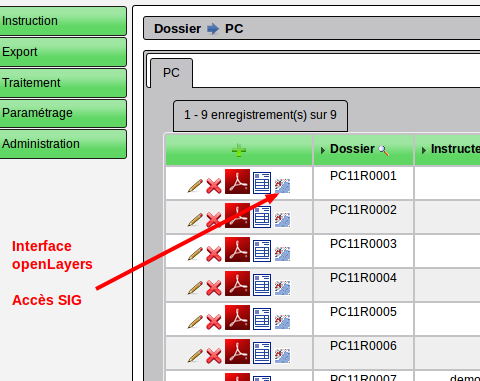
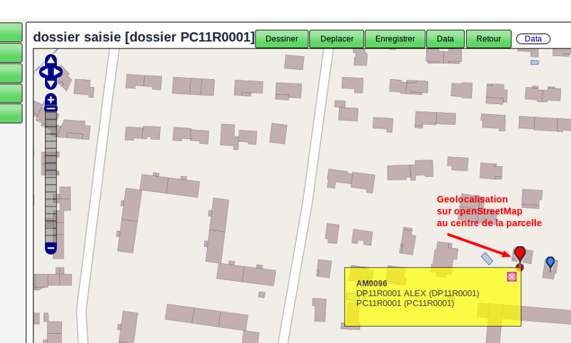
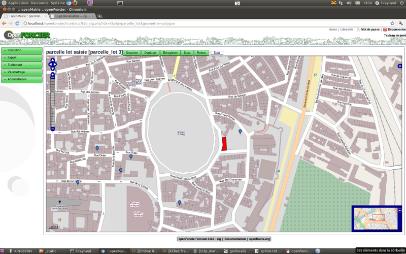
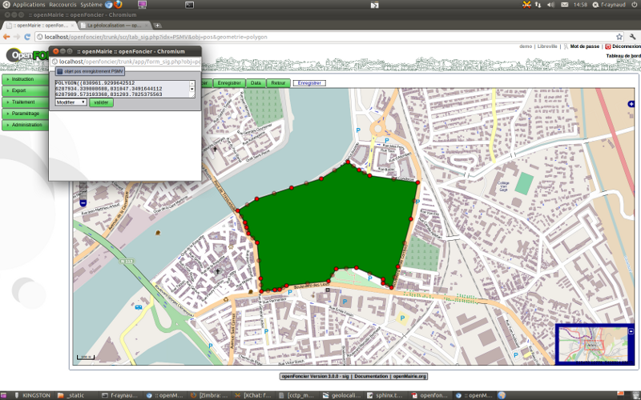
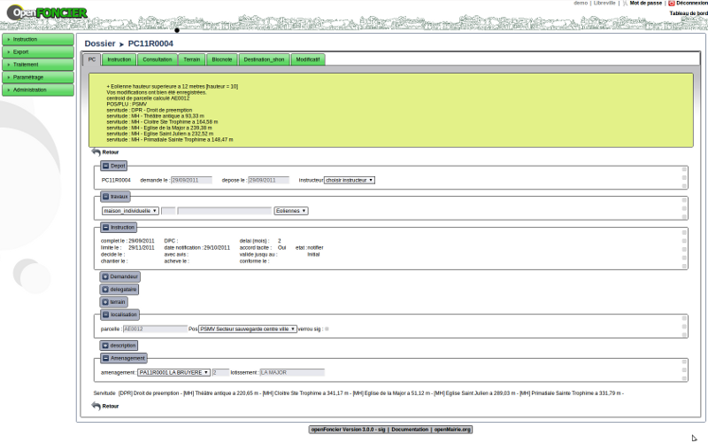
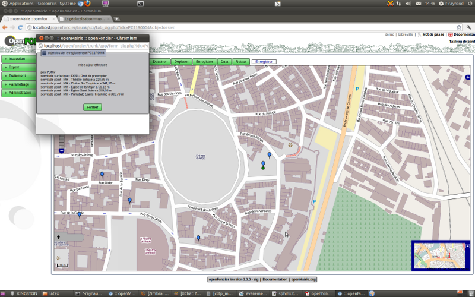
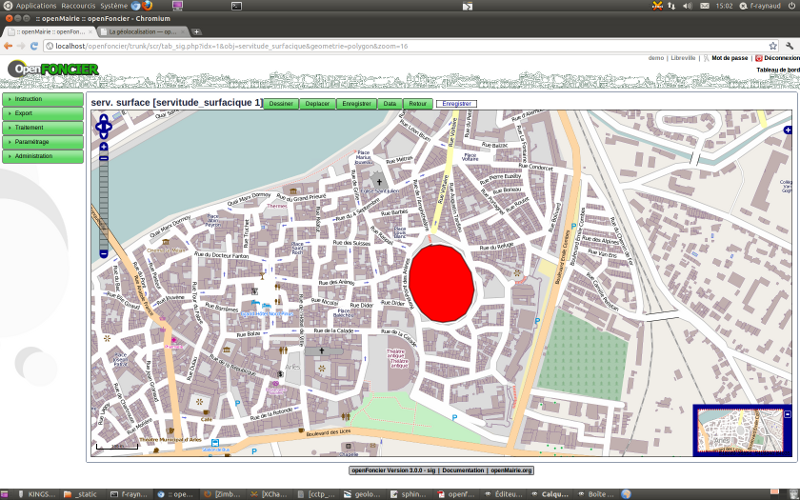
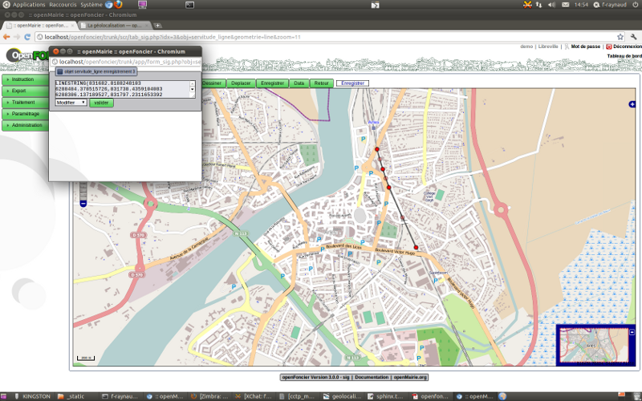
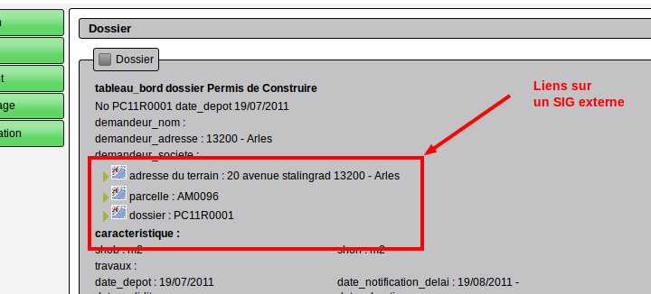

.. _geolocalisation:

##################
La géolocalisation
##################

Il est décrit ici les principes d'integration dans un SIG :

- la géolocalisation du dossier au centroid de la parcelle ou de lotissement

- l'utilisation de vues pour se connecter sur des bases externes

- l'implementation automatique de la recherche de la zone POS et servitudes

- la mise en place de lien sur un sig externe

=========================================
La geolocalisation automatique du dossier
=========================================

La géolocalisation automatique se fait sur la base du centroid de la parcelle saisie lors
de la saisie du dossier ou sur celui d'un lot de lotissement (parcelle_lot).

Attention, le champ geom doit contenir un polygone issu d'un SIG, du cadastre ou
fourni par l'IGN.

Pour que cette géolocalisation ait lieu, il faut paramétrer dans dyn/var.inc ::

    $sig=1;
      = 1 sig
      = 0 pas de sig
    $auto_parcelle = 1  
    

Si $sig = 1 et $auto_parcelle = 1, après la saisie, les méthodes triggers de dossier.class.php localise
le dossier avec un point au centroid de la parcelle si la parcelle existe.

Il est possible de géolocaliser manuellement le dossier dans le cas ou la parcelle
n'existe pas ...

Il est possible de déplacer le dossier, voire de supprimer une localisation.

Après avoir saisie la parcelle utilisez l'interface openLayers :

Affichage avec openLayers

Vous avez le détail de fonctionnement de l'interface dans le guide du développeur openMairie
(Information géographique)

Il est possible de géolocaliser une ADS sur la base du centroid d'un lot de lotissement.
Cette option n'est possible que si le lotissement a été numérisé préalablement (parametrage -> parcelle_lot).
Il faut mettre l'option $auto_parcelle_lot=1 dans dyn/var.inc pour que la géolocalisation via le lot de
lotissement soit activée.

Dans dossier, il faut alors  selectionner le lot du lotissement et le dossier est automatiquement localisé sur le
centroid du lot. Il est aussi déplaçable manuellement.

Il est possible de saisir les parcelles dans l interface openLayers dans le menu parametrage / parcelle
bien que la meilleure solution soit de récupérer la base de la direction des impôts (edigeo) ou celle de l'IGN.

.. image:: ../_static/parcelle.png

Il est possible de saisir les lots des lotissements dans le menu parametrage / parcelle_lot:

===============================
Les vues sur des bases externes
===============================

Il est possible avec postgresql et dblink d'utiliser une base de données externe
( voir installation et utilisation de dblink dans le guide du développeur openMairie)

Ces vues se substitue alors aux tables de base et elles ne sont pas modifiables.
Elles doivent être déclarées dans dyn/var.inc ::

    $vue_parcelle = 1; 
    $vue_pos=1;
    $vue_rivoli=1;
    $vue_parcelle_lot=1;
    $vue_servitude_surfacique=1;
    $vue_servitude_ligne=1;
    $vue_servitude_point=1;

    1= vue active
    0= vue non active
    
Attention dans parcelle, la zone parcelle est obligatoire et la zone surface est
nécessaire pour le calcul de la surface du terrain.

Pour rivoli, il est important d'avoir le code rivoli et le libellé.
Ce fichier peut être récupérer dans les données EDIGEO de la direction des impôts.

Exemple de paramétrage de vue (voir data/pgsql/vue.sql) ::

    -- vu sur le pos dynmap

    CREATE OR REPLACE VIEW pos AS 
     SELECT *
       FROM dblink('dbname=arles_dynmap'::text,
                'SELECT type_, (id_sect||'' ''||substring(nom_zone,0,30)) , g FROM
                sb_data_338 inner join sb_geom_338 on sb_data_338.rowid=sb_geom_338.rowid') 
                as (pos varchar(10), libelle varchar(40), geom geometry);
    
    -- vue sur les parcelles dynmap
    
    CREATE OR REPLACE VIEW parcelle AS 
     SELECT *
       FROM dblink('dbname=arles_dynmap'::text,
                'SELECT substring(idu_id,7,6), supf_id , g ,null, '''', '''', null, null FROM
                sb_data_170 inner join sb_geom_170 on sb_data_170.rowid=sb_geom_170.rowid') 
                as (parcelle varchar(6), surface numeric(10,3), geom geometry, proprietaire varchar(6),
                debut varchar(4), rivoli varchar(4), section varchar(7), pos varchar(10));
                
                
    -- vue sur parcelle depuis les fichiers IGN

Le principe des vues peut être appliqués dans le web sig ::

    - avec DYNMAP (Simalis) : reconstitution d'une table data et d'une table geom (format propriétaire de dynmap)
    
        -- vue dossier data
    
        CREATE OR REPLACE VIEW sb_data_dossier AS 
            SELECT *
            FROM dblink('dbname=openfoncier'::text,
            'SELECT oids, dossier, demandeur_nom FROM dossier '::text)
                dblink(rowid integer,
                       dossier character varying(40),
                       demandeur_nom character varying(40));
    
        -- vue dossier geom
        
        CREATE OR REPLACE VIEW sb_geom_dossier AS 
            SELECT *
            FROM dblink('dbname=openfoncier'::text,
            'SELECT oids,geom FROM dossier '::text)
                dblink(rowid integer, g geometry);
    
    - des vues sur openFoncier dans un schema de la base sig de VEREMAP (Veremes) peut de la même
    manière permettre une utilisation par veremap facilité par les formats standarts de l'OGC.

=====================================
Recuperer la zone POS dans le dossier
=====================================

Il est possible de recupérer le pos automatiquement en le paramétrant dans dyn/var.inc
Attention, la zone geom du POS doit être renseignée avec des polygones

dyn/var.inc ::

    $auto_pos=1;

    1= pos automatique
    0= pos non automatique

La methode auto_pos de dossier.class.php recherche la zone POS et met à jour
le dossier automatiquement suivant le centroid de la parcelle  ::

    $projection = projection utilisée dans openFoncier
    $geom = valeur du point géolocalisé
    
    "select pos from pos  WHERE ST_contains(geom,  geometryfromtext('".$geom."', ".$projection."))"

Il est possible de saisir le POS dans le menu parametrage option POS

Il est possible de saisir le périmètre d'une zone avec l interface openLayers.

========================
Recuperer les servitudes
========================

Il est possible de recupérer les servitudes automatiquement en le paramétrant dans dyn/var.inc
Elles sont stockées en texte dans le champ servitude de dossier

les servitudes sont soit

- surfacique dans la table (ou vue) servitude_surfacique (polygon)

- ligne en table (ou vue) servitude_ligne (line)

- ponctuel ou point en table (ou vue) servitude_point (point)

Dans le cas de polygon, l'ADS est dans le périmètre de la servitude ou pas

Dans le cas de ligne ou d'un point , l'ADS est dans le périmètre en fonction d'une distance qu'il faut déterminer

dyn/var.inc ::

    $auto_servitude_surfacique=1;
    $auto_servitude_ligne=1;
    $auto_servitude_point=1;
    

    1= servitude recupérée automatique
    0= pas de servitudes

Exemple avec dossier de recuperation parcelle, pos et servitudes:

Exemple avec l'interface openLayers de recuperation parclle, pos et servitudes:

Il est possible de saisir le périmètre, une ligne ou un point d'une servitude avec l'interface openLayers
(options du menu paramétrage)

servitude surfacique

servitude ligne

servitude point

.. image:: ../_static/servitude_point.png

===========================================
La mise en place de lien sur un SIG externe
===========================================

Il est possible de parametrer des liens sur un web sig externe.

Dans dyn/var.inc, exemple pour un accès à dynmap  ::

    Recherche parcelle
    
    $lien_sig="http://anjouan/cadastre_majic/flash/index.php?
        TABLE=12
        &CHAMP=IDU_id&RECHERCHE=004000";
    
    Recherche adresse
    
    $lien_sig1="http://anjouan/cadastre_majic/flash/index.php?
        TABLE=254
        &CHAMP=LOCALISATION&RECHERCHE=";
    
    recherche dossier
    
    $lien_sig2="http://anjouan/cadastre_majic/flash/index.php?
        TABLE=76
        &CHAMP=IDENT&RECHERCHE=";

Suivant la table et le champ de recherche, DYNMAP recherche la parcelle, le dossier ou l adresse
avec l'identifiant à rechercher dans spc/dossier.scr.

