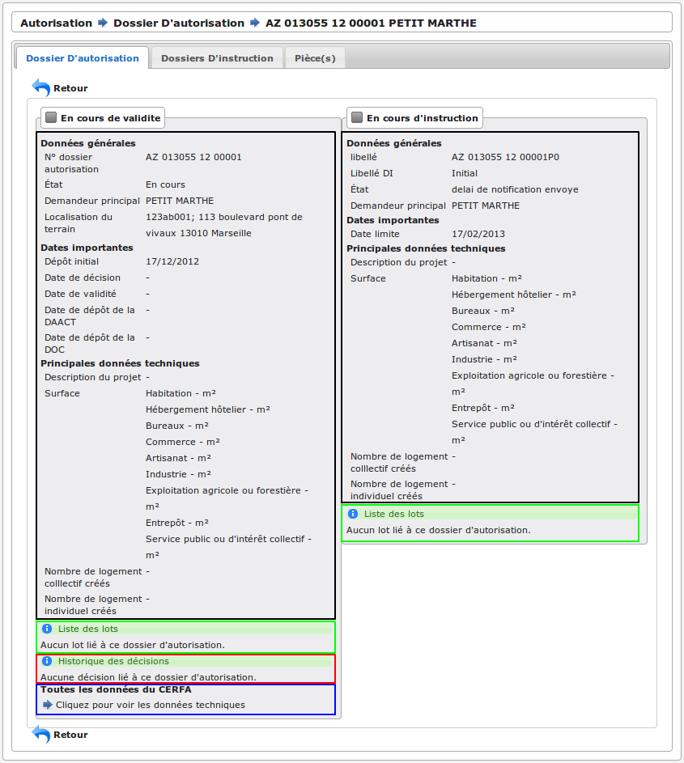
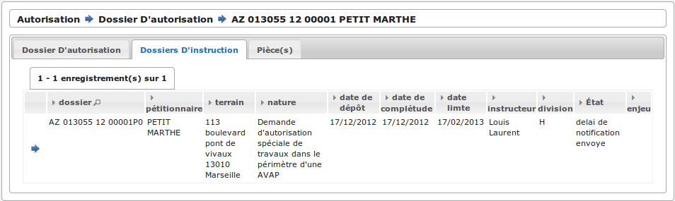
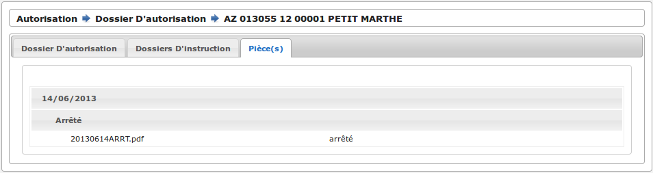

.. _autorisations:

#############
Autorisations
#############

Introduction
============

Le dossier d'autorisation contient l'ensemble des informations en cours de
validité des dossiers d'instruction qui lui sont liés.

Liste des dossiers d'autorisation
=================================

Il est possible de lister les dossiers d'autorisation depuis le menu "Autorisation".

Les dossiers d'autorisation sont listés par ordre alphabétique.

Une recherche peut être effectuée sur plusieurs critères :

- numéro de dossier

- type detaillé de dossier d'autorisation

- nom du demandeur

- parcelle

- l'adresse du terrain

- l'arrondissement

- l'état

- la date de premier dépôt

- la date de décision initiale

Ce tableau permet d'accéder à la visualisation des dossiers d'autorisation.

Visualisation des dossiers d'autorisation
=========================================

La visualisation contient deux blocs d'informations :

- "En cours de validité" : informations des dossiers d'instructions soumis à un arrété.

    * En noir : les informations importantes en cours de validité
    * En vert : la liste des lots et leurs petitionnaire principal en cours de validité
    * En rouge : la liste des décisions en cours de validité
    * En bleu : un lien vers toutes les données techniques en cours de validité

- "En cours d'instruction" : données du dossier d'instruction en cours d'instruction.

    * En noir : les informations importantes en cours d'instruction
    * En vert : la liste des lots et leurs petitionnaire principal en cours d'instruction

Mise à jour des informations
============================

Il existe 3 groupes d'informations :

- celles mises à jour lors de la création d'un dossier d'instruction initial ou lorsqu'un dossier d'instruction est accepté :

    - l'adresse du terrain
    - les références cadastrales
    - les demandeurs
    - les lots

- les dates qui sont calculées de manière individuelle :

    - date de premier dépôt : date de dépôt du dossier d'instruction initial
    - date de première décision : date de décision du dossier d'instruction initial
    - date de fin de validité : plus haute date de validité tous dossier d'instruction confondus
    - date de dépôt DOC : date d'ouverture de chantier du dernier dossier d'instruction accepté
    - date de dépôt DAACT : date de fin de chantier du dernier dossier d'instruction accepté

- des informations relatives à l'état du dossier d'autorisation :

    - l'état du dernier dossier d'instruction
    - l'état du dossier d'instruction initial après décision si il existe un seul dossier d'instruction, sinon l'état du dernier dossier d'instruction accepté
    - l'avis de la décision du dossier d'instruction initial après décision si il existe un seul dossier d'instruction, sinon l'avis de la décision du dernier dossier d'instruction accepté

Cycle de mise à jour
====================

Plusieurs facteurs peuvent déclencher la mise à jour de ces informations :

    - l'ajout, la modification ou la suppression de dossiers d'instruction 
    - l'ajout, la modification ou la suppression d'évènements d'instruction

Lors du dépôt du dossier d'instruction initial, le dossier d'autorisation est créé.
Les informations qui y sont répliquées sont celles du dossier d'instruction initial.

Par la suite, le dossier d'autorisation est mis à jour dans le cas d'une décision apportée sur un dossier d'instruction, dont l'avis fait partie de la liste suivante :

    - Favorable
    - Accord Tacite
    - Favorable avec Reserves
    - Accord prorogation
    - Annulation par tribunal
    - DOC enregistrée
    - dossier d'autorisationACT enregistrée
    - conforme
    - Accord prorogation Tacite
    - Autorisation annulée
    - ...

Attention, cette liste peut ne pas être exhaustive et n'est pas figée. Elle dépend du paramétrage des dossiers, du workflow, etc.

Certaines informations du dossier d'autorisation peuvent également être mises à jour automatiquement, en fonction de critères temporels (ex : état de l'autorisation dans le cas de la péremption de la date de validité).

Autres informations accessibles
===============================

Liste des dossiers d'instruction liés au dossier d'autorisation (voir :ref:`instruction`).

Liste des pièces liées au dossier d'autorisation.

.. note::

    Les pièces peuvent être filtrées par leur type de document.
    Pour plus d'information consulter le :ref:`paramétrage <parametrage_parametre>`.