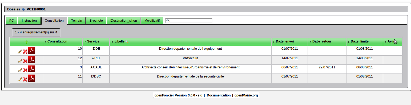
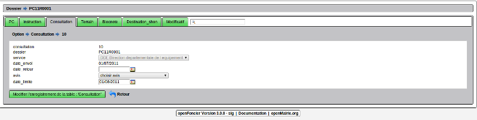
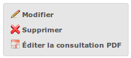

.. _consultation:

######################
Consulter les services
######################

Il est proposé de décrire dans ce paragraphe la consultation des services.

Les services sont paramétrables dans paramètrage / service. C'est à ce niveau qu'il
est indiqué le délai de consultation.

L'onglet permet de faire apparaitre les consultations du dossier.

Il est possible d'éditer la lettre type PDF dans la grille ci dessous

Il est possible de creer ou modifier une consultation dans le formulaire ci dessous

Il est saisie :

- la date d'envoi (obligatoire)

- le service concernée (obligatoire)

Lors du retour de la consultation, il est saisie :

- la date retour

- l'avis du service 

La date limite est calculée depuis le délai du service. (saisie dans paramètre -> service)

Finalisation des documents
==========================

Lors de l'ajout d'une consultation, l'édition est automatiquement finalisée.

Au clique sur le lien de l'édition dans le portail d'action de la visualisation de la consultation, le document sera ouvert depuis la GED au format PDF.

