#########
Ergonomie
#########

Tableau de bord
===============

Le tableau de bord est composé de plusieurs blocs d'informations appelés widget qui permettent à l'utilisateur de visualiser rapidement des informations transverses.

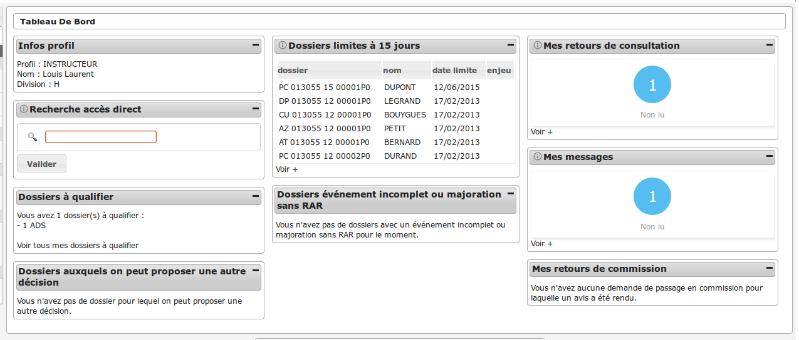

La disposition des widgets est propre à chaque profil et peut être modifiée très facilement par l'administrateur.

Widgets
=======

.. _widget_infos_profil:

Widget "Infos Profil"
---------------------

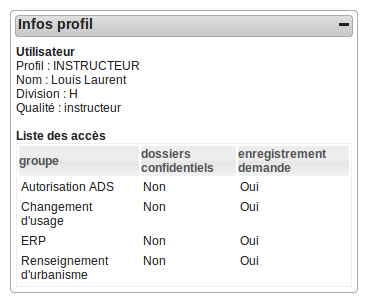

Ce widget, présent pour tous les profils, permet de visualiser en un coup d'oeil les informations suivantes de l'utilisateur connecté :

- son profil
- son nom
- si c'est un instructeur, sa division et sa qualité d'instructeur
- les groupes auxquels il appartient, s'il a accès aux dossiers confidentiels de ces groupes et s'il peut créer un dossier de ces groupes

Si l'utilisateur n'a pas de groupe associé, un message rouge prévient l'utilisateur qu'il y a un problème de paramétrage. En effet, cela risque de fortement limiter les actions qui seront disponibles dans l'application.

.. _widget_dossiers_limites:

Widget "Dossiers limites"
-------------------------

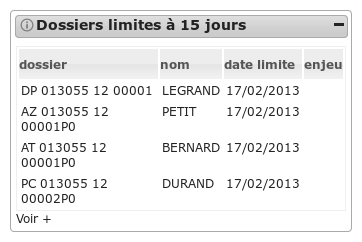

Orienté Instruction.

L'objet de ce widget est de présenter un listing des dix dossiers d'instruction dont la date limite est dans moins de X jours (le nombre de jours est :ref:`paramétrable <administration_widget_dossiers_limites>` par l'administrateur). 

Trois filtres sont disponibles sur ce widget (le filtre est :ref:`paramétrable <administration_widget_dossiers_limites>` par l'administrateur) :

- filtre par instructeur : on présente uniquement les dossiers dont il est spécifiquement instructeur.
- filtre par division : on présente tous les dossiers de la division de l'instructeur.
- aucun filtre : tous les dossiers auxquels l'utilisateurs a accès (si l'utilisateur appartient à une commune niveau mono, alors l'utilisateur n'a accès qu'aux dossiers de sa commune et si l'utilisateur appartient à une commune multi, alors l'utilisateur a accès à tous les dossiers).

Par défaut, tous les types de dossiers apparaissent dans ce listing (les types sont :ref:`paramétrable <administration_widget_dossiers_limites>` par l'administrateur).

A tout moment, au survol de l'icône d'information du widget, une description permet d'indiquer quels sont les paramètres appliqués sur le widget.

Le listing présente les informations suivantes :

- le libellé du dossier d'instruction,
- le nom du pétitionnaire principal,
- la date limite,
- le caractère à enjeux du dossier.

Un lien sur chaque enregistrement permet d'accéder à la fiche de visualisation du dossier d'instruction.

Un lien "Voir +" permet d'accéder au listing des mêmes dossiers sans limite de nombre.

.. _widget_recherche_dossier:

Widget "Recherche Dossier"
--------------------------

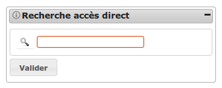

Orienté Instruction.

Ce widget permet de rechercher un dossier, et d'y accéder directement depuis le tableau de bord. Si le code du dossier est saisi dans son intégralité et que le numéro de dossier n'est pas ambigu (s'il existe un seul dossier commencant par ce numéro), on accède directement à la fiche de visualisation du dossier d'instruction. Par contre si le numéro de dossier saisi n'est pas suffisamment explicite et que plusieurs résultats correspondent, alors on accède à un listing de dossiers d'instruction qui contiennent le numéro recherché (une recherche avancée permet alors d'affiner les résultats).

Exemples :

- Recherche du dossier PC 013055 0001 et il n'y a pas de dossier sur existant → Accès direct au dossier
- Recherche du dossier PC 013055 0002 mais le dossier PC 013055 0002M01 existe → Redirection vers la recherche car il y a 2 résultats.

.. _widget_recherche_dossier_par_type:

Widget "Recherche Dossier par type"
-----------------------------------

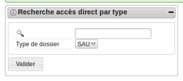

Orienté Instruction.

Ce widget est similaire au widget "Recherche Dossier" ci-dessus, mais propose en plus une liste à choix permettant de définir la portée de recherche, en sélectionnant un des types de dossiers suivants :

- SAU
- RE*
- INF.

Le choix du type de dossier filtre les résultats et conditionne la redirection de l'utilisateur :

- SAU : Instruction > Dossier d'instruction > Recherche
- RE* : Contentieux > Recours > Tous les Recours
- INF : Contentieux > Infractions > Toutes les Infractions

.. _widget_consultation_retours:

Widget "Retours de Consultation"
--------------------------------

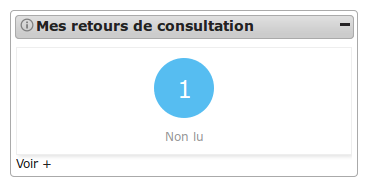

Orienté Instruction.

L'objet de ce widget est d'alerter l'utilisateur sur le nombre de retours de consultation marqués comme 'non lu'. En effet, lorsque l'instructeur a créé une consultation sur un dossier, la réponse à la consultation peut se faire par plusieurs sources : le service consulté si celui ci a un compte sur openADS, la cellule suivi qui a pu recevoir le retour par courrier et le saisir lui-même ou un traitement automatique qui au bout du délai de consultation émet un retour tacite. Lorsqu'une de ces réponses a lieu alors la consultation est marquée comme 'non lu' pour que l'instructeur puisse en avoir connaissance et le nombre de ces consultations apparaît dans ce widget entouré d'un rond bleu.

Lorsqu'aucun retour de consultation n'est marqué comme 'non lu' alors un message l'indique à l'utilisateur.

Trois filtres sont disponibles sur ce widget (le filtre est :ref:`paramétrable <administration_widget_consultation_retours>` par l'administrateur) :

- filtre par instructeur : on présente uniquement les dossiers dont il est spécifiquement instructeur.
- filtre par division : on présente tous les dossiers de la division de l'instructeur.
- aucun filtre : tous les dossiers auxquels l'utilisateurs a accès (si l'utilisateur appartient à une commune niveau mono, alors l'utilisateur n'a accès qu'aux dossiers de sa commune et si l'utilisateur appartient à une commune multi, alors l'utilisateur a accès à tous les dossiers).

À tout moment, au survol de l'icône d'information du widget, une description permet d'indiquer quels sont les paramètres appliqués sur le widget.

Le menu d'openADS propose autant de listings que de filtres possibles : ainsi le lien "Voir +" redirige vers le tableau adéquat.

.. _widget_commission_mes_retours:

Widget "Mes retours de commission"
----------------------------------

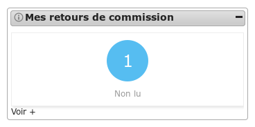

Orienté Instruction.

L'objet de ce widget est d'alerter l'utilisateur sur le nombre de retours de
commission marqués comme 'non lu'. Pour un dossier planifié lors d'une
commission, lorsque la cellule suivi y renseigne l'avis alors, un retour est
créé. En cas de mise à jour de l'avis, le retour est à nouveau marqué comme 'non
lu' si il était 'lu'.

Lorsqu'aucun retour de commission n'est marqué comme 'non lu' alors, un message
l'indique à l'utilisateur.

Trois filtres sont disponibles sur ce widget (le filtre est :ref:`paramétrable
<administration_widget_commission_mes_retours>` par l'administrateur) :

- filtre par instructeur : on présente uniquement les dossiers dont il est
  spécifiquement instructeur.
- filtre par division : on présente tous les dossiers de la division de
  l'instructeur.
- aucun filtre : tous les dossiers auxquels l'utilisateurs a accès (si
  l'utilisateur appartient à une commune niveau mono alors, l'utilisateur n'a
  accès qu'aux dossiers de sa commune et si l'utilisateur appartient à une
  commune multi alors, l'utilisateur a accès à tous les dossiers).

À tout moment, au survol de l'icône d'information du widget, une description
permet d'indiquer quels sont les paramètres appliqués sur le widget.

Le menu d'openADS propose autant de listings que de filtres possibles : ainsi le
lien "Voir +" redirige vers le tableau adéquat.

.. _widget_messages_retours:

Widget "Mes messages"
---------------------

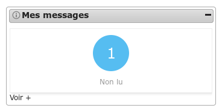

Orienté Instruction/Contentieux.

Ce widget permet d'indiquer le nombre de messages en attente de lecture ('non lu') à l'utilisateur connecté.
Pour plus de détails sur les messages, se référer :ref:`ici <instruction_dossier_message>`.

Une phrase indique à l'utilisateur lorsqu'il n'y a aucun message en attente.

Trois filtres sont disponibles sur ce widget (le filtre est :ref:`paramétrable <administration_widget_messages_retours>` par l'administrateur) :

- filtre par instructeur : on présente les dossiers dont l'instructeur affecté est celui connecté ainsi que les dossiers de sa collectivité dont le destinataire est 'commune'.
- filtre par division : on présente les dossiers de la division de l'instructeur connecté ainsi que les dossiers de sa collectivité dont le destinataire est 'commune'.
- aucun filtre : tous les dossiers auxquels l'utilisateurs a accès (si l'utilisateur appartient à une commune niveau mono, alors l'utilisateur n'a accès qu'aux dossiers de sa commune et si l'utilisateur appartient à une commune multi, alors l'utilisateur a accès à tous les dossiers).

Au survol de l'icône d'information du widget, une description permet d'indiquer quels sont les paramètres appliqués sur le widget.

Le menu d'openADS propose autant de listings que de filtres possibles : ainsi le lien "Voir +" redirige vers le tableau adéquat.

.. _widget_nouvelle_demande_nouveau_dossier:

Widget "Nouvelle demande 'nouveau dossier'"
-------------------------------------------

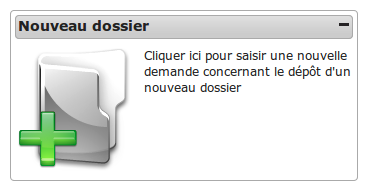

Orienté Guichet.

Ce widget permet d'accéder directement au formulaire de saisie d'une nouvelle demande dans le cadre du dépôt d'un nouveau dossier.

Deux contextes sont disponibles sur ce widget (le contexte est :ref:`paramétrable <administration_widget_nouvelle_demande_nouveau_dossier>` par l'administrateur) :

- contexte *standard* : permet de rediriger vers le formulaire de nouvelle demande du menu "Guichet Unique" ;
- contexte *contentieux* : permet de rediriger vers le formulaire de nouvelle demande du menu "Contentieux".

.. _widget_nouvelle_demande_autre_dossier:

Widget "Nouvelle demande 'autres dossiers'"
-------------------------------------------

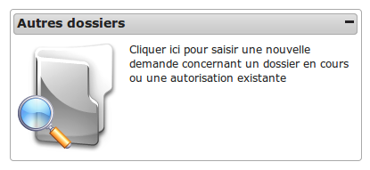

Orienté Guichet.

Raccourci permet d'accéder directement au formulaire de recherche d'un dossier en cours ou d'une autorisation existante pour y ajouter une nouvelle demande.

.. _widget_nouvelle_demande_dossier_encours:

Widget "Nouvelle demande 'dossiers en cours'"
---------------------------------------------

.. image:: widget_nouvelle_demande_dossier_encours.png

Orienté Guichet.

Raccourci permet d'accéder directement au formulaire de recherche d'un dossier en cours pour y ajouter une nouvelle demande.

.. _widget_dossiers_evenement_retour_finalise:

Widget "Dossiers auxquels on peut proposer une autre décision"
--------------------------------------------------------------

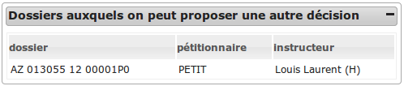

Ce widget liste les dossiers pour lesquels on peut proposer une autre décision.

Il s'agit de ceux dont le dernier événement d'instruction de type arrêté est finalisé,
n'est pas de type retour et ne dispose d'aucune date renseignée parmi les suivantes :

* date d'envoi pour signature ;
* date de retour de signature ;
* date d'envoi RAR ;
* date de retour RAR ;
* date d'envoi au contrôle légalité ;
* date de retour du contrôle de légalité.

.. _widget_dossiers_evenement_incomplet_majoration:

Widget "Dossiers événement incomplet ou majoration sans RAR"
------------------------------------------------------------

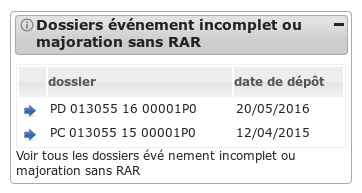

Orienté Instruction.

L'objet de ce widget est de présenter un listing de dix dossiers d'instruction maximum sur lesquels ont été appliqué un événement de majoration ou d'incomplétude avec une date d'envoi de lettre RAR renseignée pour cet événement, et dont la date de retour RAR de l'événement n'a pas été complétée. Les dossiers sont triés du plus récent au plus ancien.

Trois filtres sont disponibles sur ce widget (le filtre est :ref:`paramétrable <administration_widget_dossiers_evenement_incomplet_majoration>` par l'administrateur) :

- filtre par instructeur : on présente uniquement les dossiers dont il est spécifiquement instructeur.
- filtre par division : on présente tous les dossiers de la division de l'instructeur.
- aucun filtre : tous les dossiers auxquels l'utilisateurs a accès (si l'utilisateur appartient à une commune niveau mono, alors l'utilisateur n'a accès qu'aux dossiers de sa commune et si l'utilisateur appartient à une commune multi, alors l'utilisateur a accès à tous les dossiers).

A tout moment, au survol de l'icône d'information du widget, une description permet d'indiquer quels sont les paramètres appliqués sur le widget.

Le listing présente les informations suivantes :

- le libellé du dossier d'instruction,
- la date de dépôt du dossier,

Un lien sur chaque enregistrement permet d'accéder à la fiche de visualisation du dossier d'instruction.

Un lien "Voir tous les dossiers évènement incomplet ou majoration sans RAR" permet d'accéder au listing des mêmes dossiers sans limite de nombre.

.. _widget_dossier_contentieux_recours:

Widget "Recours"
----------------

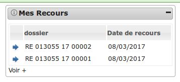

Orienté Contentieux.

L'objet de ce widget est de présenter les cinq recours les plus récents.

Deux filtres sont disponibles sur ce widget (le filtre est :ref:`paramétrable <administration_widget_dossier_contentieux_recours>` par l'administrateur) :

- filtre par instructeur : on présente uniquement les dossiers dont il est spécifiquement instructeur.
- aucun filtre : tous les dossiers auxquels l'utilisateurs a accès (si l'utilisateur appartient à une commune niveau mono, alors l'utilisateur n'a accès qu'aux dossiers de sa commune et si l'utilisateur appartient à une commune multi, alors l'utilisateur a accès à tous les dossiers).

A tout moment, au survol de l'icône d'information du widget, une description permet d'indiquer quels sont les paramètres appliqués sur le widget.

Le listing présente les informations suivantes :

- le libellé du recours,
- la date du recours.

Un lien sur chaque enregistrement permet d'accéder à la fiche de visualisation de l'infraction.

Un lien "Voir +" permet d'accéder au listing des mêmes recours sans limite de nombre.

.. _widget_dossier_contentieux_infraction:

Widget "Infractions"
--------------------

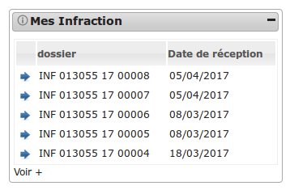

Orienté Contentieux.

L'objet de ce widget est de présenter les cinq infractions les plus récentes.

Deux filtres sont disponibles sur ce widget (le filtre est :ref:`paramétrable <administration_widget_dossier_contentieux_infraction>` par l'administrateur) :

- filtre par instructeur : on présente uniquement les dossiers dont il est spécifiquement instructeur.
- aucun filtre : tous les dossiers auxquels l'utilisateurs a accès (si l'utilisateur appartient à une commune niveau mono, alors l'utilisateur n'a accès qu'aux dossiers de sa commune et si l'utilisateur appartient à une commune multi, alors l'utilisateur a accès à tous les dossiers).

A tout moment, au survol de l'icône d'information du widget, une description permet d'indiquer quels sont les paramètres appliqués sur le widget.

Le listing présente les informations suivantes :

- le libellé de l'infraction,
- la date de réception de l'infraction.

Un lien sur chaque enregistrement permet d'accéder à la fiche de visualisation de l'infraction.

Un lien "Voir +" permet d'accéder au listing des mêmes infractions sans limite de nombre.

.. _widget_dossier_contentieux_contradictoire:

Widget "Infractions contradictoires"
------------------------------------

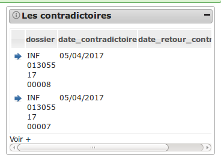

Orienté Contentieux.

L'objet de ce widget est de présenter les cinq infractions les plus anciennes pour lesquelles la date de contradictoire est saisie (soit elle est supérieure ou égale à la date du jour + 3 semaines, soit elle ne rentre pas dans cette condition et la date de retour du contradictoire est vide), il n'y a pas d'événements de type 'Annlation de contradictoire' et il n'y a pas d'AIT créé.

Trois filtres sont disponibles sur ce widget (le filtre est :ref:`paramétrable <administration_widget_dossier_contentieux_contradictoire>` par l'administrateur) :

- filtre par instructeur : on présente uniquement les dossiers dont il est spécifiquement instructeur.
- filtre par division : on présente tous les dossiers de la division de l'instructeur.
- aucun filtre : tous les dossiers auxquels l'utilisateurs a accès (si l'utilisateur appartient à une commune niveau mono, alors l'utilisateur n'a accès qu'aux dossiers de sa commune et si l'utilisateur appartient à une commune multi, alors l'utilisateur a accès à tous les dossiers).

A tout moment, au survol de l'icône d'information du widget, une description permet d'indiquer quels sont les paramètres appliqués sur le widget.

Le listing présente les informations suivantes :

- le libellé de l'infraction,
- la date du contradictoire,
- la date de retour du contradictoire.

Un lien sur chaque enregistrement permet d'accéder à la fiche de visualisation de l'infraction.

Un lien "Voir +" permet d'accéder au listing des mêmes infractions sans limite de nombre.

.. _widget_dossier_contentieux_ait:

Widget "Arrêté d'interruption de travaux"
-----------------------------------------

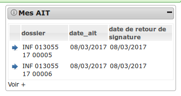

Orienté Contentieux.

L'objet de ce widget est de présenter les cinq infractions les plus récentes pour lesquelles il y a un AIT signé.

Trois filtres sont disponibles sur ce widget (le filtre est :ref:`paramétrable <administration_widget_dossier_contentieux_ait>` par l'administrateur) :

- filtre par instructeur : on présente uniquement les dossiers dont il est spécifiquement instructeur.
- filtre par division : on présente tous les dossiers de la division de l'instructeur.
- aucun filtre : tous les dossiers auxquels l'utilisateurs a accès (si l'utilisateur appartient à une commune niveau mono, alors l'utilisateur n'a accès qu'aux dossiers de sa commune et si l'utilisateur appartient à une commune multi, alors l'utilisateur a accès à tous les dossiers).

A tout moment, au survol de l'icône d'information du widget, une description permet d'indiquer quels sont les paramètres appliqués sur le widget.

Le listing présente les informations suivantes :

- le libellé de l'infraction,
- la date d'AIT,
- la date de retour de signature de l'AIT.

Un lien sur chaque enregistrement permet d'accéder à la fiche de visualisation de l'infraction.

Un lien "Voir +" permet d'accéder au listing des mêmes infractions sans limite de nombre.

.. _widget_dossier_contentieux_audience:

Widget "Audience"
-----------------

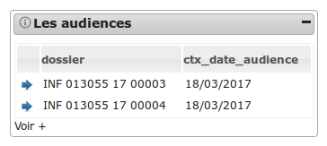

Orienté Contentieux.

L'objet de ce widget est de présenter les cinq infractions les plus récentes pour lesquelles une date d'audience existe et est comprise entre le jour courant et un mois dans le futur.

Trois filtres sont disponibles sur ce widget (le filtre est :ref:`paramétrable <administration_widget_dossier_contentieux_audience>` par l'administrateur) :

- filtre par instructeur : on présente uniquement les dossiers dont il est spécifiquement instructeur.
- filtre par division : on présente tous les dossiers de la division de l'instructeur.
- aucun filtre : tous les dossiers auxquels l'utilisateurs a accès (si l'utilisateur appartient à une commune niveau mono, alors l'utilisateur n'a accès qu'aux dossiers de sa commune et si l'utilisateur appartient à une commune multi, alors l'utilisateur a accès à tous les dossiers).

A tout moment, au survol de l'icône d'information du widget, une description permet d'indiquer quels sont les paramètres appliqués sur le widget.

Le listing présente les informations suivantes :

- le libellé de l'infraction,
- la date d'audience.

Un lien sur chaque enregistrement permet d'accéder à la fiche de visualisation de l'infraction.

Un lien "Voir +" permet d'accéder au listing des mêmes infractions sans limite de nombre.

.. _widget_dossier_contentieux_clotures:

Widget "Recours clôtures"
-------------------------

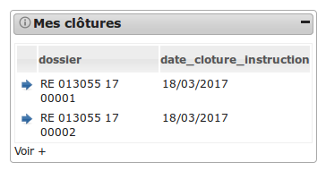

Orienté Contentieux.

L'objet de ce widget est de présenter les cinq recours les plus récents pour lesquels une date de clôture d'instruction existe et est comprise entre le jour courant et un mois dans le futur.

Trois filtres sont disponibles sur ce widget (le filtre est :ref:`paramétrable <administration_widget_dossier_contentieux_clotures>` par l'administrateur) :

- filtre par instructeur : on présente uniquement les dossiers dont il est spécifiquement instructeur.
- filtre par division : on présente tous les dossiers de la division de l'instructeur.
- aucun filtre : tous les dossiers auxquels l'utilisateurs a accès (si l'utilisateur appartient à une commune niveau mono, alors l'utilisateur n'a accès qu'aux dossiers de sa commune et si l'utilisateur appartient à une commune multi, alors l'utilisateur a accès à tous les dossiers).

A tout moment, au survol de l'icône d'information du widget, une description permet d'indiquer quels sont les paramètres appliqués sur le widget.

Le listing présente les informations suivantes :

- le libellé du recours,
- la date de clôture d'instruction.

Un lien sur chaque enregistrement permet d'accéder à la fiche de visualisation de l'infraction.

Un lien "Voir +" permet d'accéder au listing des mêmes recours sans limite de nombre.

.. _widget_dossier_contentieux_inaffectes:

Widget "Infractions non affectées"
----------------------------------

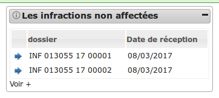

Orienté Contentieux.

L'objet de ce widget est de présenter les cinq infractions les plus anciennes non-affectées à un technicien.

Deux filtres sont disponibles sur ce widget (le filtre est :ref:`paramétrable <administration_widget_dossier_contentieux_inaffectes>` par l'administrateur) :

- filtre par division : on présente tous les dossiers de la division de l'instructeur.
- aucun filtre : tous les dossiers auxquels l'utilisateurs a accès (si l'utilisateur appartient à une commune niveau mono, alors l'utilisateur n'a accès qu'aux dossiers de sa commune et si l'utilisateur appartient à une commune multi, alors l'utilisateur a accès à tous les dossiers).

A tout moment, au survol de l'icône d'information du widget, une description permet d'indiquer quels sont les paramètres appliqués sur le widget.

Le listing présente les informations suivantes :

- le libellé de l'infraction,
- la date de réception de l'infraction.

Un lien sur chaque enregistrement permet d'accéder à la fiche de visualisation de l'infraction.

Un lien "Voir +" permet d'accéder au listing des mêmes infractions sans limite de nombre.

.. _widget_dossier_contentieux_alerte_visite:

Widget "Alerte visite"
----------------------

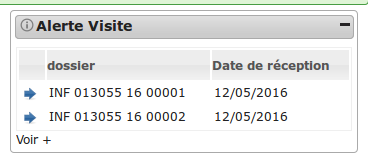

Orienté Contentieux.

L'objet de ce widget est de présenter les cinq infractions les plus anciennes pour lesquelles la date de réception est dépassée depuis plus de 3 mois et dont la date de première visite n'est pas saisie.

Trois filtres sont disponibles sur ce widget (le filtre est :ref:`paramétrable <administration_widget_dossier_contentieux_alerte_visite>` par l'administrateur) :

- filtre par instructeur : on présente uniquement les dossiers dont il est spécifiquement instructeur.
- filtre par division : on présente tous les dossiers de la division de l'instructeur.
- aucun filtre : tous les dossiers auxquels l'utilisateurs a accès (si l'utilisateur appartient à une commune niveau mono, alors l'utilisateur n'a accès qu'aux dossiers de sa commune et si l'utilisateur appartient à une commune multi, alors l'utilisateur a accès à tous les dossiers).

A tout moment, au survol de l'icône d'information du widget, une description permet d'indiquer quels sont les paramètres appliqués sur le widget.

Le listing présente les informations suivantes :

- le libellé de l'infraction,
- la date de réception de l'infraction.

Un lien sur chaque enregistrement permet d'accéder à la fiche de visualisation de l'infraction.

Un lien "Voir +" permet d'accéder au listing des mêmes infractions sans limite de nombre.

.. _widget_dossier_contentieux_alerte_parquet:

Widget "Alerte parquet"
-----------------------

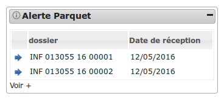

Orienté Contentieux.

L'objet de ce widget est de présenter les cinq infractions les plus anciennes pour lesquelles la date de réception est dépassée depuis plus de 9 mois et dont la date de transmission au parquet n'est pas saisie.

Trois filtres sont disponibles sur ce widget (le filtre est :ref:`paramétrable <administration_widget_dossier_contentieux_alerte_parquet>` par l'administrateur) :

- filtre par instructeur : on présente uniquement les dossiers dont il est spécifiquement instructeur.
- filtre par division : on présente tous les dossiers de la division de l'instructeur.
- aucun filtre : tous les dossiers auxquels l'utilisateurs a accès (si l'utilisateur appartient à une commune niveau mono, alors l'utilisateur n'a accès qu'aux dossiers de sa commune et si l'utilisateur appartient à une commune multi, alors l'utilisateur a accès à tous les dossiers).

A tout moment, au survol de l'icône d'information du widget, une description permet d'indiquer quels sont les paramètres appliqués sur le widget.

Le listing présente les informations suivantes :

- le libellé de l'infraction,
- la date de réception de l'infraction.

Un lien sur chaque enregistrement permet d'accéder à la fiche de visualisation de l'infraction.

Un lien "Voir +" permet d'accéder au listing des mêmes infractions sans limite de nombre.

Profils
=======

Administration
--------------

.. toctree::
    :maxdepth: 1
    
    profils/administrateur_general.rst
    profils/administrateur_technique_fonctionnel.rst

Visualisation
-------------

.. toctree::
    :maxdepth: 1
    
    profils/visualisation_da.rst
    profils/visualisation_da_di.rst

Instruction
-----------

.. toctree::
    :maxdepth: 1
    
    profils/chef_de_service.rst
    profils/divisionnaire.rst
    profils/instructeur.rst
    profils/instructeur_polyvalent.rst
    profils/instructeur_polyvalent_commune.rst
    profils/instructeur_service.rst
    profils/qualificateur.rst

Réception et suivi
------------------

.. toctree::
    :maxdepth: 1

    profils/suivi.rst
    profils/guichet_suivi.rst
    profils/guichet_unique.rst

Services consultés
------------------

.. toctree::
    :maxdepth: 1
    
    profils/service_consulte.rst
    profils/service_consulte_interne.rst
    profils/service_consulte_di.rst
    profils/service_consulte_etendu.rst
    
Contentieux
-----------

.. toctree::
    :maxdepth: 1
    
    profils/assistante.rst
    profils/chef_service_contentieux.rst
    profils/responsable_division_infraction.rst
    profils/juriste.rst
    profils/technicien.rst
    profils/direction_consultation.rst
    profils/direction_infraction.rst
    profils/direction_recours.rst
