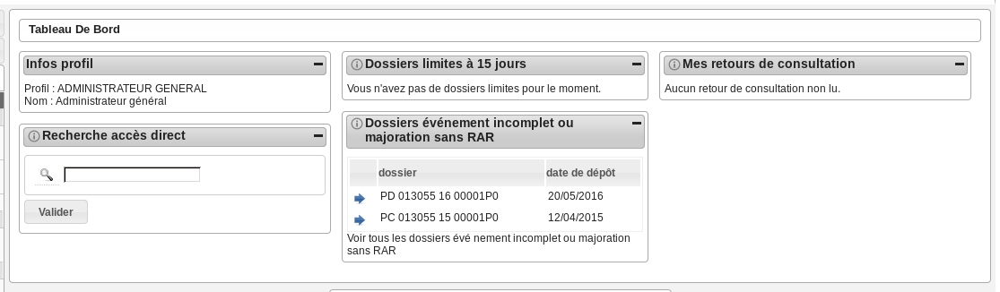
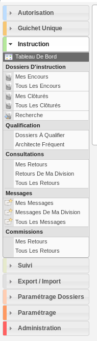

######################
ADMINISTRATEUR GÉNÉRAL
######################

Description
===========

C'est le profil utilisé par les administrateurs de l'application.

Il va leur permettre :

- de déposer des demandes
- d'instruire les dossiers d'instruction qui leurs sont affecté.
- de paramétrer l'application

Cet utilisateur peut être lié à la collectivité de la communauté de communes ou toute autre commune.
Un administrateur affecté à une commune n'aura accès qu'aux informations liées à sa commune.

Fonctionnalités disponibles
===========================

Tableau de bord
---------------

Widget *Infos profil*
#####################

- Visualiser les informations du profil de l'utilisateur connecté

Widget *Recherche accès direct*
###############################

- Rechercher un dossier d'instruction par son identifiant

Widget *Dossiers limites à 15 jours*
####################################

- Visualiser la liste des dossiers d'instruction affecté à l'utilisateur connecté dont la date limite arrive bientôt à échéance
- Accéder aux dossiers d'instruction affecté à l'utilisateur connecté dont la date limite arrive bientôt à échéance

Widget *Dossiers événement incomplet ou majoration sans RAR*
############################################################

- Visualiser la liste des dossiers d'instruction affecté à l'utilisateur connecté dont l'incomplétude n'a pas été notifié au demandeur
- Accéder aux dossiers d'instruction affecté à l'utilisateur connecté dont l'incomplétude n'a pas été notifié au demandeur

Widget *Mes retours de consultation*
####################################

- Visualiser la liste des consultations des dossiers d'instruction affecté à l'utilisateur dont un avis a été rendu
- Accéder aux consultations des dossiers d'instruction affecté à l'utilisateur dont un avis a été rendu

Menu
----

Rubrique *Autorisation*
-----------------------

Actions identiques à celles du profil instructeur (cf :ref:`Rubrique autorisation<profil_instructeur_rubrique_autorisation>`)

Rubrique *Guichet Unique*
-------------------------

Actions identiques à celles du profil guichet unique (cf :ref:`Rubrique guichet unique<guichet_unique>`)

Rubrique *Instruction*
----------------------

Actions identiques à celles du profil "instructeur" (cf :ref:`Rubrique instruction<profil_instructeur_rubrique_instruction>`)

Rubrique *Suivi*
----------------

Actions identiques à celles du profil "suivi" (cf :ref:`Rubrique suivi<profil_suivi_rubrique_suivi>`)

Rubrique *Export / Import*
--------------------------

Actions identiques à celles du profil "suivi" (cf :ref:`Rubrique Export / Import<profil_suivi_rubrique_export>`)

Rubrique *Paramétrage Dossiers*
-------------------------------
CERFA
#####
- Visualiser la liste des CERFA.
- Ajouter un CERFA.
- Accéder à la fiche de visualisation d'un CERFA.
- Modifier le texte d'un CERFA.
- Supprimer un CERFA.

Action(s) disponible(s) par onglet :

  - *Type de dossier d'autorisation détaillé* :

    - Visualiser la liste des types de dossier d'autorisation détaillé liés au type de dossier d'autorisation.
    - Ajouter un type de dossier d'autorisation détaillé au type de dossier d'autorisation.
    - Accéder à la fiche de visualisation d'un type de dossier d'autorisation détaillé.
    - Modifier le texte d'un type de dossier d'autorisation détaillé.
    - Supprimer un type de dossier d'autorisation détaillé.

Type DA
#######

- Visualiser la liste des types de dossiers d'autorisation.
- Ajouter un type de dossier d'autorisation.
- Accéder à la fiche de visualisation d'un type de dossier d'autorisation.
- Modifier le texte d'un type de dossier d'autorisation.
- Supprimer un type de dossier d'autorisation.

Action(s) disponible(s) par onglet :

  - *Type de dossier d'autorisation détaillé* :

    - Visualiser la liste des types de dossier d'autorisation détaillé liés au type de dossier d'autorisation.
    - Ajouter un type de dossier d'autorisation détaillé au type de dossier d'autorisation.
    - Accéder à la fiche de visualisation d'un type de dossier d'autorisation détaillé.
    - Modifier le texte d'un type de dossier d'autorisation détaillé.
    - Supprimer un type de dossier d'autorisation détaillé.

Type DA détaillé
################

- Visualiser la liste des types de dossier d'autorisation détaillé.
- Ajouter un type de dossier d'autorisation détaillé.
- Accéder à la fiche de visualisation d'un type de dossier d'autorisation détaillé.
- Modifier le texte d'un type de dossier d'autorisation détaillé.
- Supprimer un type de dossier d'autorisation détaillé.

Action(s) disponible(s) par onglet :

  - *Type de dossier d'instruction* :

    - Visualiser la liste des types de dossier d'instruction liés au type de dossier d'autorisation détaillé.
    - Ajouter un type de dossier d'instruction au type de dossier d'autorisation.
    - Accéder à la fiche de visualisation d'un type de dossier d'instruction.
    - Modifier le texte d'un type de dossier d'instruction.
    - Supprimer un type de dossier d'instruction.

Type DI
#######

- Visualiser la liste des types de dossier d'instruction.
- Ajouter un type de dossier d'instruction.
- Accéder à la fiche de visualisation d'un type de dossier d'instruction.
- Modifier le texte d'un type de dossier d'instruction.
- Supprimer un type de dossier d'instruction.

Contrainte
##########

- Visualiser la liste des contraintes.
- Ajouter une contrainte.
- Accéder à la fiche de visualisation d'une contrainte.
- Modifier le texte d'une contrainte.
- Supprimer une contrainte.

Synchronisation des contraintes
###############################

- Synchroniser l'ensemble des contraintes de la commune ou de la communauté selon l'affectation de l'administrateur.

Type (Demandes)
###############

- Visualiser la liste des types de demandes.
- Ajouter un type de demande.
- Accéder à la fiche de visualisation d'un type de demande.
- Modifier le texte d'un type de demande.
- Supprimer un type de demande.

Workflows
#########

- Visualiser une vue du workflow du dossier.
- Accéder à la visualisation des évenements disponible dans la suite du workflow de l'évenement courant.
- Accéder à la visualisation du courrier lié aux événements.

Évenements
##########

- Visualiser la liste des évenements.
- Dupliquer un évenement.
- Ajouter un évenement.
- Accéder à la fiche de visualisation d'un évenement.
- Modifier le texte d'un évenement.
- Supprimer un évenement.

Action(s) disponible(s) par onglet :

  - *Bible* :

    - Visualiser la liste des bibles.
    - Ajouter une bible.
    - Accéder à la fiche de visualisation d'une bible.
    - Modifier le texte d'une bible.
    - Supprimer une bible.

État
####

- Visualiser la liste des états.
- Ajouter un état.
- Accéder à la fiche de visualisation d'un état.
- Modifier le texte d'un état.
- Supprimer un état.

Avis décision
#############

- Visualiser la liste des avis.
- Ajouter un avis.
- Accéder à la fiche de visualisation d'un avis.
- Modifier le texte d'un avis.
- Supprimer un avis.

Action(s) disponible(s) par onglet :

  - *Évenement* :

    - Visualiser la liste des évenements.
    - Accéder à la fiche de visualisation d'un évenement.

Action
######

- Visualiser la liste des actions.
- Ajouter une action.
- Accéder à la fiche de visualisation d'une action.
- Modifier le texte d'une action.
- Supprimer une action.

Action(s) disponible(s) par onglet :

  - *Évenement* :

    - Visualiser la liste des évenements.
    - Accéder à la fiche de visualisation d'un évenement.

Bible
#####

- Visualiser la liste des bibles.
- Ajouter une bible.
- Accéder à la fiche de visualisation d'une bible.
- Modifier le texte d'une bible.
- Supprimer une bible.

État
####

- Visualiser la liste des états.
- Dupliquer un état.
- Ajouter un état.
- Prévisualiser l'édition PDF d'un état.
- Accéder à la fiche de visualisation d'un état.
- Modifier le texte d'un état.
- Supprimer un état.

Action(s) disponible(s) par onglet :

  - *Service* :

    - Visualiser la liste des services.
    - Ajouter un service.
    - Accéder à la fiche de visualisation d'un service.
    - Modifier le texte d'un service.
    - Supprimer un service.

Lettre type
###########

- Visualiser la liste des lettres type.
- Dupliquer une lettre type.
- Ajouter une lettre type.
- Prévisualiser l'édition PDF d'une lettre type.
- Accéder à la fiche de visualisation d'une lettre type.
- Modifier le texte d'une lettre type.
- Supprimer une lettre type.

Logo
####

- Visualiser la liste des logos.
- Dupliquer un logo.
- Ajouter un logo.
- Accéder à la fiche de visualisation d'un logo.
- Modifier le texte d'un logo.
- Supprimer un logo.

Rubrique *Paramétrage*
----------------------

Civilité
########

- Visualiser la liste des civilités.
- Ajouter une civilité.
- Accéder à la fiche de visualisation d'une civilité.
- Modifier le texte d'une civilité.
- Supprimer une civilité.

Arrondissement
##############

- Visualiser la liste des arrondissements.
- Ajouter un arrondissement.
- Accéder à la fiche de visualisation d'un arrondissement.
- Modifier le texte d'un arrondissement.
- Supprimer un arrondissement.

Action(s) disponible(s) par onglet :

  - *Affectation automatique* :

    - Visualiser la liste des affectations.
    - Ajouter une affectation.
    - Accéder à la fiche de visualisation d'une affectation.
    - Modifier le texte d'une affectation.
    - Supprimer une affectation.

  - *Quartier* :

Quartier
########

- Visualiser la liste des quartiers.
- Ajouter un quartier.
- Accéder à la fiche de visualisation d'un quartier.
- Modifier le texte d'un quartier.
- Supprimer un quartier.

Action(s) disponible(s) par onglet :

  - *Affectation automatique* :

    - Visualiser la liste des affectations.
    - Ajouter une affectation.
    - Accéder à la fiche de visualisation d'une affectation.
    - Modifier le texte d'une affectation.
    - Supprimer une affectation.

Genre
#####

- Visualiser la liste des genres.
- Ajouter un genre.
- Accéder à la fiche de visualisation d'un genre.
- Modifier le texte d'un genre.
- Supprimer un genre.

Action(s) disponible(s) par onglet :

  - *Groupe* :

Groupe
######

- Visualiser la liste des groupes.
- Ajouter un groupe.
- Accéder à la fiche de visualisation d'un groupe.
- Modifier le texte d'un groupe.
- Supprimer un groupe.

Action(s) disponible(s) par onglet :

  - *Type de demande* :

    - Visualiser la liste des types de demande.
    - Ajouter un type de demande.
    - Accéder à la fiche de visualisation d'un type de demande.
    - Modifier le texte d'un type de demande.
    - Supprimer un type de demande.

  - *Type de dossier d'autorisation* :

    - Visualiser la liste des types de dossier d'autorisation.
    - Ajouter un type de dossier d'autorisation.
    - Accéder à la fiche de visualisation d'un type de dossier d'autorisation.
    - Modifier le texte d'un type de dossier d'autorisation.
    - Supprimer un type de dossier d'autorisation.

Direction
#########

- Visualiser la liste des directions.
- Ajouter une direction.
- Accéder à la fiche de visualisation d'une direction.
- Modifier le texte d'une direction.
- Supprimer une direction.

Action(s) disponible(s) par onglet :

  - *Division* :

Division
########

- Visualiser la liste des divisions.
- Ajouter une division.
- Accéder à la fiche de visualisation d'une division.
- Modifier le texte d'une division.
- Supprimer une division.

Action(s) disponible(s) par onglet :

  - *Instructeur* :

Instructeur
###########

- Visualiser la liste des instructeurs.
- Ajouter un instructeur.
- Accéder à la fiche de visualisation d'un instructeur.
- Modifier le texte d'un instructeur.
- Supprimer un instructeur.

Action(s) disponible(s) par onglet :

  - *Affectation automatique* :

    - Visualiser la liste des affectations.
    - Ajouter une affectation.
    - Accéder à la fiche de visualisation d'une affectation.
    - Modifier le texte d'une affectation.
    - Supprimer une affectation.

Signataire arrêté
#################

- Visualiser la liste des signataires.
- Ajouter un signataire.
- Accéder à la fiche de visualisation d'un signataire.
- Modifier le texte d'un signataire.
- Supprimer un signataire.

Taxe d'aménagement
##################

- Visualiser la liste des taxes.
- Ajouter une taxe.
- Accéder à la fiche de visualisation d'une taxe.
- Modifier le texte d'une taxe.
- Supprimer une taxe.

Type de commission
##################

- Visualiser la liste des types de commission.
- Ajouter un type de commission.
- Accéder à la fiche de visualisation d'un type de commission.
- Modifier le texte d'un type de commission.
- Supprimer un type de commission.

Avis consultation
#################

- Visualiser la liste des avis de consultation.
- Ajouter un avis de consultation.
- Accéder à la fiche de visualisation d'un avis de consultation.
- Modifier le texte d'un avis de consultation.
- Supprimer un avis de consultation.

Service
#######

- Visualiser la liste des services.
- Ajouter un service.
- Accéder à la fiche de visualisation d'un service.
- Modifier le texte d'un service.
- Supprimer un service.

Action(s) disponible(s) par onglet :

  - *Lien service/utilisateur* :

    - Visualiser la liste des affectations d'utilisateurs au service.
    - Ajouter une affectation.
    - Accéder à la fiche de visualisation d'une affectation.
    - Modifier le texte d'une affectation.
    - Supprimer une affectation.

  - *Lien service/service catégorie* :

Thématique des services
#######################

- Visualiser la liste des catégories de service.
- Ajouter une catégorie.
- Accéder à la fiche de visualisation d'une catégorie.
- Modifier une catégorie de service.
- Supprimer une catégorie.

État des dossiers d'autorisations
#################################

- Visualiser la liste des états.
- Ajouter un état.
- Accéder à la fiche de visualisation d'un état.
- Modifier le texte d'un état.
- Supprimer un état.

Affectation automatique
#######################

- Visualiser la liste des affectations.
- Ajouter une affectation.
- Accéder à la fiche de visualisation d'une affectation.
- Modifier le texte d'une affectation.
- Supprimer une affectation.

Autorité compétente
###################

- Visualiser la liste des autorités compétentes.
- Ajouter une autorité compétente.
- Accéder à la fiche de visualisation d'une autorité compétente.
- Modifier une autorité compétente.
- Supprimer une autorité compétente.

Phase
#####

- Visualiser la liste des phases.
- Ajouter une phase.
- Accéder à la fiche de visualisation d'une phase.
- Modifier une phase.
- Supprimer une phase.

Rubrique *Administration*
-------------------------

Collectivité
############

- Visualiser la liste des collectivités.
- Ajouter une collectivité.
- Accéder à la fiche de visualisation d'une collectivité.
- Modifier le texte d'une collectivité.
- Supprimer une collectivité.

Liste des onglets :

  - *Utilisateur*
  - *Paramètre*
  - *État*
  - *Lettre type*
  - *Sous état*

Paramètre
#########

- Visualiser la liste des paramètres.
- Ajouter un paramètre.
- Accéder à la fiche de visualisation d'un paramètre.
- Modifier le texte d'un paramètre.
- Supprimer un paramètre.

Utilisateur
###########

- Visualiser la liste des utilisateurs.
- Ajouter un utilisateur.
- Accéder à la fiche de visualisation d'un utilisateur.
- Modifier le texte d'un utilisateur.
- Supprimer un utilisateur.

Liste des onglets :

  - *Instructeur*
  - *Lien service/utilisateur*

Annuaire
########

- Synchroniser les utilisateurs avec l'annuaire

Widget
######

- Visualiser la liste des widgets.
- Ajouter un widget.
- Accéder à la fiche de visualisation d'un widget.
- Modifier le texte d'un widget.
- Supprimer un widget.

Liste des onglets :

  - *Dashboard*

Composition
###########

- Disposer les widgets sur le tableau de bord du profil sélectionné.

Sous état
#########

- Visualiser la liste des sous état.
- Dupliquer un sous état.
- Ajouter un sous état.
- Accéder à la fiche de visualisation d'un sous état.
- Modifier le texte d'un sous état.
- Supprimer un sous état.

Om requête
##########

- Visualiser la liste des requêtes utilisées par les éditions PDF.
- Ajouter une requête.
- Accéder à la fiche de visualisation d'une requête.
- Modifier le texte d'une requête.
- Supprimer une requête.

Liste des onglets :

  - *Lettre type*
  - *État*

Import
######

- Importer des données au format CSV pour les table suivante :

  - affectation automatique
  - architecte
  - bible
  - Collectivité
  - contrainte
  - demandeur
  - direction
  - division
  - dossier
  - instructeur
  - Instruction
  - Paramètre
  - parcelle
  - Service
  - signataire
  - Utilisateur

Import spécifique
#################

- Importer des dossiers d'instruction clôturés au format CSV ADS2007.