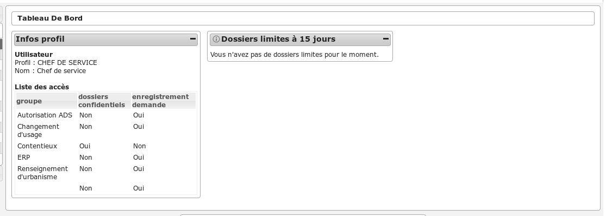
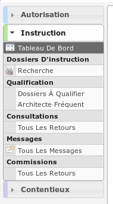

###############
CHEF DE SERVICE
###############

Description
===========

C'est le profil utilisé pour les chefs de services. Il va leur permettre :

- d'instruire les dossiers d'instruction.
- d'ajouter des demandes de passage en commission
- d'accéder aux dossiers liés

L'utilisateur qui a ce profil doit forcément être rattaché à un instructeur ainsi
qu'à une division pour pouvoir visualiser les dossiers qui lui sont
affectés ou affectés aux instructeurs de sa division.

Fonctionnalités disponibles
===========================

Tableau de bord
---------------

Widget *Infos profil*
#####################

- Visualiser les informations du profil de l'utilisateur connecté

Widget *Dossiers limites à 15 jours*
####################################

- Visualiser la liste des dossiers d'instruction affecté à l'utilisateur connecté dont la date limite arrive bientôt à échéance
- Accéder aux dossiers d'instruction affecté à l'utilisateur connecté dont la date limite arrive bientôt à échéance

Menu
----

Rubrique *Autorisation*
-----------------------

Actions identiques à celles du profil "instructeur" (cf :ref:`Rubrique autorisation<profil_instructeur_rubrique_autorisation>`)

Rubrique *Instruction*
----------------------

Mes encours
###########

- Liste toujours vide car ce profil n'est pas lié à un instructeur.

La liste des autres actions est disponible dans la partie `Recherche`_.

Tous les encours
################

- Liste toujours vide car ce profil n'est pas lié à un instructeur.

La liste des autres actions est disponible dans la partie `Recherche`_.

Mes clôturés
############

- Liste toujours vide car ce profil n'est pas lié à un instructeur.

La liste des autres actions est disponible dans la partie `Recherche`_.

Tous les clôturés
#################

- Liste toujours vide car ce profil n'est pas lié à un instructeur.

La liste des autres actions est disponible dans la partie `Recherche`_.

Recherche
#########

- Visualiser la liste des dossiers d'instruction de la collectivité de l'instructeur connecté ou de toutes les collectivités si l'instructeur appartient à la collectivité multi.
- Rechercher des dossiers d'instruction en fonction de plusieurs critères.
- Accéder aux dossiers d'instruction dans le sig
- Accéder à la fiche de visualisation d'un dossier d'instruction

.. sidebar:: Note :

    Les actions SIG sont disponibles si celui-ci est paramétré pour la collectivité du dossier d'instruction.

Action(s) disponible(s) par onglet :

  - *DI* :

    - Modifier le dossier d'instruction
    - Afficher l'édition de récapitulatif du dossier d'instruction

  - *Contrainte(s)* :

    - Visualiser la liste des contraintes du dossier d'instruction triées par groupe et sous-groupe.
    - Ajouter une contrainte au dossier d'instruction.
    - Accéder à la fiche de visualisation d'une contrainte.
    - Modifier le texte d'une contrainte.
    - Supprimer une contrainte.

  - *Instruction* :

    - Visualiser la liste des événements d'instruction du dossier d'instruction triées par date d'événement.
    - Ajouter un événement d'instruction au dossier d'instruction.
    - Accéder à la fiche de visualisation d'un événement d'instruction.
    - Modifier un événement d'instruction
    - Visualiser l'édition de l'événement d'instruction

  - *Commission(s)* :

    - Visualiser la liste des demandes de passage en commission pour le dossier d'instruction courant.
    - Ajouter une demande de passage en commission pour le dossier d'instruction courant.
    - Accéder à la fiche de visualisation d'une commission.

  - *Lot(s)* :

    - Visualiser la liste des lots du dossier d'instruction.
    - Ajouter un lot au dossier d'instruction.
    - Accéder à la fiche de visualisation d'un lot.
    - Modifier un lot.
    - Supprimer un lot.
    - Éditer les données techniques du lot.
    - Transférer ce lot aux nouveaux demandeurs

  - *Message(s)* :

    - Visualiser la liste des messages du dossier d'instruction.

  - *Bloc-note* :

    - Visualiser la liste des notes du dossier d'instruction.
    - Ajouter une note au dossier d'instruction.
    - Accéder à la fiche de visualisation d'une note.
    - Modifier une note.
    - Supprimer une note.

  - *Pièce(s)* :

    - Visualiser la liste des pièces du dossier d'instruction.
    - Ajouter une pièce au dossier d'instruction.
    - Accéder à la fiche de visualisation d'une pièce.
    - Modifier une pièce.
    - Supprimer une pièce.
    - Télécharger le fichier d'une pièce.
    - Télécharger toutes les pièces du dossier d'instruction.

  - *DA* :

    - Visualiser les informations du dossier d'autorisation.
    - Visualiser la liste des dossiers d'instruction portant sur la même autorisation.
    - Visualiser la liste des dossiers d'autorisation liés géographiquement.
    - Accéder à chacun de ces dossiers.

Dossier à qualifier
###################

- Visualiser la liste des dossiers d'instruction a qualifier instruits par la division l'instructeur connecté.
- Accéder aux dossiers d'instruction dans le sig

La liste des autres actions est disponible dans la partie `Recherche`_.

Architecte fréquent
###################

- Visualiser la liste des architectes fréquents
- Rechercher un architecte fréquent
- Imprimer la liste des architectes fréquent présents dans la liste
- Consulter un architecte fréquent

(Consultation) Mes retours
##########################

- Liste toujours vide car ce profil n'est pas lié à un instructeur.
- Accéder à la fiche de visualisation de la consultation dont l'avis a été rendu dans le contexte du dossier d'instruction.

La liste des autres actions est disponible dans la partie `Recherche`_.

(Consultation) Tous les retours
###############################

- Liste toujours vide car ce profil n'est pas lié à un instructeur.
- Accéder à la fiche de visualisation de la consultation dont l'avis a été rendu dans le contexte du dossier d'instruction.

La liste des autres actions est disponible dans la partie `Recherche`_.

Mes messages
############

- Liste toujours vide car ce profil n'est pas lié à un instructeur.
- Accéder à la fiche de visualisation du message dans le contexte du dossier d'instruction.

Tous les messages
#################

- Liste toujours vide car ce profil n'est pas lié à un instructeur.
- Accéder à la fiche de visualisation du message dans le contexte du dossier d'instruction.

(Commission) Mes retours
########################

- Liste toujours vide car ce profil n'est pas lié à un instructeur.
- Accéder à la fiche de visualisation du message dans le contexte du dossier d'instruction.

(Commission) Tous les retours
#############################

- Liste toujours vide car ce profil n'est pas lié à un instructeur.
- Accéder à la fiche de visualisation du message dans le contexte du dossier d'instruction.
