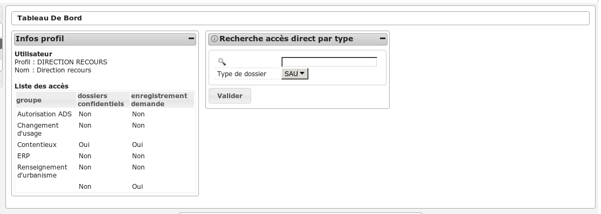

#################
DIRECTION RECOURS
#################

Description
===========

Ce profil permet de consulter les dossiers d'autorisation et les dossiers d'instruction de l'application.

Fonctionnalités disponibles
===========================

Tableau de bord
---------------

Widget *Infos profil*
#####################

- Visualiser les informations du profil de l'utilisateur connecté

Widget *Recherche accès direct*
###############################

- Rechercher un dossier d'instruction par son identifiant

Menu
----

.. image:: menu_dirrec.png

Rubrique *Autorisation*
-----------------------

Dossiers d'autorisation
#######################

- Visualiser la liste des dossiers d'autorisation de la collectivité de l'instructeur connecté.
- Rechercher des dossiers d'autorisation en fonction de plusieurs critères.
- Accéder à la fiche de visualisation du dossier d'autorisation.

  Action(s) disponible(s) par onglet :

  - *Dossier d'autorisation* :

    - Visualiser les lots
    - Visualiser les décisions prises sur les dossiers d'instruction
    - Visualiser les données techniques en cours de validité

  - *Pièce(s)* :

    - Visualiser la liste des pièces du dossier d'autorisation
    - Télécharger le fichier d'une pièce
    - Télécharger toutes les pièces du dossier d'autorisation

  - *Dossiers d'instruction* :

    - visualiser la liste des dossiers d'instruction du dossier d'autorisation
    - accéder à la consultation des dossiers d'instruction
    - accéder au dossier d'instruction dans le sig (si paramétré)

Rubrique *Instruction*
----------------------

Recherche
#########

- Visualiser la liste des dossiers d'instruction de la collectivité de l'instructeur connecté ou de toutes les collectivités si l'instructeur appartient à la collectivité multi.
- Rechercher des dossiers d'instruction en fonction de plusieurs critères.
- Accéder aux dossiers d'instruction dans le sig
- Accéder à la fiche de visualisation d'un dossier d'instruction

.. sidebar:: Note :

    Les actions SIG sont disponibles si celui-ci est paramétré pour la collectivité du dossier d'instruction.

Action(s) disponible(s) par onglet :

  - *DI* :

    - Accéder a la fiche de visualisation des données techniques
    - Accéder au dossier d'instruction dans le SIG
    - Afficher l'édition de récapitulatif du dossier d'instruction

  - *Instruction* :

    - Visualiser la liste des événements d'instruction du dossier d'instruction triées par date d'événement.
    - Accéder à la fiche de visualisation d'un événement d'instruction.
    - Visualiser l'édition de l'événement d'instruction

  - *Consultation(s)* :

    - Visualiser la liste des consultation du dossier d'instruction triées par date d'envoi.
    - Accéder à la fiche de visualisation d'une consultation.
    - Visualiser l'édition d'une consultation.

  - *Commission(s)* :

    - Visualiser la liste des demandes de passage en commission pour le dossier d'instruction courant.
    - Accéder à la fiche de visualisation d'une commission.

  - *Lot(s)* :

    - Visualiser la liste des lots du dossier d'instruction.
    - Accéder à la fiche de visualisation d'un lot.

  - *Message(s)* :

    - Visualiser la liste des messages du dossier d'instruction.
    - Accéder à la fiche de visualisation d'un message.

  - *Bloc-note* :

    - Visualiser la liste des notes du dossier d'instruction.
    - Accéder à la fiche de visualisation d'une note.

  - *Pièce(s)* :

    - Visualiser la liste des pièces du dossier d'instruction.
    - Télécharger le fichier d'une pièce.
    - Télécharger toutes les pièces du dossier d'instruction.

  - *DA* :

    - Visualiser les informations du dossier d'autorisation.
    - Visualiser la liste des dossiers d'instruction portant sur la même autorisation.
    - Visualiser la liste des dossiers d'autorisation liés géographiquement.
    - Accéder à chacun de ces dossiers.

Rubrique *Contentieux*
----------------------

Tous Les Recours
################

Voir :ref:`Tous Les Recours<contentieux_tous_les_recours>` dans la section
contentieux.

Toutes Les Infractions
######################

Voir :ref:`Toutes Les Infractions<contentieux_toutes_les_infractions>` dans la
section contentieux.
