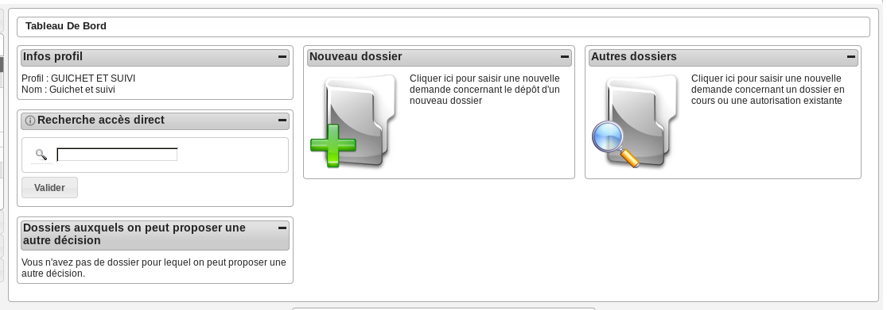
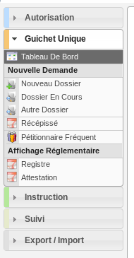

################
GUICHET ET SUIVI
################

Description
===========

Fonctionnalités disponibles
===========================

Tableau de bord
---------------

Widget *Infos profil*
#####################

- Visualiser les informations du profil de l'utilisateur connecté

Widget *Recherche accès direct*
###############################

- Rechercher un dossier d'instruction par son identifiant

Widget *Nouveau dossier*
########################

Widget *Autres dossiers*
########################

Widget *Dossiers auxquels on peut proposer une autre décision*
##############################################################

Menu
----

Rubrique *Autorisation*
-----------------------

Actions identiques à celles du profil instructeur (cf :ref:`Rubrique autorisation<profil_instructeur_rubrique_autorisation>`)

Rubrique *Guichet Unique*
-------------------------

Actions identiques à celles du profil guichet unique (cf :ref:`Rubrique guichet unique<guichet_unique>`)

Rubrique *Instruction*
----------------------

Rubrique *Suivi*
----------------

Rubrique *Export / Import*
--------------------------
