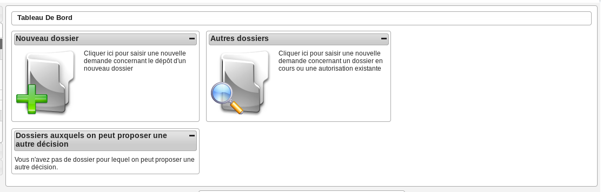
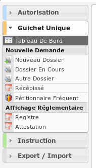

##############
GUICHET UNIQUE
##############

Description
===========

C'est le profil utilisé par les agents chargés de la réception du public, qui vont 
principalement créer les diverses demandes dans openADS. Ce profil va leur permettre :

- de créer des nouvelles demandes
- de consulter les dossiers d'autorisation et d'instruction existants
- d'éditer le récépissé de la demande
- de générer et afficher le registre et l'attestation d'affichage réglementaire
- de consulter et télécharger les pièces numérisées des dossiers.
- d'effectuer des exports de statistiques

Fonctionnalités disponibles
===========================

Tableau de bord
---------------

Widget *Nouveau dossier*
########################

Widget *Autres dossiers*
########################

Menu
----

Rubrique *Autorisation*
-----------------------

*Dossiers d'autorisation*
#########################

**Tableau**

* Visualiser la liste des dossiers d'autorisation

  * triés par leur numéro (alphabétique)
  * filtrés par la collectivité de l'utilisateur

* Ajouter un nouveau dossier d'autorisation
* Recherche simple et avancée d'un dossier d'autorisation
* Accéder à la fiche de visualisation du dossier d'autorisation
    
**Onglets**

* *Pièces*

  * Visualiser la liste des pièces

    * triées par date de création (chronologique), puis par catégorie (alphabétique), puis par nom de fichier (alphabétique)
    * filtrées par le dossier d'autorisation auquel est rattaché la pièce et selon le type de pièce (si option activée)

  * Télécharger le fichier d'une pièce
  * Télécharger toutes les pièces du dossier d'autorisation

* *Dossiers d'instruction*

  * Visualiser la liste des des dossiers d'instruction

    * triés par leur numéro (alphabétique)
    * filtrés par le dossier d'autorisation auquel ils sont rattachés

  * Accéder à la fiche de visualisation du dossier d'instruction
  * Visualiser les lots
  * Visualiser les décisions prises sur les dossiers d’instruction
  * Visualiser les données techniques en cours de validité

.. _profil_guichet_unique_rubrique_guichet_unique:

Rubrique *Guichet Unique*
-------------------------

*Nouveau dossier*
#################

* Ajouter un nouveau dossier d'autorisation
* Récupérer l'addresse de la parcelle (si option activée)
* Saisir le pétitionnaire principal
* Ajouter un pétitionnaire
* Saisir un autre correspondant
* Ajouter un pétitionnaire fréquent
* Recherche un pétitionnaire fréquent
* Accéder à la fiche de visualisation du dossier d'instruction nouvellement créé
* Télécharger le récépissé de la demande

*Dossier en cours*
##################

* Recherche simple et avancée d'un dossier
* Ajouter une nouvelle demande sur un dossier en cours
* Ajouter un pétitionnaire
* Modifier l'adresse du dossier
* Saisir un autre correspondant
* Accéder à la fiche de visualisation du dossier d'instruction sur existant
* Télécharger le récépissé de la demande sur existant

*Autre dossier*
###############

* Recherche simple et avancée d'un dossier
* Ajouter une nouvelle demande sur un dossier en cours
* Ajouter un pétitionnaire
* Modifier l'adresse du dossier
* Saisir un autre correspondant
* Accéder à la fiche de visualisation du dossier d'instruction sur existant
* Télécharger le récépissé de la demande sur existant

*Récépissé*
###########

* Recherche simple et avancée d'un dossier
* Accéder à la fiche de visualisation d'un dossier d'instruction de la liste
* Télécharger le récépissé de la demande

*Pétitionnaire fréquent*
########################

* Recherche d'un pétitionnaire fréquent
* Accéder à la fiche détaillée d'un pétitionnaire fréquent

*Registre*
##########

* Générer et afficher le registre d'affichage réglementaire

*Attestation*
#############

* Générer et afficher l'attestation d'affichage réglementaire

Rubrique *Instruction*
----------------------

*Recherche*
###########

**Tableau**

* Visualiser la liste des dossiers d'instruction
* Recherche simple et avancée d'un dossier d'instruction
* Accéder à la fiche de visualisation du dossier d'instruction

Action(s) disponible(s) par onglet :

  - *DI* :

    - Afficher l'édition de récapitulatif du dossier d'instruction
    - Modifier le dossier d’instruction (l'adresse du terrain et les pétitionnaires tant que le dossier n'est pas instruit)
    - Régénérer le récépissé (tant que le dossier n'est pas instruit)
    - Télécharger le récépissé de la demande

  - *Pièce(s)* :

    - Visualiser la liste des pièces du dossier d'instruction.
    - Télécharger le fichier d'une pièce.
    - Télécharger toutes les pièces du dossier d'instruction.

  - *DA* :

    - Visualiser les informations du dossier d'autorisation.
    - Visualiser la liste des dossiers d'instruction portant sur la même autorisation.
    - Visualiser la liste des dossiers d'autorisation liés géographiquement.
    - Accéder à chacun de ces dossiers.

Rubrique *Export / Import*
--------------------------

*Statistiques à la demande*
###########################

* Exporter une liste de dossiers d'instruction selon leur type, et avec des détails 
  différents selon la requête utilisée.
