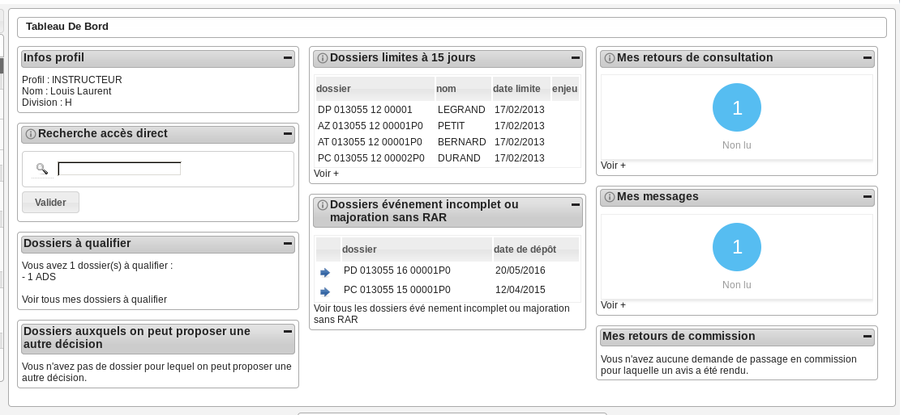
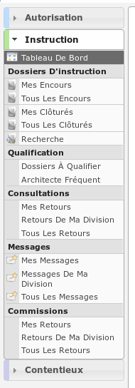

###########
INSTRUCTEUR
###########

Description
===========

C'est le profil utilisé par les instructeurs. Il va leur permettre :

- d'instruire les dossiers d'instruction qui leurs sont affecté.
- d'ajouter des demandes de passage en commission
- de consulter des services
- d'accéder aux dossiers liés

L'utilisateur qui a ce profil doit forcément être rattaché à un instructeur qui
lui est rattaché à une division pour pouvoir visualiser les dossiers qui lui sont
affectés ou affectés aux instructeurs de sa division.

Fonctionnalités disponibles
===========================

Tableau de bord
---------------

Widget *Infos profil*
#####################

- Visualiser les informations du profil de l'utilisateur connecté

Widget *Recherche accès direct*
###############################

- Rechercher un dossier d'instruction par son identifiant

Widget *Dossiers à qualifier*
#############################

- Visualiser la liste des dossiers d'instruction à qualifier qui ne sont pas ERP, affecté à l'utilisateur connecté
- Accéder aux dossiers d'instruction à qualifier qui ne sont pas ERP, affecté à l'utilisateur connecté

Widget *Dossiers limite à 15 jours*
###################################

- Visualiser la liste des dossiers d'instruction affecté à l'utilisateur connecté dont la date limite arrive bientôt à échéance
- Accéder aux dossiers d'instruction affecté à l'utilisateur connecté dont la date limite arrive bientôt à échéance

Widget *Dossiers événement incomplet ou majoration sans RAR*
############################################################

- Visualiser la liste des dossiers d'instruction affecté à l'utilisateur connecté dont l'incomplétude n'a pas été notifié au demandeur
- Accéder aux dossiers d'instruction affecté à l'utilisateur connecté dont l'incomplétude n'a pas été notifié au demandeur

Widget *Mes retours de consultation*
####################################

- Visualiser la liste des consultations des dossiers d'instruction affecté à l'utilisateur dont un avis a été rendu
- Accéder aux consultations des dossiers d'instruction affecté à l'utilisateur dont un avis a été rendu

Widget *Mes messages*
#####################

- Visualiser la liste des messages non lu des dossiers d'instruction affecté à l'utilisateur
- Accéder aux messages non lu des dossiers d'instruction affecté à l'utilisateur

Widget *Mes retours de commission*
##################################

- Visualiser la liste des demandes de passages en commission
- Accéder aux demandes de passages en commission

.. _profil_instructeur_rubrique_autorisation:

Menu
----

Rubrique *Autorisation*
-----------------------

Dossiers d'autorisation
#######################

- Visualiser la liste des dossiers d'autorisation de la collectivité de l'instructeur connecté.
- Accéder à la fiche de visualisation du dossier d'autorisation.

  Action(s) disponible(s) par onglet :

  - *Dossier d'autorisation* :

    - Visualiser les données techniques en cours de validité

  - *Pièce(s)* :

    - Visualiser la liste des pièces du dossier d'autorisation
    - Télécharger le fichier d'une pièce
    - Télécharger toutes les pièces du dossier d'autorisation

  - *Dossiers d'instruction* :

    - visualiser la liste des dossiers d'instruction du dossier d'autorisation
    - accéder à la consultation des dossiers d'instruction
    - accéder au dossier d'instruction dans le sig (si paramétré)

.. _profil_instructeur_rubrique_instruction:

Rubrique *Instruction*
----------------------

Mes encours
###########

- Visualiser la liste des dossiers d'instruction en cours affecté à l'instructeur connecté.

La liste des autres actions est disponible dans la partie `Recherche`_.

Tous les encours
################

- Visualiser la liste des dossiers d'instruction en cours instruits par la division l'instructeur connecté.

La liste des autres actions est disponible dans la partie `Recherche`_.

Mes clôturés
############

- Visualiser la liste des dossiers d'instruction clôturés affecté à l'instructeur connecté.

La liste des autres actions est disponible dans la partie `Recherche`_.

Tous les clôturés
#################

- Visualiser la liste des dossiers d'instruction clôturés instruits par la division l'instructeur connecté.

La liste des autres actions est disponible dans la partie `Recherche`_.

Recherche
#########

- Visualiser la liste des dossiers d'instruction de la collectivité de l'instructeur connecté ou de toutes les collectivités si l'instructeur appartient à la collectivité multi.
- Rechercher des dossiers d'instruction en fonction de plusieurs critères.
- Accéder aux dossiers d'instruction dans le sig
- Accéder à la fiche de visualisation d'un dossier d'instruction

.. sidebar:: Note :

    Les actions SIG sont disponibles si celui-ci est paramétré pour la collectivité du dossier d'instruction.

Action(s) disponible(s) par onglet :

  - *DI* :

    - Modifier le dossier d'instruction
    - Accéder a la fiche de visualisation des données techniques
    - Modifier les données techniques
    - Accéder à l'édition du rapport d'instruction
    - Modifier le rapport d'instruction
    - Visualiser le rapport d'instruction
    - Finaliser le rapport d'instruction
    - Reprendre la rédaction du rapport d'instruction
    - Régénérer le récépissé (tant que le dossier n'est pas instruit)
    - Télécharger le récépissé de la demande
    - Accéder aux actions de géolocalisation
    - Lancer toutes les actions de géolocalisation
    - Vérifier les parcelles
    - Calculer l'emprise
    - Dessiner l'emprise
    - Calculer le centroïde
    - Récupérer les contraintes
    - Accéder au dossier d'instruction dans le SIG
    - Afficher l'édition de récapitulatif du dossier d'instruction
    - Générer la clé d'accès au portail citoyen

  - *Contrainte(s)* :

    - Visualiser la liste des contraintes du dossier d'instruction triées par groupe et sous-groupe.
    - Ajouter une contrainte au dossier d'instruction.
    - Accéder à la fiche de visualisation d'une contrainte.
    - Modifier le texte d'une contrainte.
    - Supprimer une contrainte.

  - *Instruction* :

    - Visualiser la liste des événements d'instruction du dossier d'instruction triées par date d'événement.
    - Ajouter un événement d'instruction au dossier d'instruction.
    - Accéder à la fiche de visualisation d'un événement d'instruction.
    - Modifier un événement d'instruction
    - Visualiser l'édition de l'événement d'instruction
    - Finaliser l'édition de l'événement d'instruction
    - Reprendre la rédaction de l'édition de l'événement d'instruction
    - Ajouter des bibles dans les compléments de l'événement d'instruction

  - *Consultation(s)* :

    - Visualiser la liste des consultation du dossier d'instruction triées par date d'envoi.
    - Ajouter une consultation au dossier d'instruction.
    - Ajouter plusieurs consultations au dossier d'instruction.
    - Accéder à la fiche de visualisation d'une consultation.
    - Modifier le texte d'une consultation.
    - Supprimer une consultation.
    - Visualiser l'édition d'une consultation.
    - Finaliser l'édition d'une consultation.
    - Reprendre la rédaction de l'édition d'une consultation.
    - Marquer comme lu

  - *Commission(s)* :

    - Visualiser la liste des demandes de passage en commission pour le dossier d'instruction courant.
    - Ajouter une demande de passage en commission pour le dossier d'instruction courant.
    - Accéder à la fiche de visualisation d'une commission.
    - Modifier une demande de passage en commission.
    - Supprimer une demande de passage en commission.
    - Marquer la demande de passage en commission comme lu

  - *Lot(s)* :

    - Visualiser la liste des lots du dossier d'instruction.
    - Ajouter un lot au dossier d'instruction.
    - Accéder à la fiche de visualisation d'un lot.
    - Modifier un lot.
    - Supprimer un lot.
    - Éditer les données techniques du lot.
    - Transférer ce lot aux nouveaux demandeurs

  - *Message(s)* :

    - Visualiser la liste des messages du dossier d'instruction.
    - Consulter un message
    - Marquer le message comme lu
    - Marquer le message comme non lu

  - *Bloc-note* :

    - Visualiser la liste des notes du dossier d'instruction.
    - Ajouter une note au dossier d'instruction.
    - Accéder à la fiche de visualisation d'une note.
    - Modifier une note.
    - Supprimer une note.

  - *Pièce(s)* :

    - Visualiser la liste des pièces du dossier d'instruction.
    - Accéder à la fiche de visualisation d'une pièce.
    - Télécharger le fichier d'une pièce.
    - Télécharger toutes les pièces du dossier d'instruction.

  - *DA* :

    - Visualiser les informations du dossier d'autorisation.
    - Visualiser la liste des dossiers d'instruction portant sur la même autorisation.
    - Visualiser la liste des dossiers d'autorisation liés géographiquement.
    - Accéder à chacun de ces dossiers.

Dossier à qualifier
###################

- Visualiser la liste des dossiers d'instruction a qualifier instruits par la division l'instructeur connecté.
- Accéder aux dossiers d'instruction dans le sig

La liste des autres actions est disponible dans la partie `Recherche`_.

Architecte fréquent
###################

- Visualiser la liste des architectes fréquents
- Rechercher un architecte fréquent
- Imprimer la liste des architectes fréquent présents dans la liste
- Consulter un architecte fréquent
- Marquer non fréquent un architecte fréquent
- Modifier un architecte non fréquent
- Supprimer un architecte non fréquent

(Consultation) Mes retours
##########################

- Visualiser la liste des dossiers d'instruction instruits l'instructeur connecté pour lesquels un avis a été rendu et qu'il n'a pas encore été lu.
- Accéder à la fiche de visualisation de la consultation dont l'avis a été rendu dans le contexte du dossier d'instruction.

La liste des autres actions est disponible dans la partie `Recherche`_.

(Consultation) Retours de ma division
#####################################

- Visualiser la liste des dossiers d'instruction instruits par la division de l'instructeur connecté pour lesquels un avis a été rendu et qu'il n'a pas encore été lu.
- Accéder à la fiche de visualisation de la consultation dont l'avis a été rendu dans le contexte du dossier d'instruction.

La liste des autres actions est disponible dans la partie `Recherche`_.

(Consultation) Tous les retours
###############################

- Visualiser la liste des dossiers d'instruction instruits dans la collectivité de l'instructeur connecté (si l'instructeur est affecté à la collectivité de niveau 2 alors la liste contient les DI de toutes les collectivtés) pour lesquels un avis a été rendu et qu'il n'a pas encore été lu.
- Accéder à la fiche de visualisation de la consultation dont l'avis a été rendu dans le contexte du dossier d'instruction.

La liste des autres actions est disponible dans la partie `Recherche`_.

Mes messages
############

- Visualiser la liste des dossiers d'instruction instruits par l'instructeur connecté qui ont des messages non lus.
- Accéder à la fiche de visualisation du message dans le contexte du dossier d'instruction.

Messages de ma division
#######################

- Visualiser la liste des dossiers d'instruction instruits par la division de l'instructeur connecté qui ont des messages non lus.
- Accéder à la fiche de visualisation du message dans le contexte du dossier d'instruction.

Tous les messages
#################

- Visualiser la liste des dossiers d'instruction instruits dans la collectivité de l'instructeur connecté (si l'instructeur est affecté à la collectivité de niveau 2 alors la liste contient les DI de toutes les collectivtés) qui ont des messages non lus.
- Accéder à la fiche de visualisation du message dans le contexte du dossier d'instruction.

(Commission) Mes retours
########################

- Visualiser la liste des dossiers d'instruction instruits par l'instructeur connecté qui ont un retour de commission non lu.
- Accéder à la fiche de visualisation du message dans le contexte du dossier d'instruction.

(Commission) Tous les retours
#############################

- Visualiser la liste des dossiers d'instruction instruits par la division de l'instructeur connecté qui ont un retour de commission non lu.
- Accéder à la fiche de visualisation du message dans le contexte du dossier d'instruction.
