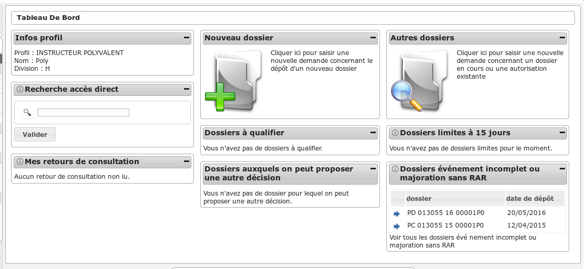
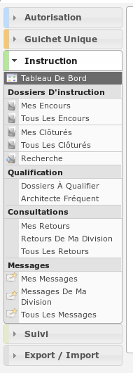

######################
INSTRUCTEUR POLYVALENT
######################

Description
===========

C'est le profil utilisé par les instructeurs des communautés de communes dans le cas d'une utilisation de l'application multi-communes.

Il va leur permettre :

- d'instruire les dossiers d'instruction qui leurs sont affecté.
- d'ajouter des demandes de passage en commission
- de consulter des services
- d'accéder aux dossiers liés

L'utilisateur qui a ce profil doit forcément être rattaché à un instructeur qui
lui est rattaché à une division pour pouvoir visualiser les dossiers qui lui sont
affectés ou affectés aux instructeurs de sa division.
Cet utilisateur doit être liée à la collectivité de la communauté de communes.

Fonctionnalités disponibles
===========================

Tableau de bord
---------------

Widget *Infos profil*
#####################

- Visualiser les informations du profil de l'utilisateur connecté

Widget *Recherche accès direct*
###############################

- Rechercher un dossier d'instruction par son identifiant

Widget *Mes retours de consultation*
####################################

- Visualiser la liste des consultations des dossiers d'instruction affecté à l'utilisateur dont un avis a été rendu
- Accéder aux consultations des dossiers d'instruction affecté à l'utilisateur dont un avis a été rendu

Widget *Nouveau dossier*
########################

Widget *Dossiers à qualifier*
#############################

- Visualiser la liste des dossiers d'instruction à qualifier qui ne sont pas ERP, affecté à l'utilisateur connecté
- Accéder aux dossiers d'instruction à qualifier qui ne sont pas ERP, affecté à l'utilisateur connecté

Widget *Dossiers auxquels on peut proposer une autre décision*
##############################################################

- Visualiser la liste des dossiers d'instruction dont l'utilisateur connecté peut changer la décision
- Accéder aux dossiers d'instruction dont l'utilisateur connecté peut changer la décision

Widget *Autres dossiers*
########################

Widget *Dossiers limite à 15 jours*
###################################

- Visualiser la liste des dossiers d'instruction affecté à l'utilisateur connecté dont la date limite arrive bientôt à échéance
- Accéder aux dossiers d'instruction affecté à l'utilisateur connecté dont la date limite arrive bientôt à échéance

Widget *Dossiers événement incomplet ou majoration sans RAR*
############################################################

- Visualiser la liste des dossiers d'instruction affecté à l'utilisateur connecté dont l'incomplétude n'a pas été notifié au demandeur
- Accéder aux dossiers d'instruction affecté à l'utilisateur connecté dont l'incomplétude n'a pas été notifié au demandeur

Menu
----

Rubrique *Autorisation*
-----------------------

Actions identiques à celles du profil "instructeur" (cf :ref:`Rubrique autorisation<profil_instructeur_rubrique_autorisation>`)

Rubrique *Instruction*
----------------------

Actions identiques à celles du profil "instructeur" (cf :ref:`Rubrique instruction<profil_instructeur_rubrique_instruction>`)

En plus des actions identiques :

  - *DI* :

    - Régénérer le récépissé (tant que le dossier n'est pas instruit)
    - Télécharger le récépissé de la demande

  - *Instruction* :

    - Notifier la commune

Rubrique *Guichet Unique*
-------------------------

Actions identiques à celles du profil "guichet" (cf :ref:`Rubrique guichet unique<profil_guichet_unique_rubrique_guichet_unique>`)

.. _profil_instructeur_polyvalent_rubrique_suivi:

Rubrique *Suivi*
----------------

(Suivi des pièces) Mise à jour des dates
########################################

- Mettre à jour les dates de suivi d'événements d'instruction.
- Visualiser la synthèse des date de suivi d'événements d'instruction.

Envoi lettre RAR
################

- Télécharger au format PDF l'édition des pré-imprimés RAR.

Bordereaux
##########

- Télécharger le bordereau d'envoi des dossiers compris dans un intervalle de dates.

(Demandes d'avis) Mise à jour des dates
#######################################

- Mettre à jour les dates de retour de consultation de service.

Retours de consultation
#######################

- Saisir le retour d'avis du service consulté.

Rubrique *Export / Import*
--------------------------

Actions identiques à celles du profil "suivi" (cf :ref:`Rubrique suivi<profil_suivi_rubrique_export>`)
