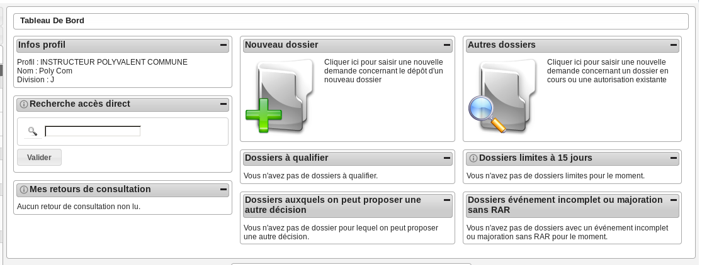
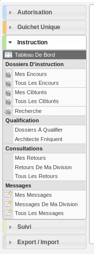

##############################
INSTRUCTEUR POLYVALENT COMMUNE
##############################

Description
===========

C'est le profil utilisé par les instructeurs des communes dans le cas d'une utilisation de l'application multi-communes.

Il va leur permettre :

- d'instruire les dossiers d'instruction qui leurs sont affecté.
- d'ajouter des demandes de passage en commission
- de consulter des services
- d'accéder aux dossiers liés

L'utilisateur qui a ce profil doit forcément être rattaché à un instructeur qui
lui est rattaché à une division pour pouvoir visualiser les dossiers qui lui sont
affectés ou affectés aux instructeurs de sa division.
Cet utilisateur doit être liée à une collectivité administrée par la communauté de communes.

Fonctionnalités disponibles
===========================

Tableau de bord
---------------

Widget *Infos profil*
#####################

- Visualiser les informations du profil de l'utilisateur connecté

Widget *Recherche accès direct*
###############################

- Rechercher un dossier d'instruction par son identifiant

Widget *Mes retours de consultation*
####################################

- Visualiser la liste des consultations des dossiers d'instruction affecté à l'utilisateur dont un avis a été rendu
- Accéder aux consultations des dossiers d'instruction affecté à l'utilisateur dont un avis a été rendu

Widget *Nouveau dossier*
########################

Widget *Dossiers à qualifier*
#############################

- Visualiser la liste des dossiers d'instruction à qualifier qui ne sont pas ERP, affecté à l'utilisateur connecté
- Accéder aux dossiers d'instruction à qualifier qui ne sont pas ERP, affecté à l'utilisateur connecté

Widget *Dossiers auxquels on peut proposer une autre décision*
##############################################################

- Visualiser la liste des dossiers d'instruction dont l'utilisateur connecté peut changer la décision
- Accéder aux dossiers d'instruction dont l'utilisateur connecté peut changer la décision

Widget *Autres dossiers*
########################

Widget *Dossiers limite à 15 jours*
###################################

- Visualiser la liste des dossiers d'instruction affecté à l'utilisateur connecté dont la date limite arrive bientôt à échéance
- Accéder aux dossiers d'instruction affecté à l'utilisateur connecté dont la date limite arrive bientôt à échéance

Widget *Dossiers événement incomplet ou majoration sans RAR*
############################################################

- Visualiser la liste des dossiers d'instruction affecté à l'utilisateur connecté dont l'incomplétude n'a pas été notifié au demandeur
- Accéder aux dossiers d'instruction affecté à l'utilisateur connecté dont l'incomplétude n'a pas été notifié au demandeur

Menu
----

Rubrique *Autorisation*
-----------------------

Actions identiques à celles du profil "instructeur" (cf :ref:`Rubrique autorisation<profil_instructeur_rubrique_autorisation>`)

Rubrique *Instruction*
----------------------

Actions identiques à celles du profil "instructeur" (cf :ref:`Rubrique instruction<profil_instructeur_rubrique_instruction>`)

En plus des actions identiques :

  - *DI* :

    - Régénérer le récépissé (tant que le dossier n'est pas instruit)
    - Télécharger le récépissé de la demande

En plus des actions déjà disponibles sur les dossiers de sa division les instructeurs
peuvent effectuer des action sur les dossiers de leur commune qui ne sont pas affectés à leur division :

  - *DI* :

    - Modifier le dossier d'instruction
    - Accéder a la fiche de visualisation des données techniques
    - Modifier les données techniques
    - Accéder à l'édition du rapport d'instruction
    - Modifier le rapport d'instruction
    - Visualiser le rapport d'instruction
    - Régénérer le récépissé (tant que le dossier n'est pas instruit)
    - Télécharger le récépissé de la demande
    - Accéder aux actions de géolocalisation
    - Lancer toutes les actions de géolocalisation
    - Vérifier les parcelles
    - Calculer l'emprise
    - Dessiner l'emprise
    - Calculer le centroïde
    - Récupérer les contraintes
    - Accéder au dossier d'instruction dans le SIG
    - Afficher l'édition de récapitulatif du dossier d'instruction

  - *Contrainte(s)* :

    - Visualiser la liste des contraintes du dossier d'instruction triées par groupe et sous-groupe.
    - Ajouter une contrainte au dossier d'instruction.
    - Accéder à la fiche de visualisation d'une contrainte.
    - Modifier le texte d'une contrainte.
    - Supprimer une contrainte.

  - *Instruction* :

    - Visualiser la liste des événements d'instruction du dossier d'instruction triées par date d'événement.
    - Ajouter un événement d'instruction au dossier d'instruction dans le cadre d'un changement de décision par le maire de la commune.
    - Accéder à la fiche de visualisation d'un événement d'instruction.
    - Modifier un événement d'instruction ajouté par un instructeur de la commune
    - Visualiser l'édition de l'événement d'instruction
    - Finaliser l'édition de l'événement d'instruction ajouté par un instructeur de la commune
    - Reprendre la rédaction de l'édition de l'événement d'instruction ajouté par un instructeur de la commune

  - *Consultation(s)* :

    - Visualiser la liste des consultation du dossier d'instruction triées par date d'envoi.
    - Ajouter une consultation au dossier d'instruction.
    - Ajouter plusieurs consultations au dossier d'instruction.
    - Accéder à la fiche de visualisation d'une consultation.
    - Modifier le texte d'une consultation.
    - Supprimer une consultation.
    - Visualiser l'édition d'une consultation.
    - Finaliser l'édition d'une consultation.
    - Reprendre la rédaction de l'édition d'une consultation.
    - Marquer comme lu

  - *Commission(s)* :

    - Visualiser la liste des demandes de passage en commission pour le dossier d'instruction courant.

  - *Lot(s)* :

    - Visualiser la liste des lots du dossier d'instruction.

  - *Message(s)* :

    - Visualiser la liste des messages du dossier d'instruction.
    - Visualiser le contenu du message

  - *Bloc-note* :

    - Visualiser la liste des notes du dossier d'instruction.
    - Ajouter une note au dossier d'instruction.
    - Accéder à la fiche de visualisation d'une note.
    - Modifier une note.
    - Supprimer une note.

  - *Pièce(s)* :

    - Visualiser la liste des pièces du dossier d'instruction.
    - Ajouter une pièce au dossier d'instruction.
    - Accéder à la fiche de visualisation d'une pièce.
    - Modifier une pièce.
    - Supprimer une pièce.
    - Télécharger le fichier d'une pièce.
    - Télécharger toutes les pièces du dossier d'instruction.

  - *DA* :

    - Visualiser les informations du dossier d'autorisation.
    - Visualiser la liste des dossiers d'instruction portant sur la même autorisation.
    - Visualiser la liste des dossiers d'autorisation liés géographiquement.
    - Accéder à chacun de ces dossiers.

Rubrique *Guichet Unique*
-------------------------

Actions identiques à celles du profil "guichet" (cf :ref:`Rubrique guichet unique<profil_guichet_unique_rubrique_guichet_unique>`)

Rubrique *Suivi*
----------------

Actions identiques à celles du profil "suivi" (cf :ref:`Rubrique suivi<profil_instructeur_polyvalent_rubrique_suivi>`)

Rubrique *Export / Import*
--------------------------

Actions identiques à celles du profil "suivi" (cf :ref:`Rubrique suivi<profil_suivi_rubrique_export>`)
