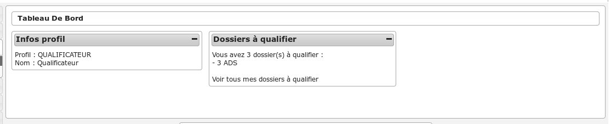
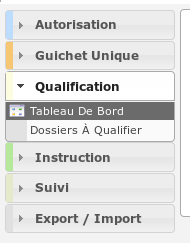

#############
QUALIFICATEUR
#############

Description
===========

C'est le profil utilisé pour les utilisateurs qui valide et complète les dossiers saisis par le profil guichet unique.
Il va leur permettre :

- de saisir une demande
- de compléter un dossier d'instruction

Fonctionnalités disponibles
===========================

Tableau de bord
---------------

Widget *Infos profil*
#####################

- Visualiser les informations du profil de l'utilisateur connecté

Widget *Dossiers à qualifier*
#############################

- Visualiser la liste des dossiers d'instruction à qualifier qui ne sont pas ERP, affecté à l'utilisateur connecté
- Accéder aux dossiers d'instruction à qualifier qui ne sont pas ERP, affecté à l'utilisateur connecté

Menu
----

Rubrique *Autorisation*
-----------------------

Actions identiques à celles du profil instructeur (cf :ref:`Rubrique autorisation<profil_instructeur_rubrique_autorisation>`)

Rubrique *Guichet Unique*
-------------------------

Actions identiques à celles du profil guichet unique (cf :ref:`Rubrique guichet unique<profil_guichet_unique_rubrique_guichet_unique>`)

Rubrique *Qualification*
------------------------

- Visualiser la liste des dossiers d'instruction a qualifier.
- Rechercher des dossiers d'instruction en fonction de plusieurs critères.
- Accéder aux dossiers d'instruction dans le sig.

Action(s) disponible(s) par onglet :

  - *DI* :

    - Modifier le dossier d'instruction
    - Accéder a la fiche de visualisation des données techniques
    - Modifier les données techniques
    - Accéder à l'édition du rapport d'instruction
    - Modifier le rapport d'instruction
    - Visualiser le rapport d'instruction
    - Finaliser le rapport d'instruction
    - Reprendre la rédaction du rapport d'instruction
    - Accéder aux actions de géolocalisation
    - Lancer toutes les actions de géolocalisation
    - Vérifier les parcelles
    - Calculer l'emprise
    - Dessiner l'emprise
    - Calculer le centroïde
    - Récupérer les contraintes
    - Accéder au dossier d'instruction dans le SIG
    - Afficher l'édition de récapitulatif du dossier d'instruction

  - *Contrainte(s)* :

    - Visualiser la liste des contraintes du dossier d'instruction triées par groupe et sous-groupe.
    - Ajouter une contrainte au dossier d'instruction.
    - Accéder à la fiche de visualisation d'une contrainte.
    - Modifier le texte d'une contrainte.
    - Supprimer une contrainte.

  - *Instruction* :

    - Visualiser la liste des événements d'instruction du dossier d'instruction triées par date d'événement.
    - Ajouter un événement d'instruction au dossier d'instruction.
    - Accéder à la fiche de visualisation d'un événement d'instruction.
    - Modifier un événement d'instruction
    - Visualiser l'édition de l'événement d'instruction

  - *Consultation(s)* :

    - Visualiser la liste des consultation du dossier d'instruction triées par date d'envoi.
    - Ajouter une consultation au dossier d'instruction.
    - Ajouter plusieurs consultations au dossier d'instruction.
    - Accéder à la fiche de visualisation d'une consultation.
    - Visualiser l'édition d'une consultation.

  - *Pièce(s)* :

    - Visualiser la liste des pièces du dossier d'instruction.
    - Ajouter une pièce au dossier d'instruction.
    - Accéder à la fiche de visualisation d'une pièce.
    - Modifier une pièce.
    - Supprimer une pièce.
    - Télécharger le fichier d'une pièce.
    - Télécharger toutes les pièces du dossier d'instruction.

  - *DA* :

    - Visualiser les informations du dossier d'autorisation.
    - Visualiser la liste des dossiers d'instruction portant sur la même autorisation.
    - Visualiser la liste des dossiers d'autorisation liés géographiquement.
    - Accéder à chacun de ces dossiers.

*Export / Import*
-----------------

*Statistiques à la demande*
###########################

* Exporter une liste de dossiers d'instruction selon leur type, et avec des détails 
  différents selon la requête utilisée.
