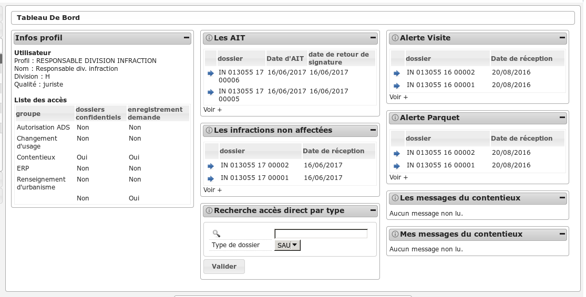
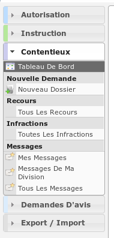

###############################
RESPONSABLE DIVISION INFRACTION
###############################

Description
===========

Ce profil permet à un utilisateur d'instruire les dossiers d'infraction.

Il va leur permettre :

- d'instruire les dossiers d'instruction qui leurs sont affecté.
- d'ajouter des demandes de passage en commission
- de consulter des services
- d'accéder aux dossiers liés
- de répondre directement depuis le logiciel aux consultations de service qui leurs sont adressés ;
- de voir les avis qui avaient été rendus ;
- de faire des exports CSV ;

L'utilisateur qui a ce profil doit forcément être rattaché un instructeur.

Fonctionnalités disponibles
===========================

Tableau de bord
---------------

Widget *Infos profil*
#####################

- Visualiser les informations du profil de l'utilisateur connecté

Widget *Recherche accès direct*
###############################

- Rechercher un dossier d'instruction par son identifiant

Widget *Mes messages*
#####################

- Visualiser la liste des messages non lu des dossiers d'instruction affecté à l'utilisateur
- Accéder aux messages non lu des dossiers d'instruction affecté à l'utilisateur

Widget *Les AIT*
################

- Visualiser la liste des infractions de la collectivité pour lesquelles il y a un AIT signé
- Accéder aux infractions de la collectivité pour lesquelles il y a un AIT signé

Widget *Les infractions non affectées*
######################################

- Visualiser la liste des infractions de la collectivité non affectées
- Accéder aux infractions de la collectivité non affectées

Widget *Alerte visite*
######################

- Visualiser la liste des infractions de la collectivité qui n'ont pas de date de première visite
- Accéder aux infractions de la collectivité qui n'ont pas de date de première visite

Widget *Alerte parquet*
#######################

- Visualiser la liste des infractions de la collectivité qui n'ont pas de date transmission au parquet
- Accéder aux infractions de la collectivité qui n'ont pas de date de transmission au parquet

Menu
----

Rubrique *Autorisation*
-----------------------

Actions identiques à celles du profil "instructeur" (cf :ref:`Rubrique autorisation<profil_instructeur_rubrique_autorisation>`)

Rubrique *Instruction*
----------------------

Actions identiques à celles du profil "instructeur" (cf :ref:`Rubrique instruction<profil_instructeur_rubrique_instruction>`)

Rubrique *Demande D'avis*
-------------------------

Actions identiques à celles du profil "service consulté" (cf :ref:`Rubrique demande d'avis<profil_service_consulte_rubrique_demande_avis>`)

Rubrique *Contentieux*
----------------------

Nouveau Dossier
###############

Voir :ref:`nouveau dossier infraction<contentieux_nouveau_dossier_infraction>`
ou :ref:`nouveau dossier recours<contentieux_nouveau_dossier_recours>` dans la
section contentieux.

Tous Les Recours
################

Voir :ref:`Tous Les Recours<contentieux_tous_les_recours>` dans la section
contentieux.

Toutes Les Infractions
######################

Voir :ref:`Toutes Les Infractions<contentieux_toutes_les_infractions>` dans la
section contentieux.

Mes Messages
############

Voir :ref:`Mes Messages<profil_juriste_mes_messages>` dans le
profil juriste.

Messages De Ma Division
#######################

Voir :ref:`Messages De Ma Division<profil_juriste_messages_division>` dans
le profil juriste.

Tous Les Messages
#################

Voir :ref:`Tous Les Messages<profil_juriste_tous_les_messages>` dans le
profil juriste.
