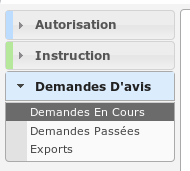

###################
SERVICE CONSULTÉ DI
###################

Description
===========

C'est le profil basé sur :ref:`service consulté interne<profil_service_consulte_interne>` avec quelques droits restreints.

Il va leur permettre :

- de répondre directement depuis le logiciel aux consultations de service qui leurs sont adressés ;
- de voir les avis qui avaient été rendus ;
- de faire des exports CSV ;
- de visualiser les DA sur lesquels ils ont été consultés ;

L'utilisateur qui a ce profil doit forcément être rattaché à un ou plusieurs services pour pouvoir visualiser des dossiers et des demandes d'avis.

Fonctionnalités disponibles
===========================

Tableau de bord
---------------

Tableau de bord innaccessible : redirection automatique vers la liste des demandes d'avis en cours.

Menu
----

Rubrique *Autorisation*
-----------------------

*Dossiers d'autorisation*
#########################

- Visualiser la liste des dossiers d'autorisation de la commune.
- Accéder à la fiche de visualisation du dossier d'autorisation.

  Action(s) disponible(s) par onglet :

  - *Dossier d'autorisation* :

    - Visualiser les données techniques en cours de validité
    - Visualiser les lots
    - Visualiser les décisions prises sur les dossiers d’instruction

Rubrique *Instruction*
----------------------

Recherche
#########

- Visualiser la liste des dossiers d'instruction de la collectivité de l'instructeur connecté ou de toutes les collectivités si l'instructeur appartient à la collectivité multi.
- Rechercher des dossiers d'instruction en fonction de plusieurs critères.
- Accéder aux dossiers d'instruction dans le SIG.
- Accéder à la fiche de visualisation d'un dossier d'instruction.

.. sidebar:: Note :

    Les actions SIG sont disponibles si celui-ci est paramétré pour la collectivité du dossier d'instruction.

Action(s) disponible(s) par onglet :

  - *DI* :

    - Accéder à la fiche de visualisation des données techniques.
    - Accéder au dossier d'instruction dans le SIG.
    - Afficher l'édition de récapitulatif du dossier d'instruction.

  - *DA* (en passant par *Dossiers liés* puis *dossier d'autorisation*) :

    - Visualiser les informations du dossier d'autorisation.
    - Visualiser la liste des dossiers d'instruction portant sur la même autorisation.
    - Visualiser la liste des dossiers d'autorisation liés géographiquement.
    - Accéder aux dossiers d'instruction portant sur la même autorisation dans le SIG
    - Accéder à chacun de ces dossiers.

Rubrique *Demandes D'avis*
--------------------------

*Demandes en cours*
###################

- Visualiser la liste des demandes d'avis en cours sur lesquelles un des services de l'utilisateur a été consulté.
- Télécharger au format CSV la liste des demandes d'avis en cours sur lesquelles un des services de l'utilisateur a été consulté.
- Accéder à la fiche de visualisation d'une demande d'avis en cours sur laquelle un des services de l'utilisateur a été consulté.

  Action(s) disponible(s) par onglet :

  - *Demande d'avis en cours* :

    - Visualiser les informations de la demande d'avis
    - Visualiser les principales caractéristiques du projet
    - Rendre un avis
    - Visualiser la demande d'avis au format PDF
    - Marquer un dossiers
    - Dé-marquer un dossier

*Demandes passées*
##################

- Visualiser la liste des demandes d'avis passées sur lesquelles un des services de l'utilisateur a été consulté.
- Télécharger au format CSV la liste des demandes d'avis passées sur lesquelles un des services de l'utilisateur a été consulté.
- Accéder à la fiche de visualisation d'une demande d'avis passée sur laquelle un des services de l'utilisateur a été consulté.

  Action(s) disponible(s) par onglet :

  - *Demande d'avis passée* :

    - Visualiser les informations de la demande d'avis
    - Visualiser les principales caractéristiques du projet
    - Visualiser les informations du retour d'avis
    - Télécharger le fichier joint au retour d'avis
    - Visualiser la demande d'avis au format PDF

*Exports*
#########

- Visualiser la liste des demandes d'avis sur lesquelles un des services de l'utilisateur a été consulté.
- Télécharger au format CSV la liste des demandes d'avis sur lesquelles un des services de l'utilisateur a été consulté.
- Accéder à la fiche de visualisation d'une demande d'avis sur laquelle un des services de l'utilisateur a été consulté.

  Action(s) disponible(s) par onglet :

  - *Demande d'avis* :

    - Visualiser les informations de la demande d'avis
    - Visualiser les principales caractéristiques du projet
    - Visualiser les informations du retour d'avis
    - Télécharger le fichier joint au retour d'avis
    - Visualiser la demande d'avis au format PDF
