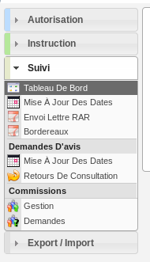

#############
CELLULE SUIVI
#############

Description
===========

C'est le profil utilisé pour le service de suivi. Il va leur permettre :

- d'assurer le suivi des dates et délais des dossiers ;
- de gérer les demandes de passage en commission ;
- de faire des exports CSV ;
- de visualiser les DA ;

Fonctionnalités disponibles
===========================

Tableau de bord
---------------

Aucun widget.

Menu
----

Rubrique *Autorisation*
-----------------------

Dossiers d'autorisation
#######################

Actions identiques à celles du profil instructeur (cf :ref:`Rubrique autorisation<profil_instructeur_rubrique_autorisation>`)

Rubrique *Instruction*
----------------------

Recherche
#########

- Visualiser la liste des dossiers d'instruction de la collectivité de l'instructeur connecté ou de toutes les collectivités si l'instructeur appartient à la collectivité multi.
- Rechercher des dossiers d'instruction en fonction de plusieurs critères.
- Accéder aux dossiers d'instruction dans le sig
- Accéder à la fiche de visualisation d'un dossier d'instruction

.. sidebar:: Note :

    Les actions SIG sont disponibles si celui-ci est paramétré pour la collectivité du dossier d'instruction.

Action(s) disponible(s) par onglet :

  - *DI* :

    - Accéder a la fiche de visualisation des données techniques
    - Afficher l'édition de récapitulatif du dossier d'instruction

  - *Instruction* :

    - Visualiser la liste des événements d'instruction du dossier d'instruction triées par date d'événement.
    - Accéder à la fiche de visualisation d'un événement d'instruction.

  - *Consultation(s)* :

    - Visualiser la liste des consultation du dossier d'instruction triées par date d'envoi.
    - Ajouter une consultation au dossier d'instruction.
    - Ajouter plusieurs consultations au dossier d'instruction.
    - Accéder à la fiche de visualisation d'une consultation.
    - Modifier le texte d'une consultation.
    - Visualiser l'édition d'une consultation.

  - *Commission(s)* :

    - Visualiser la liste des demandes de passage en commission pour le dossier d'instruction courant.
    - Ajouter une demande de passage en commission pour le dossier d'instruction courant.
    - Accéder à la fiche de visualisation d'une commission.
    - Modifier une demande de passage en commission.
    - Supprimer une demande de passage en commission.

  - *Lot(s)* :

    - Visualiser la liste des lots du dossier d'instruction.
    - Accéder à la fiche de visualisation d'un lot.

  - *Bloc-note* :

    - Visualiser la liste des notes du dossier d'instruction.
    - Ajouter une note au dossier d'instruction.
    - Accéder à la fiche de visualisation d'une note.
    - Modifier une note.
    - Supprimer une note.

  - *Pièce(s)* :

    - Visualiser la liste des pièces du dossier d'instruction.
    - Accéder à la fiche de visualisation d'une pièce.
    - Télécharger le fichier d'une pièce.
    - Télécharger toutes les pièces du dossier d'instruction.

  - *DA* :

    - Visualiser les informations du dossier d'autorisation.
    - Visualiser la liste des dossiers d'instruction portant sur la même autorisation.
    - Visualiser la liste des dossiers d'autorisation liés géographiquement.
    - Accéder à chacun de ces dossiers.

.. _profil_suivi_rubrique_suivi:

Rubrique *Suivi*
----------------

(Suivi des pièces) Mise à jour des dates
########################################

- Mettre à jour les dates de suivi d'événements d'instruction.
- Visualiser la synthèse des date de suivi d'événements d'instruction.

Envoi lettre RAR
################

- Télécharger au format PDF l'édition des pré-imprimés RAR.

Bordereaux
##########

- Télécharger le bordereau d'envoi des dossiers compris dans un intervalle de dates.

(Demandes d'avis) Mise à jour des dates
#######################################

- Mettre à jour les dates de retour de consultation de service.

Retours de consultation
#######################

- Saisir le retour d'avis du service consulté.

(Commission) Gestion
####################

- Visualiser la liste des commissions triées par date.
- Ajouter une commission.
- Accéder à la fiche de visualisation d'une commission.
- Modifier une commission.
- Supprimer une commission.
- Diffuser l'ordre du jour.
- Diffuser le compte rendu.
- Télécharger l'édition des propositions d'avis.
- Télécharger l'édition de l'ordre du jour.
- Télécharger l'édition du compte rendu.
- Visualiser la liste des dossiers de la commission.
- Rendre un avis sur un dossier en commission.
- Ajouter et retirer des dossiers de la commission.
- Planifier un dossier en commission.

(Commission) demandes
#####################

- Visualiser la liste des dossiers d'instruction qui ont une demande de passage en commission.

.. _profil_suivi_rubrique_export:

Rubrique *Export / Import*
--------------------------

Export Sitadel
##############

- Générer un export SITADEL des dossiers d'instruction compris dans un intervalle de dates.

Versement aux archives
######################

- Importer automatiquement le numéro de versement aux archives des dossiers depuis un fichier CSV.

Statistiques à la demande
#########################

- Exporter une liste de dossiers d'instruction selon leur type, et avec des détails 
  différents selon la requête utilisée.
