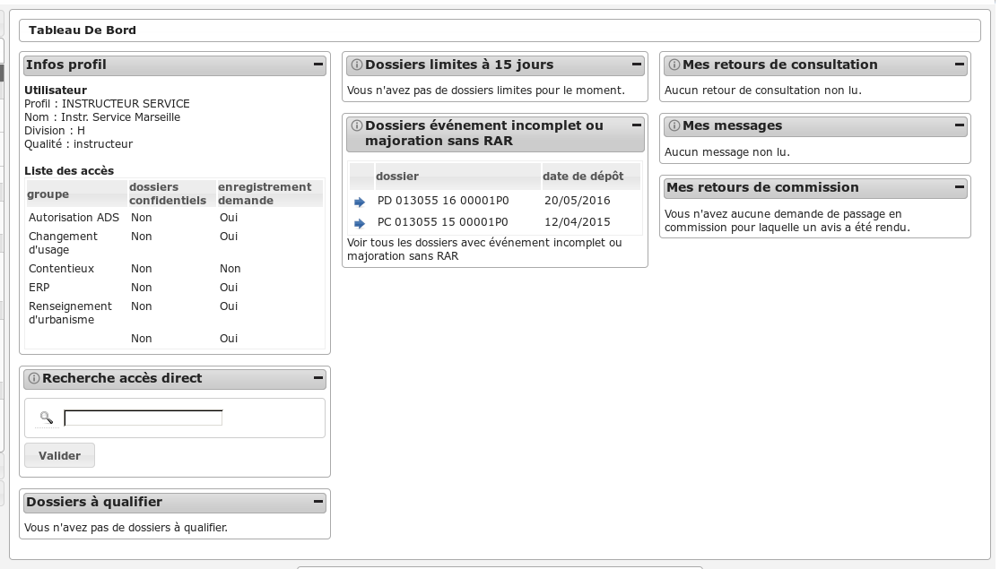
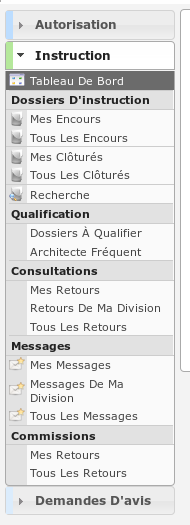

##########
TECHNICIEN
##########

Description
===========

Ce profil permet à un utilisateur d'instruire les dossiers de contentieux de recours.

Il va leur permettre :

- d'instruire les dossiers d'instruction qui leurs sont affecté.
- d'ajouter des demandes de passage en commission
- de consulter des services
- d'accéder aux dossiers liés
- de répondre directement depuis le logiciel aux consultations de service qui leurs sont adressés ;
- de voir les avis qui avaient été rendus ;
- de faire des exports CSV ;

L'utilisateur qui a ce profil doit forcément être rattaché un instructeur.

Fonctionnalités disponibles
===========================

Tableau de bord
---------------

Widget *Infos profil*
#####################

- Visualiser les informations du profil de l'utilisateur connecté

Widget *Nouveau dossier*
########################

- Ajouter un nouveau dossier

Widget *Recherche accès direct*
###############################

- Rechercher un dossier d'instruction par son identifiant

Widget *Mes messages*
#####################

- Visualiser la liste des messages non lu des dossiers d'instruction affecté à l'utilisateur
- Accéder aux messages non lu des dossiers d'instruction affecté à l'utilisateur

Menu
----

Rubrique *Autorisation*
-----------------------

Actions identiques à celles du profil "instructeur" (cf :ref:`Rubrique autorisation<profil_instructeur_rubrique_autorisation>`)

Rubrique *Instruction*
----------------------

Actions identiques à celles du profil "instructeur" (cf :ref:`Rubrique instruction<profil_instructeur_rubrique_instruction>`)

Rubrique *Demande D'avis*
-------------------------

Actions identiques à celles du profil "service consulté" (cf :ref:`Rubrique demande d'avis<profil_service_consulte_rubrique_demande_avis>`)
