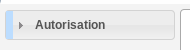

################
VISUALISATION DA
################

Description
===========

Ce profil permet de consulter les dossiers d'autorisation.

Fonctionnalités disponibles
===========================

Tableau de bord
---------------

Aucun widget.

Menu
----

Rubrique *Autorisation*
-----------------------

Dossiers d'autorisation
#######################

- Visualiser la liste des dossiers d'autorisation de la collectivité de l'instructeur connecté.
- Rechercher des dossiers d'autorisation en fonction de plusieurs critères.
- Accéder à la fiche de visualisation du dossier d'autorisation.

  Action(s) disponible(s) par onglet :

  - *Dossier d'autorisation* :

    - Visualiser les lots
    - Visualiser les décisions prises sur les dossiers d'instruction
    - Visualiser les données techniques en cours de validité

  - *Pièce(s)* :

    - Visualiser la liste des pièces du dossier d'autorisation
    - Télécharger le fichier d'une pièce
    - Télécharger toutes les pièces du dossier d'autorisation
