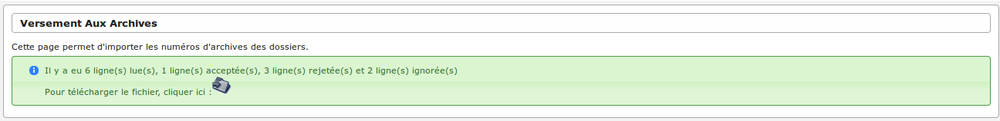

.. _export_import:

###############
Export / Import
###############

.. _export_sitadel:

Export SITADEL
##############

(:menuselection:`Export / Import --> Export SITADEL`)

Ce menu sert à générer un export SITADEL.
Pour cela, il faut choisir une date de début, une date de fin et un numéro d'ordre d'envoi.

Le numéro d'ordre d'envoi est le numéro de version de votre export.

Au préalable à cet export, il faut vérifier deux paramètres (:menuselection:`Administration --> Paramètre`) :

* **region** : le code insee de la région de la commune qui génère l'export
* **commune** : le code insee de la commune, sur trois chiffres, de la commune qui génère l'export

.. _versement_archives:

Versement aux archives
######################

(:menuselection:`Export / Import --> Versement aux archives`)

Cette fonctionnalité permet d'importer automatiquement le numéro de versement
aux archives des dossiers depuis un fichier CSV.

==========================
Les interfaces utilisateur
==========================

Il y a deux interfaces :

Le formulaire de saisie
=======================

Cette interface permet de saisir les informations concernant l'importation des
numéros de versement aux archives des dossiers.

.. image:: versement_archive_formulaire.png

Les informations à saisir sont :

* **insee** : code INSEE à cinq chiffres. Si ce champ est renseigné, seulement
  les dossiers ayant le même code INSEE seront traités,
* **fichier** : fichier csv comportant les données de mis à jour du numéro de
  versement,
* **séparateur** : sélection du caractère utilisé pour la séparation des 
  colonnes dans le fichier csv (';' ou ',').

Le message de résultat
======================

Cette interface permet d'avoir un résumé des actions effectuées par rapport au
fichier csv.

Le message indique :

* le nombre de ligne lue : total des lignes ayant subit un taitement,
* le nombre de ligne acceptée : total des lignes dont la mise à jour a été
  correctement effectuée,
* le nombre de ligne rejetée : total des lignes qui n'ont pas put être traitées
  (voir :ref:`versement_archives_liste_statut_ligne`),
* le nombre de ligne ignorée : total des lignes qui n'ont pas été traitées car 
  le code INSEE renseigné dans le formulaire n'est pas le même que celui de la 
  ligne,
* la possiblité de télécharger le fichier CSV avec le détail pour chaque ligne.

==================
Format des données
==================

.. _versement_archives_format_donnees_entree:

Format des données en entrée
============================

Chaque ligne du fichier CSV en entrée doit respecter le format suivant :
Les champs doivent être séprarés par des ';'.
Le dernier champ de la ligne n'est pas suivi du séparateur ';' mais de la fin de
ligne.

* **Code insee** sur cinq caractères numériques,
* **Année** sur deux caractères,
* **Type du dossier d'autorisation** sur deux caractères alphanumérique
  (Exemple : PC, PA, etc...),
* **Numéro du dossier** sur cinq caractères maximum,
* **Numéro de version** sur deux caractères maximum,
* **Numéro de versement** sur trois ou quatre caractères numériques et suivi de 
  la lettre 'W' (Exemple : 1025W),
* **Numéro d'article** de 1 à 999999999999999.

Exemple de fichier CSV correct en entré :

03185;08;PC;1;0;1025W;111111

03185;08;RU;1;0;1025W;222222

01234;08;AT;1;0;1025W;333333

01234;12;PC;1;0;1025W;444444

Format des données en sortie
============================

Le fichier téléchargeable lors de la fin du traitement est le même CSV qu'en
entrée avec une colonne en plus qui précise le traitement fait sur la ligne.

.. _versement_archives_liste_statut_ligne:

==========================
Liste des statuts de ligne
==========================

Voici la liste des statuts possible pour une ligne du fichier CSV :

* **ligne rejetée : nombre de séparateur incorrect.** Indique que la ligne peut 
  être mal formaté, notamment au niveau du nombre de colonne,
* **ligne rejetée : contenu non conforme.** Indique que certaines données sont 
  non conforme aux spécifications 
  (voir :ref:`versement_archives_format_donnees_entree`),
* **ligne ignorée : code insee différent de celui indiqué dans le formulaire.**,
* **ligne rejetée : dossier inexistant dans l'application.**,
* **ligne acceptée : dossier mis à jour.**,

=====================
Exemple d'utilisation
=====================

Avec comme code INSEE fournis : 01234.

Fichier CSV en entré :

03185;08;PC;1;0;1025W;111111

03185;08;RU;1;0;1025W;222222

01234;08;AT;1;0;1025W;333333

01234;12;PC;1;0;1025W;444444

mmmmmmmjjjjjkkkklllll

aa;aa;aa;aa;aa;aa;aa

Fichier CSV en sortie :

03185;08;PC;1;0;1025W;111111;"ligne ignorée : code insee différent de celui indiqué dans le formulaire."

03185;08;RU;1;0;1025W;222222;"ligne ignorée : code insee différent de celui indiqué dans le formulaire."

01234;08;AT;1;0;1025W;333333;"ligne rejetée : dossier inexistant dans l'application."

01234;12;PC;1;0;1025W;444444;"ligne acceptée : dossier mis à jour."

mmmmmmmjjjjjkkkklllll;"ligne rejetée : nombre de séparateur incorrect."

aa;aa;aa;aa;aa;aa;aa;"ligne rejetée : contenu non conforme."
