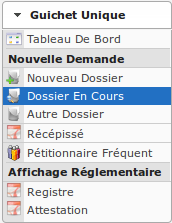
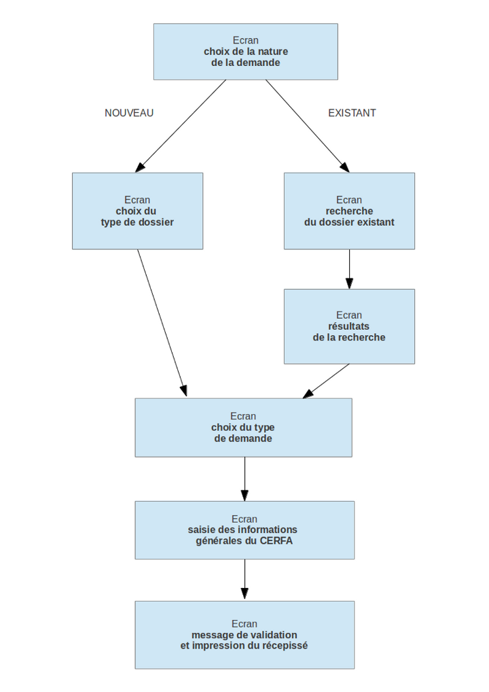
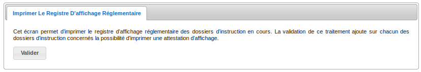
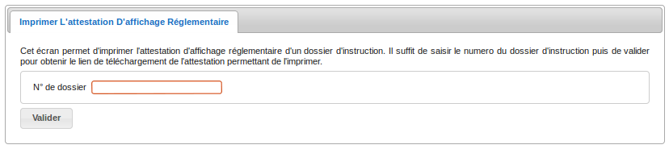

.. _guichet_unique:

##############
Guichet unique
##############

.. _guichet_unique_menu:

Le menu
#######

.. _guichet_unique_nouvelle_demande:

Les nouvelles demandes
######################

==================
Saisir une demande
==================

Une demande peut être de deux natures différentes : elle peut concerner soit un
nouveau dossier ou soit un dossier existant.

.. _guichet_unique_nouvelle_demande_nouveau_dossier:

Pour un nouveau dossier
=======================

(:menuselection:`Guichet Unique --> Nouvelle demande --> Nouveau Dossier`)

La demande va donner lieu à la création d'un nouveau dossier d'autorisation.
La première étape est donc la sélection du type de dossier d'autorisation qui a
été déposé.

.. _guichet_unique_nouvelle_demande_dossier_en_cours:

Pour un dossier en cours
========================

(:menuselection:`Guichet Unique --> Nouvelle demande --> Dossier en cours`)

La demande va se rattacher à un dossier d'autorisation en cours de traitement,
les dossiers affichés sont donc acceptés ou en cours d'instruction.

.. _guichet_unique_nouvelle_demande_autre_dossier:

Pour un autre dossier
=====================

(:menuselection:`Guichet Unique --> Nouvelle demande --> Autre dossier`)

La demande va se rattacher à un dossier d'autorisation existant, peu importe leur 
état. La première étape ici est donc la sélection/recherche du dossier d'instruction 
sur lequel va porter la demande.

Saisie commune (nouveau dossier ou dossier existant) de la nouvelle demande
===========================================================================

Après la sélection du type de la demande, une fenêtre d'aide à la saisie
affichera la liste des documents obligatoires, chaque élément de la liste
devra être coché afin de continuer la saisie (voir :ref:`parametrage_dossiers_demande_type` pour paramétrer cette liste de document).

Le reste de la saisie consiste en la saisie des informations suivantes :

* la date de la demande (:ref:`modifier la date de dépôt <instruction_action_modifier_date>`)
* la ou les références cadastrales
* l'adresse et la superficie du terrain
* le pétitionnaire principal 
* un éventuel délégataire
* le ou les éventuels co-demandeurs

Toutes les informations ne sont pas nécessairement disponibles pour la saisie,
en effet si la saisie concerne un nouveau dossier alors la saisie du
pétitionnaire est nécessaire alors que si la demande concerne un dossier
existant les informations du pétitionnaire sont déjà préremplies et il n'est
donc pas nécessaire de les saisir.

.. _guichet_unique_nouvelle_demande_recepisse:

=====================
Imprimer un récépissé
=====================

(:menuselection:`Guichet Unique --> Nouvelle demande --> Récépissé`)

Lors de la validation de la nouvelle demande, si l'utilisateur n'a pas eu le
temps d'imprimer le récépissé de demande (car il a changé d'écran un peu
rapidement ou pour toute autre raison), cet écran permet de rechercher la
demande qui vient d'être saisie pour en imprimer le récépissé.

Recherche de la demande
=======================

Un listing de toutes les demandes permet de visualiser les informations
principales. Ce listing est trié par défaut par ordre décroissant de date de
demande donc les demandes du jour doivent apparaître en premier.

Visualisation de la demande et édition du récépissé
===================================================

Un écran récapitule les informations saisies lors de la demande et une action
est disponible dans le portlet d'action contextuelle pour permettre d'éditer le
récépissé.

.. _guichet_unique_nouvelle_demande_petitionnaire_frequent:

Le lien du récépissé de la demande ouvre le document depuis le stockage au format PDF.

===================================
Lister les pétitionnaires fréquents
===================================

(:menuselection:`Guichet Unique --> Nouvelle demande --> Pétitionnaire Fréquent`)

Il est possible d'ajouter un pétitionnaire redondant dans la liste des
pétitionnaires fréquents pour éviter de saisir ses informations à chaque nouvelle entrée,
en cochant le champ "Sauvegarder (pétitionnaire fréquent)" avant de valider.

Pour retrouver un pétitionnaire fréquent, il suffit de taper les trois premières 
lettres de son nom ou de son prénom dans les champs adéquats et de cliquer sur
l'îcone de la loupe "Chercher un pétitionnaire".

.. _guichet_unique_affichage_reglementaire:

L'affichage réglementaire
#########################

Dans les conditions prévues par arrêté du ministre chargé de l'urbanisme, un
affichage au public (aussi appelé registre) de tous les dossiers d'instruction
en cours est obligatoire. Le guichet unique doit pouvoir imprimer une
attestation de cet affichage réglementaire pour un dossier d'instruction
particulier à la demande d'un usager.

.. important::

   Pour l'administrateur : l'événement d'instruction créé sur chaque dossier
   qui permet de générer l'attestation d'affichage doit être paramétré, c'est
   l'identifiant de l'événement en question qui doit être paramétré dans
   l'enregistrement 'id_affichage_obligatoire' depuis l'écran 
   :menuselection:`Administration --> Paramètre`. Si le paramétrage ou
   l'événement n'existe pas alors un message prévient l'utilisateur :
   
   .. image:: guichet_unique_affichage_reglementaire_message_erreur_parametrage.png

.. _guichet_unique_affichage_reglementaire_registre:

====================
Imprimer le registre
====================

(:menuselection:`Guichet Unique --> Affichage Réglementaire --> Registre`)

Cet écran permet d'imprimer le registre d'affichage réglementaire des dossiers
d'instruction en cours. La validation de ce traitement ajoute sur chacun des
dossiers d'instruction concernés un événement d'instruction spécifique
(uniquement si c'est la première édition du dossier d'instruction) qui offre la
possibilité d'imprimer une attestation d'affichage.

.. _guichet_unique_affichage_reglementaire_attestation:

======================
Imprimer l'attestation
======================

(:menuselection:`Guichet Unique --> Affichage Réglementaire --> Attestation`)

Cet écran permet d'imprimer l'attestation d'affichage réglementaire d'un dossier
d'instruction. Pour le faire, il suffit de saisir le numéro du dossier
d'instruction dans le formulaire puis de cliquer sur le bouton valider.

Une fois le formulaire validé, trois cas de figure sont possibles :

* soit l'identifiant saisi ne correspond à aucun dossier d'instruction existant :
  
  .. image:: guichet_unique_affichage_reglementaire_attestation_message_dossier_inexistant.png

* soit le dossier d'instruction existe mais ne possède pas d'attestation
  d'affichage :
  
  .. image:: guichet_unique_affichage_reglementaire_attestation_message_dossier_jamais_affiche.png

* soit le dossier d'instruction existe et possède une attestation d'affichage,
  on obtient alors un lien vers le fichier pdf de l'attestation permettant de
  l'imprimer :
  
  .. image:: guichet_unique_affichage_reglementaire_attestation_message_lien_attestation.png

Le lien de l'attestation d'affichage réglementaire d'un dossier d'instruction ouvre le document depuis le stockage au format PDF.
