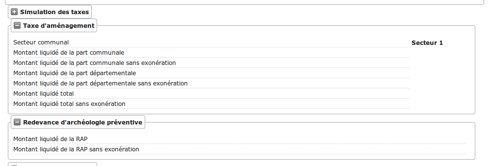
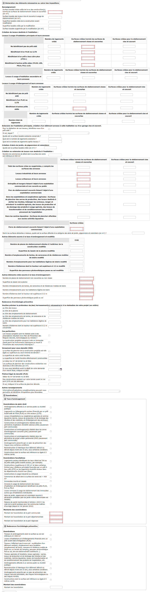
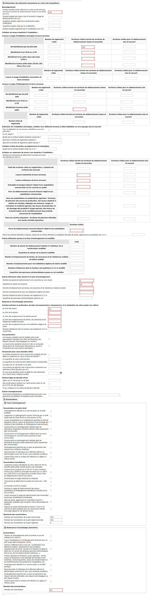
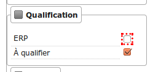

.. _instruction:

###########
Instruction
###########

======================
Dossiers d'instruction
======================

(:menuselection:`Instruction --> Dossiers D'instruction`)

Cette rubrique propose des sous-menus qui ouvrent des tableaux permettant d'accéder
à tout ou une partie (filtre par statut) des dossiers d'instruction :

* les encours de l'utilisateur connecté ;
* tous les encours ;
* les clôturés de l'utilisateur connecté ;
* tous les clôturés ;
* tous les dossiers via *Recherche*.

Visualisation des dossiers d'instruction
========================================

Depuis le fieldset des pétitionnaires :

.. image:: instruction_dossier_instruction_form_petitionnaires_fieldset.png

* si l'option d'accès au portail citoyen détaillée dans :ref:`cette rubrique <parametrage_parametre>` est activée, le champ **clé d'accès au portail citoyen** affiche le code d'accès nécessaire au pétitionnaire pour accèder à la visualisation de son autorisation depuis le portail citoyen.

Représentation des contentieux
==============================

Dans le fieldset **Enjeu** :

.. image:: instruction_dossier_instruction_form_enjeu_fieldset.png

* Le champ **contentieux** indique si au moins un dossier en cours **Infraction** ou **Recours** concerne une ou plusieurs parcelles du dossier.
  Le cas échéant le champ contiendra respectivement **RE** en orange et **IN** en rouge.

.. _instruction_simulation_taxes:

=======================
La simulation des taxes
=======================

Fonctionnement général
======================

La simulation des taxes permet, pour chaque dossier, d'obtenir une estimation :

* du montant de la Taxe d'Aménagement (TA)
* du montant de la Redevance d'Archéologie Préventive (RAP)

Taxe d'Aménagement
##################

La TA est constituée de trois parties : la part communale, la part départementale et la part régionale. Pour chacune d'entre-elles, deux montants sont proposés : 

* le montant de la part liquidé (calcul de base minoré des abattements et des exonérations) ;
* le montant de la part liquidé avant exonération (calcul de base minoré des abattements, exonérations non-appliquées).

Un total des trois parts avec et sans exonération est également proposé.

    .. important:: La part régionale concerne seulement les collectivités se situant en Île-de-France (case à cocher au niveau du :ref:`paramétrage des taxes<parametrage_taxe_amenagement>`).

Redevance d'Archéologie Préventive
##################################

La RAP se fait sur la globalité de l'autorisation et propose seulement deux montants :

* le montant de la part liquidé (calcul de base minoré des abattements et des exonérations) ;
* le montant de la part liquidé avant exonération (calcul de base minoré des abattements, exonérations non-appliquées).

Calcul
######

Le calcul de base et des abattements se fait automatiquement en fonction les valeurs saisies dans les données techniques du dossier d'instruction. 
En renvanche, le calcul des montants des exonérations ne peut pas être automatisé : les montants doivent être saisis manuellement.

Résultats
#########

Les différents montants issus du simulateur sont présentés sous la forme d'une zone *Simulation de taxes* sur la vue de synthèse du DI.

Restrictions
############

La simulation des taxes est possible seulement si les points suivants sont respectés :

* le :ref:`paramétrage des taxes<parametrage_taxe_amenagement>` pour la collectivité du dossier d'instruction doit être complété ;
* le secteur communal du dossier d'instruction doit être sélectionné ;
* le type d'autorisation du dossier d'instruction doit comporter les données techniques nécessaires au calcul des taxes (pour la :ref:`TA<instruction_simulation_taxes_ta>` et pour la :ref:`RAP<instruction_simulation_taxes_rap>`) ;
* l'utilisateur doit avoir la permission de voir ces informations ;
* l'option :ref:`option_simulation_taxes<parametrage_parametre>` doit être activée sur la collectivité du dossier d'instruction ;

Le non-respect de ses points pourra entrainer des résultats vides ou à zéro, l'absence de la zone *Simulation de taxes* sur la vue de synthèse du DI, etc.

Gestion du *Secteur communal*
#############################

Concernant le secteur communal du dossier d'instruction, celui-ci est sélectionné automatiquement à l'ajout d'une demande si la collectivité possède un seul secteur paramétré (il peut y avoir jusqu'à 20 secteurs par collectivité, voir le :ref:`paramétrage des taxes<parametrage_taxe_amenagement>`). Si plusieurs sont paramétrés, chacun d'entre-eux est sélectionnable lors de la modification du dossier d'instruction : il faut alors le choisir manuellement à la modification du DI.

Champs de fusion
################

Des champs de fusion permettant d'utiliser les montants calculés sont disponibles pour être utilisés dans les éditions.

Le détail est disponible dans l'aide à la saise des lettres-type.

    .. important:: Ce sont les montants avec exonération qui sont récupérés comme champ de fusion dans les éditions.

Déclencheurs et mises à jour
############################

Les montants de la simulation de taxe sont calculés automatiquement :

* à la validation des données techniques ;
* lorsque le secteur communal du dossier d'instruction est modifié.

Dans le cas où le calcul ne peut pas se faire, par manque d'information dans les données techniques par exemple, les valeurs des montants seront vides.
Dans le cas où l'option est activée a posteriori, l'existant n'est pas recalculé automatiquement. Une mise à jour par l'un des deux déclencheurs mentionnés précédement devra être effectuée sur les dossiers souhaités.

.. _instruction_simulation_taxes_ta:

La taxe d'aménagement (TA)
==========================

Le simulateur effectue le calcul de base ainsi que les abattements possibles automatiquement. Les exonérations ne sont pas calculées par l'application, il revient à l'utilisateur d'en saisir le montant dans les données techniques.

Source de données pour le calcul de base
########################################

La liste ci-dessous présente les données techniques utilisées pour le calcul de base de la TA :

* **tax_surf_tot_cstr** → Surface taxable totale créée de la ou des construction(s), hormis les surfaces de stationnement closes et couvertes (en m²) ;
* **tax_empl_ten_carav_mobil_nb_cr** → Nombre d’emplacements de tentes, de caravanes et de résidences mobiles de loisirs ;
* **tax_empl_hll_nb_cr** → Nombre d’emplacements pour les habitations légères de loisirs ;
* **tax_sup_bass_pisc_cr** → Superficie du bassin de la piscine ;
* **tax_eol_haut_nb_cr** → Nombre d’éoliennes dont la hauteur est supérieure à 12 m ;
* **tax_pann_volt_sup_cr** → Superficie des panneaux photovoltaïques posés au sol ;
* **tax_am_statio_ext_cr** → Nombre de places de stationnement non couvertes ou non closes.

Abattements
###########

Constructions pour lesquelles un abattement de 50% s'applique sur la valeur forfaitaire :

1. les locaux d'habitation et d'hébergement aidés (hors PLAI ou LLTS) ;
2. les 100 premiers mètres carrés des locaux à usage d'habitation principale ;
3. les locaux à usage industriel et leurs annexes ;
4. les locaux à usage artisanal et leurs annexes ;
5. les entrepôts et hangars non ouverts au public faisant l'objet d'une exploitation commerciale ;
6. les parcs de stationnement couverts faisant l'objet d'une exploitation commerciale.

    .. important:: Les abattements 1 et 2 ne sont pas cumulables d'après l'article L331-12 du code de l'urbanisme (depuis le 1 janvier 2011).

La liste ci-dessous présente les données techniques utilisées pour le calcul des abattements de la TA (pour tous les champs issus d'un tableau, la valeur est récupérée de la colonne *Surfaces créées hormis les surfaces de stationnement closes et couvertes*) :

* **tax_su_princ_surf4** → Tableau "Locaux à usage d’habitation principale et leurs annexes" et ligne "Bénéficiant d'un prêt a taux zéro plus (PTZ+)" ;
* **tax_su_princ_surf3** → Tableau "Locaux à usage d’habitation principale et leurs annexes" et ligne "Bénéficiant d'autres prêts aides (PLUS, LES, PSLA, PLS, LLS)" ;
* **tax_su_heber_surf3** → Tableau "Locaux à usage d’hébergement et leurs annexes" et ligne "Bénéficiant d'autres prêts aidés" ;
* **tax_su_princ_surf1** → Tableau "Locaux à usage d’habitation principale et leurs annexes" et ligne "Ne bénéficiant pas de prêt aidé" ;
* **tax_su_princ_surf2** → Tableau "Locaux à usage d’habitation principale et leurs annexes" et ligne "Bénéficiant d'un PLAI ou LLTS" ;
* **tax_su_non_habit_surf2** → Tableau "Création ou extension de locaux non destinés à l'habitation" et ligne "Locaux industriels et leurs annexes" ;
* **tax_su_non_habit_surf3** → Tableau "Création ou extension de locaux non destinés à l'habitation" et ligne "Locaux artisanaux et leurs annexes" ;
* **tax_su_non_habit_surf4** → Tableau "Création ou extension de locaux non destinés à l'habitation" et ligne "Entrepôts et hangars faisant l'objet d'une exploitation commerciale et non ouverts au public" ;
* **tax_su_parc_statio_expl_comm_surf** → Parcs de stationnement couverts faisant l’objet d’une exploitation commerciale.

    .. important:: Si ces champs ne sont pas renseignés, les abattements ne seront pas pris en compte dans le calcul.

Exonérations
############

La liste ci-dessous présente les données techniques utilisées pour le calcul de l'exonération de la TA :

* **mtn_exo_ta_part_commu** → Montant de l'exonération de la part communale ;
* **mtn_exo_ta_part_depart** → Montant de l'exonération de la part départementale ;
* **mtn_exo_ta_part_reg** → Montant de l'exonération de la part régionale.

Les exonérations de plein droit et facultatives peuvent être sélectionnées depuis les données techniques, mais le sont seulement à caractère informatif.

Identification visuelle sur les formulaires
###########################################

Ces données sont accessibles depuis la zone de champ *Déclaration des éléments nécessaires au calcul des impositions* des données techniques. Les champs identifiés en rouge correspondent aux données présentées ci-dessus.

Formule de calcul
#################

Détail du calcul de base (noté **A**) de la TA (les valeurs forfaitaires sont récupérées depuis le :ref:`paramétrage des taxes<parametrage_taxe_amenagement>`)) ::

	[tax_surf_tot_cstr] * valeur forfaitaire par surface de construction
	+ [tax_empl_ten_carav_mobil_nb_cr] * valeur forfaitaire par emplacement de tente, caravane ou résidence mobile de loisirs
	+ [tax_empl_hll_nb_cr] * valeur forfaitaire par emplacement d'habitation légère de loisirs
	+ [tax_sup_bass_pisc_cr] * valeur forfaitaire par surface de pisicine
	+ [tax_eol_haut_nb_cr] * valeur forfaitaire par éolienne
	+ [tax_pann_volt_sup_cr] * valeur forfaitaire par surface de panneau photovoltaïque
	+ [tax_am_statio_ext_cr] * valeur forfaitaire par parking extérieur

Détail du calcul des abattements à 50% (noté **B**) de la TA ::

	([tax_su_princ_surf4] + [tax_su_princ_surf3] + [tax_su_heber_surf3]) * (valeur forfaitaire par surface de construction / 2)
	+ (SI [tax_su_princ_surf1] + [tax_su_princ_surf2] > 100 ALORS 100 SINON somme des deux champs) * (valeur forfaitaire par surface de construction / 2)
	+ ([tax_su_non_habit_surf2] * (valeur forfaitaire par surface de construction / 2)
	+ [tax_su_non_habit_surf3] * (valeur forfaitaire par surface de construction / 2)
	+ [tax_su_non_habit_surf4] * (valeur forfaitaire par surface de construction / 2)
	+ [tax_su_parc_statio_expl_comm_surf] * (valeur forfaitaire par surface de construction / 2)

Pour chacune des parts (communale, départementale et régionale) deux résultats sont présentés (les taux sont récupérés depuis le :ref:`paramétrage des taxes<parametrage_taxe_amenagement>`)) :

* le premier résultat est ::

	(A - B) * Taux de le part - le montant de l'exonération de la part

* le second résultat affiche le calcul sans l'exonération.

.. _instruction_simulation_taxes_rap:

La redevance d'archéologie préventive (RAP)
===========================================

La même méthode de calcul que celle de la TA est utilisée pour calculer la RAP.

Source de données pour le calcul de base
########################################

La liste ci-dessous présente les données techniques utilisées pour le calcul de base de la RAP :

* **tax_surf_loc_arch** → Profondeur du(des) terrassement(s) au titre des locaux (en mètre) ;
* **tax_surf_tot_cstr** → Surface taxable totale créée de la ou des construction(s), hormis les surfaces de stationnement closes et couvertes (en m²) ;
* **tax_empl_ten_carav_mobil_nb_arch** → Profondeur du(des) terrassement(s) au titre des emplacements de tentes, de caravanes et de résidences mobiles de loisirs (en mètre) ;
* **tax_empl_ten_carav_mobil_nb_cr** → Nombre d’emplacements de tentes, de caravanes et de résidences mobiles de loisirs ;
* **tax_empl_hll_nb_arch** → Profondeur du(des) terrassement(s) au titre des emplacements pour les habitations légères de loisirs (en mètre) ;
* **tax_empl_hll_nb_cr** → Nombre d’emplacements pour les habitations légères de loisirs ;
* **tax_surf_pisc_arch** → Profondeur du(des) terrassement(s) au titre de la piscine (en mètre) ;
* **tax_sup_bass_pisc_cr** → Superficie du bassin de la piscine ;
* **tax_am_statio_ext_arch** → Profondeur du(des) terrassement(s) au titre des emplacements de stationnement (en mètre) ;
* **tax_am_statio_ext_cr** → Nombre de places de stationnement non couvertes ou non closes.

Abattements
###########

Constructions pour lesquelles un abattement à 50% s'applique sur la valeur forfaitaire pour les 100 premiers m² :

1. local d'habitation constituant une résidence principale ;
2. locaux d'habitation et d'hébergement, ainsi que leurs annexes, édifiés à l'aide d'un prêt locatif à usage social (PLUS), un prêt locatif social (PLS) ou un prêt social de location-accession (PSLA) ;
3. constructions abritant des activités économiques.

    .. important:: Les abattements 1 et 2 ne sont pas cumulables.

La liste ci-dessous présente les données techniques utilisées pour le calcul des abattements de la RAP (pour tous les champs issus d'un tableau la valeur est récupérée de la colonne *Surfaces créées hormis les surfaces de stationnement closes et couvertes*) :

* **tax_su_princ_surf4** → Tableau "Locaux à usage d’habitation principale et leurs annexes" et ligne "Bénéficiant d'un prêt a taux zéro plus (PTZ+)" ;
* **tax_su_princ_surf3** → Tableau "Locaux à usage d’habitation principale et leurs annexes" et ligne "Bénéficiant d'autres prêts aides (PLUS, LES, PSLA, PLS, LLS)" ;
* **tax_su_heber_surf3** → Tableau "Locaux à usage d’hébergement et leurs annexes" et ligne "Bénéficiant d'autres prêts aidés" ;
* **tax_su_princ_surf1** → Tableau "Locaux à usage d’habitation principale et leurs annexes" et ligne "Ne bénéficiant pas de prêt aidé" ;
* **tax_su_princ_surf2** → Tableau "Locaux à usage d’habitation principale et leurs annexes" et ligne "Bénéficiant d'un PLAI ou LLTS" ;
* **tax_su_non_habit_surf2** → Tableau "Création ou extension de locaux non destinés à l'habitation" et ligne "Locaux industriels et leurs annexes" ;
* **tax_su_non_habit_surf3** → Tableau "Création ou extension de locaux non destinés à l'habitation" et ligne "Locaux artisanaux et leurs annexes" ;
* **tax_su_non_habit_surf4** → Tableau "Création ou extension de locaux non destinés à l'habitation" et ligne "Entrepôts et hangars faisant l'objet d'une exploitation commerciale et non ouverts au public" ;
* **tax_su_parc_statio_expl_comm_surf** → Parcs de stationnement couverts faisant l’objet d’une exploitation commerciale.

    .. important:: Si ces champs ne sont pas renseignés, les abattements ne seront pas pris en compte dans le calcul.

Exonérations
############

La liste ci-dessous présente les données techniques utilisées pour le calcul de l'exonération de la RAP :

* **mtn_exo_rap** → Montant de l'exonération.

Les exonérations peuvent être sélectionnées depuis les données techniques mais seulement à caractère informatif.

Identification visuelle sur les formulaires
###########################################

Ces données sont accessibles depuis la zone de champ *Déclaration des éléments nécessaires au calcul des impositions* des données techniques. Les champs identifiés en rouge correspondent aux données présentées ci-dessus.

Formule de calcul
#################

Détail du calcul de base (noté **A**) de la RAP (les valeurs forfaitaires sont récupérés depuis le :ref:`paramétrage des taxes<parametrage_taxe_amenagement>`) ::

	SI [tax_surf_loc_arch] > 0.5 ALORS [tax_surf_tot_cstr] * valeur forfaitaire par surface de construction SINON 0
	+ SI [tax_empl_ten_carav_mobil_nb_arch] > 0.5 ALORS [tax_empl_ten_carav_mobil_nb_cr] * valeur forfaitaire par emplacement de tente, caravane ou résidence mobile de loisirs SINON 0
	+ SI [tax_empl_hll_nb_arch] > 0.5 ALORS [tax_empl_hll_nb_cr] * valeur forfaitaire par emplacement d'habitation légère de loisirs SINON 0
	+ SI [tax_surf_pisc_arch] > 0.5 ALORS [tax_sup_bass_pisc_cr] * valeur forfaitaire par surface de pisicine SINON 0
	+ SI [tax_am_statio_ext_arch] > 0.5 ALORS [tax_am_statio_ext_cr] * valeur forfaitaire par parking extérieur SINON 0

Détail du calcul des abattements à 50% (noté **B**) de la RAP, qui ne s'applique que si [tax_empl_ten_carav_mobil_nb_arch] > 0 ::

	(SI [tax_su_princ_surf4] + [tax_su_princ_surf3] + tax_su_heber_surf3 > 100 ALORS 100 SINON somme des trois champs) * (valeur forfaitaire par surface de construction / 2)
	+ (SI [tax_su_princ_surf1] + [tax_su_princ_surf2] > 100 ALORS 100 SINON somme des deux champs) * (valeur forfaitaire par surface de construction / 2)
	+ (SI [tax_su_non_habit_surf2] + [tax_su_non_habit_surf3] + [tax_su_non_habit_surf4] + [tax_su_parc_statio_expl_comm_surf] > 100 ALORS 100 SINON somme des quatre champs) * (valeur forfaitaire par surface de construction / 2)

Deux résultats sont générés (le taux est récupéré depuis le :ref:`paramétrage des taxes<parametrage_taxe_amenagement>`)) :

* le premier résultat est ::

	(A - B) * Taux de le RAP - le montant de l'exonération

* le second résultat affiche le calcul sans l'exonération.

=======
Actions
=======

Régénérer le récépissé
======================
* Disponible si l'utilisateur a un droit spécifique, s'il n'y a qu'un événement d'instruction sur le dossier et qu'il s'agit du récépissé de la demande.
* Régénère l'événement d'instruction du récépissé de la demande et affiche un lien pour le télécharger.

.. _instruction_portlet_rapport_instruction:

Rapport d'instruction
=====================

Le rapport d'instruction est utilisé comme un document de travail par l'instructeur.
Il peut être imprimé à plusieurs étapes de la vie du dossier (présenté à une commission
par exemple).

.. image:: instruction_portlet_rapport_instruction.png

Ce document est composé d'un en-tête avec des informations générales sur le dossier, puis des blocs
de texte et de l'option suivante :

* L'analyse réglementaire : ce champ contient le corps de l'analyse de l'instructeur, il est fait pour être mis à jour tout au long de l'instruction.
* La description du projet : cette zone de texte qui est pré-remplie avec la valeur de la nature des travaux.
* Le complément : ce champ de texte permet d'apporter des informations complémentaires, sous la forme d'un texte libre.
* La proposition de décision : une liste à choix de propositions.

Une fois le rapport enregistré, il est possible de sortir une édition PDF contenant ces informations à partir du modèle de l'état *Rapport d'instruction*.

.. note::
    La valeur par défaut du champ d'analyse réglementaire est définie dans le paramètre **rapport_instruction_analyse_reglementaire**.
    Les options de proposition disponibles sont choisies dans le paramètre **rapport_instruction_proposition_decision**.

.. _instruction_portlet_generate_citizen_access_key:

Générer la clé d'accès au portail citoyen
=========================================

.. image:: instruction_portlet_generate_citizen_access_key.png

Si l'option d'accès au portail citoyen détaillée dans :ref:`cette rubrique <parametrage_parametre>` n'est pas activée lors de la création du dossier, alors celui-ci n'a pas de clé d'accès au portail citoyen.
Cette action permet de générer une clé d'accès, qui permettra au demandeur de suivre l'avancement de sa demande via le portail citoyen.
Pour que l'action soit disponible il faut que le dossier ne soit pas clôturé, et qu'il ait la même division que celle de l'utilisateur si celui-ci est un instructeur.

.. _instruction_portlet_regenerate_citizen_access_key:

Régénérer la clé d'accès au portail citoyen
===========================================

.. image:: instruction_portlet_regenerate_citizen_access_key.png

L'action génère une nouvelle clé d'accès qui écrase l'ancienne, ce qui la rend inutilisable. Cette action n'est disponible que pour les administrateurs et demande une confirmation de la part de l'utilisateur.

=============================
Gestion des pièces du dossier
=============================

Chaque dossier d'instruction peut avoir plusieurs documents numérisés.

Ajouter une pièce
=================

Pour ajouter un document, il faut cliquer sur la mention "+ Ajouter un document".
Seuls les documents au format PDF sont autorisés.

.. image:: piece_form.png

Dans le formulaire qui apparaît tous les champs sont obligatoires :

* **Fichier** : Document au format PDF a stocker.
* **Date de création** : Date de création du document.
* **Type de pièces** : Type du document.

Seulement les types de pièces étant :ref:`paramétrées <parametrage_document_numerise_type>` comme ajoutables par l'instructeur sont visibles dans cette liste pour les profils instructeur.

Si on ajoute plusieurs fois le même type de pièce avec la même date de création, les noms de fichiers seront suffixés par "-1", "-2", etc.
Exemple : pour 3 ajouts de pièces de type **Arrêté retour préfecture** le 14/09/2016, les noms des pièces seront 20160914ART.pdf, 20160914ART-1.pdf, et 20160914ART-2.pdf.

Les documents sont listés dans l'onglet "Pièces" et organisés par date et catégorie.

.. image:: piece_tab.png

Lors du clic sur le nom du document, le document sera ouvert en visualisation PDF.

Pour ouvrir le formulaire de consultation de la pièce, il suffit de cliquer sur la flèche bleue à gauche ou sur le type du document à droite.
Cette action est disponible seulement pour les utilisateurs ayant les droits dans le contexte d'un dossier d'instruction.

Modifier une pièce
==================

Pour modifier la pièce, il faut cliquer sur l'action "modifier" disponible depuis le formulaire de consultation.

La date et le type du document permettant de générer le nom de la pièce, en cas de modification de ceux-ci le nom du document sera régénéré.

Télécharger toutes les pièces
=============================

Il est possible de télécharger l'ensemble des pièces du dossier en cliquant sur le bouton correspondant :

.. image:: bouton_telecharger_archive.png

Après avoir cliqué sur le lien un message de confirmation vous demandera de valider votre téléchargement.
Les documents seront placés dans une archive zip qui sera proposée au téléchargement.

.. image:: lien_telecharger_archive.png

.. note::

    Selon le déploiement de l'application la création de cette archive peut être longue.
    Si le navigateur et fermé ou que l'utilisateur poursuit la navigation, la génération de l'archve se termine mais l'archive ne sera pas proposée au téléchargement.

========================
Événements d'instruction
========================

.. image:: instruction_form_edition.png

Événement
=========

* **événement** : sélection de l'événement d'instruction
* **date d'événement** : date de l'événement (date du jour par défaut)
* **lettre type** : choix de la lettre type affectée à cet événement d'instruction

Dates
=====

Dates de suivi chronologique de l'événement d'instruction.

* **date de finalisation du courrier**
* **date d'envoi pour signature**
* **date d'envoi RAR**
* **date d'envoi au contrôle légalité**
* **signataire** (on peut en sélectionner un par défaut, cf. `Paramétrage --> Organisation --> Signataire Arrêté`)
* **date de retour de signature**
* **date de retour RAR**
* **date de retour du contrôle de légalité**

.. _instruction_complement:

Compléments
===========

Les champs de complément sont composés d'un éditeur riche permettant une mise en
page complexe.

Il est possible d'ajouter des compléments d'informations pour les événements 
d'instruction depuis les blocs "Complément" et "Complément 2".

La plupart des compléments d'informations sont disponibles depuis la bible.

.. image:: instruction_complement_bible.png

Il suffit de choisir l'élément que l'on désire voir apparaître dans le champ 
complément.
En laissant la souris sur le libellé une infobulle affichera le texte qui sera 
affiché.

(Pour plus d'information sur la bible voir :ref:`parametrage_dossiers_bible`.)

Si l'option **consultation** de l'événement est activée lors de son
:ref:`paramétrage<parametrage_dossiers_saisir_evenement>` alors l'action
**automatique** disponible en bas du formulaire va ajouter les consultations
avec leurs avis.

Suppression
===========

Il est possible de supprimer le dernier événement d'instruction créé s'il remplit
ces critères :

 - le dossier d'instruction rattaché n'est pas clôturé
 - l'événement d'instruction n'est pas finalisé
 - les dates suivantes ne sont pas renseignées : envoi pour signature, retour de signature, envoi RAR, re­tour RAR, envoi au contrôle légalité, retour du contrôle légalité
 - l'événement lié n’est pas de type « retour »

 .. _previsualisation_edition:

Prévisualisation de l'édition
=============================

Si le :ref:`paramètre<parametrage_parametre>` **option_previsualisation_edition** est activé pour la collectivité de l'utilisateur connecté, alors celui-ci a accès au rendu du PDF sur le formulaire de modification de l'événement d'instruction. Après avoir modifié un complément on peut regénérer l'édition en cliquant sur *Actualiser*.

============
Finalisation
============

Finalisation des documents de l'instruction
===========================================

Le principe
###########

Pour finaliser l'édition de l'instruction, il faut cliquer sur le lien "Finaliser le document" du portlet d'actions contextuelles de la visualisation.

.. image:: portlet_finaliser.png

Au clic sur le lien de l'édition dans le portlet d'actions contextuelles de la visualisation de l'instruction, le document sera ouvert depuis le stockage au format PDF.

L'instruction n'est plus ni modifiable, ni supprimable.

Il est aussi possible de dé-finaliser le document au clic sur le lien "Reprendre la rédaction du document".

.. image:: instruction_portlet_mise_a_jour_des_dates.png

Lorsque le document est finalisé certaines informations concernant le dossier
lui sont associées lors de l'enregistrement.

Il est aussi possible de dé-finaliser le document au clic sur le lien "Reprendre la rédaction du document".

Le clic sur le lien de l'édition dans le portlet d'actions contextuelles de la visualisation de l'instruction ouvrira le document généré à la volée au format PDF.

L'instruction est à nouveau modifiable et supprimable.

La mise à jour des dates de suivi depuis l'instruction
######################################################

Les dates de suivi n'étant pas affichées dans le document PDF de l'instruction, elles sont modifiables une fois l'instruction finalisée. Il faut pour cela cliquer sur le bouton du portlet d'actions contextuelles "Suivi des dates".

.. image:: instruction_portlet_mise_a_jour_des_dates.png

On arrive alors sur la page suivante où seules les dates de suivi sont modifiables.

.. image:: maj_date_instruction.png

.. note::

  Pour avoir accès à cette action il faut que le dossier ne soit pas clôturé et :
   - si on est instructeur, soit être celui du dossier ou tout au moins de sa division, soit être un instructeur polyvalent de la commune du dossier dont l'instruction a été déléguée à la communauté ;
   - sinon être soit de la communauté (par exemple un administrateur), soit de la commune du dossier (par exemple le profil *GUICHET SUIVI*).

Finalisation des documents du rapport d'instruction
===================================================

Pour finaliser l'édition du rapport d'instruction, il faut cliquer sur le lien "Finaliser le document" du portlet d'actions contextuelles de la visualisation.

.. image:: portlet_finaliser.png

Lorsque le document est finalisé certaines informations concernant le dossier
lui sont associées lors de l'enregistrement.

Au clic sur le lien de l'édition dans le portlet d'actions contextuelles de la visualisation du rapport d'instruction, le document sera ouvert depuis le stockage au format PDF.

Le rapport d'instruction n'est plus ni modifiable, ni supprimable.

Il est aussi possible de dé-finaliser le document en cliquant sur le lien "Reprendre la rédaction du document".

.. image:: portlet_definaliser.png

Le clic sur le lien de l'édition dans le portlet d'actions contextuelles de la visualisation du rapport d'instruction ouvrira le document généré à la volée au format PDF.

Le rapport d'instruction est à nouveau modifiable et supprimable.

Finalisation des documents de la consultation
=============================================

Pour finaliser l'édition de la consultation, il faut cliquer sur le lien "Finaliser le document" du portlet d'actions contextuelles de la visualisation.

.. image:: portlet_finaliser_consultation.png

Lorsque le document est finalisé certaines informations concernant le dossier
lui sont associées lors de l'enregistrement.

Au clic sur le lien de l'édition dans le portlet d'actions contextuelles de la visualisation 
de la consultation, le document sera ouvert depuis le stockage au format PDF.

La consultation n'est plus supprimable.

Il est aussi possible de dé-finaliser le document en cliquant sur le lien "Reprendre la rédaction du document".

.. image:: portlet_definaliser.png

Le clic sur le lien de l'édition dans le portlet d'actions contextuelles de la visualisation 
de la consultation ouvrira le document généré à la volée au format PDF.

La consultation est à nouveau supprimable.

Notifier la commune par courriel
================================

Un événement d'instruction est notifiable par courriel aux communes.

.. image:: notifier_commune.png

Les quatre conditions suivantes doivent être satisfaites pour rendre l'action disponible :

* :ref:`paramétrage <parametrage_parametre>` renseigné ;
* événement d'instruction finalisé ;
* être rattaché à la communauté de communes ;
* disposer du profil instructeur polyvalent ou administrateur général.

.. _instruction_dossier_contrainte:

=============================
Contraintes liées au dossier
=============================

Des contraintes (ou risques) peuvent être ajoutées à un dossier.

.. _instruction_dossier_contrainte_view:

Visualisation des contraintes liées au dossier
===============================================

Les contraintes affichées dans le tableau de données sont groupées par groupe et
sous-groupe et sont classées par le numéro d'ordre d'affichage.

Chaque contrainte possède un bouton raccourci pour ouvrir le formulaire en 
modification et un autre en mode suppression.
Seulement le champ **texte complété** est modifiable.

.. image:: instruction_dossier_contrainte_view.png

.. _instruction_dossier_contrainte_add_man:

Ajouter des contraintes manuellement
====================================

En cliquant sur le bouton **Ajouter des contraintes**, un formulaire présentant
toutes les contraintes de l'application apparaît.

Les contraintes sont triées comme dans le tableau de données, par groupe, sous-groupe et par ordre d'affichage. Par défaut chaque groupe et sous-groupe est
replié.

Il suffit de cliquer sur un contrainte pour la sélectionner et de valider le
formulaire pour que celle-ci soit ajoutée au dossier. Un message de validation 
apparait.

.. image:: instruction_dossier_contrainte_form.png

.. image:: instruction_dossier_contrainte_form_valide.png

Les contraintes peuvent aussi être récupérées automatiquement à partir d'un SIG si
celui-ci est configuré, (voir :ref:`instruction_geolocalisation` ).

===========
Commissions
===========

L'onglet **Commission(s)** permet de lister et consulter les demandes de passage en commissions.

Si on est instructeur d'une collectivité de niveau mono, seuls les types de commissions rattachés à notre collectivité sont affichés.

Si on est instructeur d'une collectivité de niveau multi, tous les types de commissions sont affichés.

====
Lots
====

L'onglet **Lot(s)** permet de lister et consulter tous les lots du dossier d'instruction. Ces lots sont créés manuellement pas l'instructeur sur un permis valant division.
La gestion des lots permet lors d'une demande de transfert partiel d'affecter le ou les pétitionnaire à un ou plusieurs lots.

L'instructeur du dossier peut :

- ajouter des lots
- modifier des lots
- supprimer des lots
- éditer les données techniques des lots
- tranférer le ou les pétitionnaire à un ou plusieurs lots

.. _instruction_dossier_message:

========
Messages
========

.. image:: instruction_dossier_message_tab.png

L'onglet **Message(s)** permet de lister et consulter tous les messages du dossier.

Les messages sont automatiquement ajoutés suite à des actions spécifiques, comme par exemple l'ajout de pièce numérisée, à condition que l'option :ref:`'option_notification_piece_numerisee' <parametrage_parametre>` soit activée.
Lorsqu'une action notifiée est réalisée par un utilisateur différent de l'instructeur du dossier, alors le message de notification sera destiné à l'instructeur.
Si cette action est réalisée par l'instructeur du dossier et que celui-ci fait partie de la même collectivité que celle du dossier, alors il n'y a pas besoin de message de notification.
Dernier cas, si l'action est réalisée par l'instructeur du dossier et celui-ci n'est pas de la même collectivité que celle du dossier, alors le message de notification sera destinée à la collectivité du dossier.
Pour éviter de multiplier les notifications, ne seront pas ajoutés les messages traitant d'une même action à la même date et dont le destinataire est identique à un message déjà existant et non lu.

Une action disponible depuis son formulaire de consultation permet de le marquer comme lu :

.. image:: instruction_dossier_message_form.png

Les messages marqués comme 'non lu' sont listés dans les tableaux du menu *Instruction* > *Messages* :

* *Mes Messages*
* *Messages De Ma Division*
* *Tous Les Messages*

Un clic sur une ligne de résultat redirige directement vers le message non lu dans le contexte du dossier d'instruction.

.. note::

  Certains messages sont susceptibles d'être accompagnés d'une édition. Lorsque c'est le cas une action spécifique est disponible depuis le portlet d'actions contextuelles. Ci-après leur liste avec leur message correspondant :

  * *Accusé de réception* pour :ref:`[213](Échange ERP → ADS) Dossier PC Accusé de réception de consultation officielle<echange_erp_ads_213>`.

=============
Dossiers liés
=============

.. image:: instruction_dossiers_lies.png

L'onglet **Dossiers liés** permet d'obtenir tous les dossiers liés au dossier d'instruction courant.
Il existe quatre types de liaisons entre les dossiers pour quatre listings différents. Dans l'ordre :

    * dossier d'autorisation ;
    * dossiers d'instruction liés manuellement ou implicitement par le dossier d'autorisation ;
    * dossiers sur lesquels un lien vers le dossier courant a été établi ;
    * dossiers d'autorisation liés géographiquement, c'est-à-dire ayant au moins une parcelle commune.

.. note::
    Des dossiers auxquels vous n'avez pas accès sont susceptibles d'apparaître à titre indicatif dans les différents listings. Si vous essayez de les consulter en cliquant dessus alors vous rencontrerez une erreur de droits insuffisants.

Il est possible depuis l'action d'ajout "+" dans le tableau des dossiers d'instruction liés, d'ajouter des liaisons avec d'autres dossiers d'instruction.
Il n'est pas possible de lier le dossier d'instruction courant deux fois à un même DI ou de le lier manuellement à un DI déjà lié implicitement par le dossier d'autorisation.

.. image:: instruction_dossiers_lies_form_ajout.png

Les liaisons manuelles peuvent être supprimées seulement depuis le tableau **Dossiers liés** grâce à l'action de suppression "X" disponible sur chaque ligne. Par la même occasion, le dossier courant n'apparaîtra plus dans le tableau des liaisons retour du dossier pour lequel on a supprimé la liaison.
Les liaisons retours ne peuvent pas être supprimées depuis le dossier cible. Il faut le faire depuis le dossier source.

.. note::
    Dans le cas des recours (contentieux), il existe une notion de liaison principale avec un dossier d'instruction.
    Cette liaison n'est modifiable que par les profils ayant une permission spécifique.

.. _instruction_geolocalisation:

==================
La géolocalisation
==================

L'action Géolocalisation est disponible seulement pour les communes paramétrées. Elle 
permet, pour les dossiers qui ont des références cadastrales renseignées, de récupérer des
données géographiques à partir du SIG paramétré.

Pour ouvrir l'overlay de géolocalisation, cliquer sur le bouton "Géolocalisation" sur
l'onglet principal du DI.

.. image:: instruction_portlet_geolocalisation.png

L'overlay de géolocalisation est le suivant.

.. image:: instruction_geolocalisation_view.png

Vérifier les parcelles
======================

Cette action permet de vérifier si les parcelles définies dans le dossier existent au
niveau du SIG. Cette étape est nécessaire a l'exécution des autres traitements.

Calculer l'emprise
==================

L'emprise est le total de la surface des parcelles. Le calcul de l'emprise est requis pour
pouvoir calculer le centroïde des parcelles.

Dessiner l'emprise
==================

Dans le cas où le calcul de l'emprise a échoué du côté du SIG, cette action permet d'être
redirigé sur le SIG, sur lequel il est alors possible de dessiner l'emprise à la main.

Calculer le centroïde
=====================

Le centroïde est le point représentatif de l'emprise calculée précedement. Il est ensuite
récupéré et stocké dans le dossier d'instruction.

Récupérer les contraintes
=========================

Cette action permet de récupérer les contraintes du SIG qui sont applicables aux parcelles
du dossier. Ces contraintes peuvent appartenir à la communauté de communes aussi bien qu'à
la commune.

L'action "J'ai de la chance"
============================

Ce bouton permet un lancement automatique, à la chaine, de toutes les actions de
géolocalisation d'un dossier décrites précedement. Il permet de gagner du temps.

=============
Consultations
=============

.. image:: instruction_dossier_consultation_tab.png

L'onglet **Consultation(s)** permet de lister et consulter toutes les consultations du dossier
d'instruction. Les consultations de type *pour conformité* sont surlignées en jaune.

Modifier la visibilité d'une consultation dans les éditions
===========================================================

Il est possible de masquer une consultation dans les éditions qui y font référence,
comme le *Récapitulatif du dossier* ou le *Rapport d'instruction*.

Depuis le portlet d'actions contextuelles
#########################################

Pour masquer une consultation depuis le portlet d'actions contextuelles
il faut cliquer sur l'action *Masquer dans les éditions*.

.. image:: portlet_masquer_consultation.png

La consultation n’apparaîtra plus dans les éditions qui affichent leur liste.
Pour l'afficher à nouveau cliquer sur l'action *Afficher dans les éditions*.

.. image:: portlet_visible_consultation.png

Ces actions ne sont pas disponibles sur les dossiers d'instruction clôturés ou si l'utilisateur connecté ne fait pas partie de la division du dossier. Ces deux conditions peuvent être exclues grâce à une permission spécifique.

Depuis la liste de consultations
################################

Depuis le listing des consultations, il est possible de modifier la visibilité
des consultations dans les éditions.

Si la consultation est visible, cliquer sur l'icône en forme d'oeil rouge permet de la masquer.

.. image:: instruction_tab_masquer_consultation.png

Si la consultation est masquée, cliquer sur l'icône en forme d'oeil vert permet de la rendre visible.

.. image:: instruction_tab_visible_consultation.png

Ces actions ne sont pas disponibles sur les dossiers d'instruction clôturés ou si l'utilisateur connecté ne fait pas partie de la division du dossier. Ces deux conditions peuvent être exclues grâce à une permission spécifique.

.. _instruction_qualification:

================
La qualification
================

La qualification d'un dossier d'instruction se fait depuis son formulaire de modification.

La qualification en ERP
=======================

Pour indiquer un dossier d'instruction comme concernant un **ERP**, il faut cocher la case *ERP* dans l'encadré *Qualification* du formulaire.

Lors de la validation du formulaire, toutes les pièces numérisées et générées liées au dossier d'instruction auront leur métadonnée *concerneERP* modifiée. À condition que le connecteur du système de stockage soit configuré pour effectuer cette action.
