.. _instruction:

###########
Instruction
###########

======================
Dossiers d'instruction
======================

(:menuselection:`Instruction --> Dossiers D'instruction`)

Cette rubrique propose des sous-menus qui ouvrent des tableaux permettant d'accéder
à tout ou une partie (filtre par statut) des dossiers d'instruction :

* les encours de l'utilisateur connecté ;
* tous les encours ;
* les clôturés de l'utilisateur connecté ;
* tous les clôturés ;
* tous les dossiers via *Recherche*.

Visualisation des dossiers d'instruction
========================================

Depuis le fieldset des pétitionnaires :

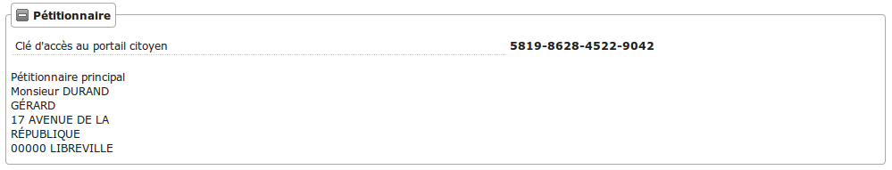

* si l'option d'accès au portail citoyen détaillée dans :ref:`cette rubrique <parametrage_parametre>` est activée, le champ **clé d'accès au portail citoyen** affiche le code d'accès nécessaire au pétitionnaire pour accèder à la visualisation de son autorisation depuis le portail citoyen.

Représentation des contentieux
==============================

Dans le fieldset **Enjeu** :

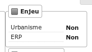

* Il y a un champ **contentieux** pour spécifier si au moins un dossier **Infraction**, ou au moins un dossier **Recours Contentieux** est déposé pour une ou plusieurs parcelles du dossier, le champs contiendra respectivement INF en rouge ou RE en bleu seront affichés.

La taxe d'aménagement
=====================

Dans le cadre de la taxe d'aménagement il y a :

* le secteur communal ; il est sélectionné automatiquement à l'ajout d'une demande si la collectivité en question a un seul secteur de paramétré (il peut y avoir jusqu'à 20 secteurs par collectivité) sinon, s'il y a en a plusieurs, il faut le choisir manuellement dans le dossier d'instruction ;
* le montant liquidé de la part communale ;
* le montant liquidé de la part départementale ;
* le montant liquidé de la part régionale (seulement si la collectivité se situe en Île-de-France) ;
* le montant liquidé total.

Tous les montants sont calculés automatiquement à la validation des données techniques, ou lorsque le secteur communal du dossier d'instruction est modifié.

    .. important:: Le paramétrage sur la taxe d'aménagement doit être fait pour que les informations concernant celle-ci s'affiche sur le dossier (:ref:`parametrage_taxe_amenagement`), le cerfa du dossier d'instruction doit aussi avoir les champs nécessaires à la simulation.

=======
Actions
=======

Régénérer le récépissé
======================
* Disponible si l'utilisateur a un droit spécifique, s'il n'y a qu'un événement d'instruction sur le dossier et qu'il s'agit du récépissé de la demande.
* Régénère l'événement d'instruction du récépissé de la demande et affiche un lien pour le télécharger.

.. _instruction_portlet_rapport_instruction:

Rapport d'instruction
=====================

Le rapport d'instruction est utilisé comme un document de travail par l'instructeur.
Il peut être imprimé à plusieurs étapes de la vie du dossier (présenté à une commission
par exemple).

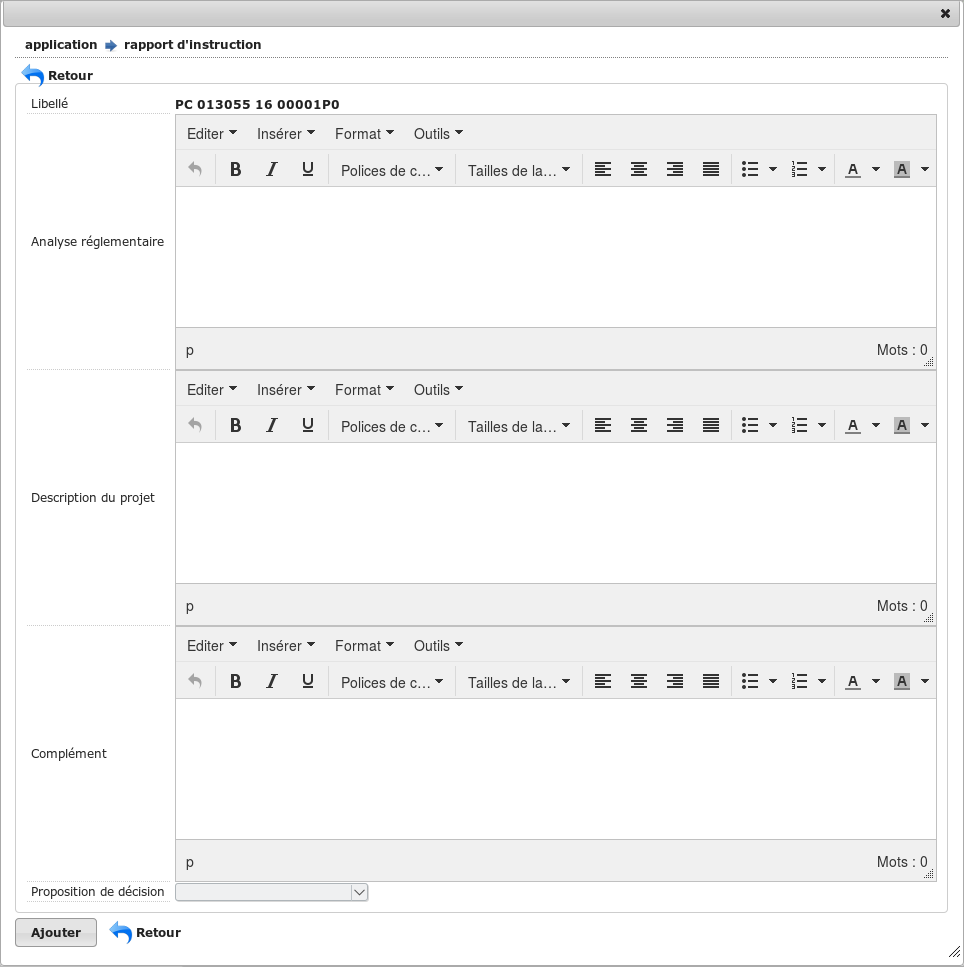

Ce document est composé d'un en-tête avec des informations générales sur le dossier, puis des blocs
de texte et de l'option suivante :

* L'analyse réglementaire : ce champ contient le corps de l'analyse de l'instructeur, il est fait pour être mis à jour tout au long de l'instruction.
* La description du projet : cette zone de texte qui est pré-remplie avec la valeur de la nature des travaux.
* Le complément : ce champ de texte permet d'apporter des informations complémentaires, sous la forme d'un texte libre.
* La proposition de décision : une liste à choix de propositions.

Une fois le rapport enregistré, il est possible de sortir une édition PDF contenant ces informations à partir du modèle de l'état *Rapport d'instruction*.

.. note::
    La valeur par défaut du champ d'analyse réglementaire est définie dans le paramètre **rapport_instruction_analyse_reglementaire**.
    Les options de proposition disponibles sont choisies dans le paramètre **rapport_instruction_proposition_decision**.

.. _instruction_portlet_generate_citizen_access_key:

Générer la clé d'accès au portail citoyen
=========================================

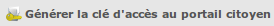

Si l'option d'accès au portail citoyen détaillée dans :ref:`cette rubrique <parametrage_parametre>` n'est pas activée lors de la création du dossier, alors celui-ci n'a pas de clé d'accès au portail citoyen.
Cette action permet de générer une clé d'accès, qui permettra au demandeur de suivre l'avancement de sa demande via le portail citoyen.
Pour que l'action soit disponible il faut que le dossier ne soit pas clôturé, et qu'il ait la même division que celle de l'utilisateur si celui-ci est un instructeur.

.. _instruction_portlet_regenerate_citizen_access_key:

Régénérer la clé d'accès au portail citoyen
===========================================

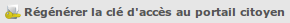

L'action génère une nouvelle clé d'accès qui écrase l'ancienne, ce qui la rend inutilisable. Cette action n'est disponible que pour les administrateurs et demande une confirmation de la part de l'utilisateur.

=============================
Gestion des pièces du dossier
=============================

Chaque dossier d'instruction peut avoir plusieurs documents numérisés.

Ajouter une pièce
=================

Pour ajouter un document, il faut cliquer sur la mention "+ Ajouter un document".
Seuls les documents au format PDF sont autorisés.

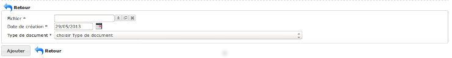

Dans le formulaire qui apparaît tous les champs sont obligatoires :

* **Fichier** : Document au format PDF a stocker.
* **Date de création** : Date de création du document.
* **Type de pièces** : Type du document.

Seulement les types de pièces étant :ref:`paramétrées <parametrage_document_numerise_type>` comme ajoutables par l'instructeur sont visibles dans cette liste pour les profils instructeur.

Si on ajoute plusieurs fois le même type de pièce avec la même date de création, les noms de fichiers seront suffixés par "-1", "-2", etc.
Exemple : pour 3 ajouts de pièces de type **Arrêté retour préfecture** le 14/09/2016, les noms des pièces seront 20160914ART.pdf, 20160914ART-1.pdf, et 20160914ART-2.pdf.

Les documents sont listés dans l'onglet "Pièces" et organisés par date et catégorie.

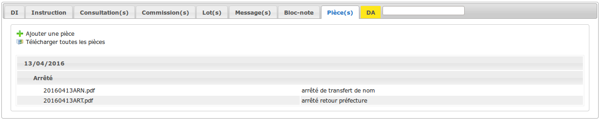

Lors du clic sur le nom du document, le document sera ouvert en visualisation PDF.

Pour ouvrir le formulaire de consultation de la pièce, il suffit de cliquer sur la flèche bleue à gauche ou sur le type du document à droite.
Cette action est disponible seulement pour les utilisateurs ayant les droits dans le contexte d'un dossier d'instruction.

Modifier une pièce
==================

Pour modifier la pièce, il faut cliquer sur l'action "modifier" disponible depuis le formulaire de consultation.

La date et le type du document permettant de générer le nom de la pièce, en cas de modification de ceux-ci le nom du document sera régénéré.

Télécharger toutes les pièces
=============================

Il est possible de télécharger l'ensemble des pièces du dossier en cliquant sur le bouton correspondant :

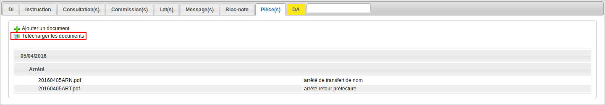

Après avoir cliqué sur le lien un message de confirmation vous demandera de valider votre téléchargement.
Les documents seront placés dans une archive zip qui sera proposée au téléchargement.

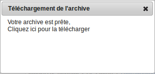

.. note::

    Selon le déploiement de l'application la création de cette archive peut être longue.
    Si le navigateur et fermé ou que l'utilisateur poursuit la navigation, la génération de l'archve se termine mais l'archive ne sera pas proposée au téléchargement.

========================
Événements d'instruction
========================

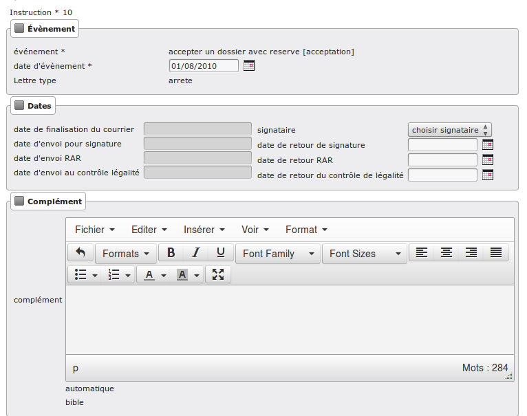

Événement
=========

* **événement** : sélection de l'événement d'instruction
* **date d'événement** : date de l'événement (date du jour par défaut)
* **lettre type** : choix de la lettre type affectée à cet événement d'instruction

Dates
=====

Dates de suivi chronologique de l'événement d'instruction.

* **date de finalisation du courrier**
* **date d'envoi pour signature**
* **date d'envoi RAR**
* **date d'envoi au contrôle légalité**
* **signataire** (on peut en sélectionner un par défaut, cf. `Paramétrage --> Organisation --> Signataire Arrêté`)
* **date de retour de signature**
* **date de retour RAR**
* **date de retour du contrôle de légalité**

Compléments
===========

Les champs de complément sont composés d'un éditeur riche permettant une mise en
page complexe.

Il est possible d'ajouter des compléments d'informations pour les événements 
d'instruction depuis les blocs "Complément" et "Complément 2".

La plupart des compléments d'informations sont disponibles depuis la bible.

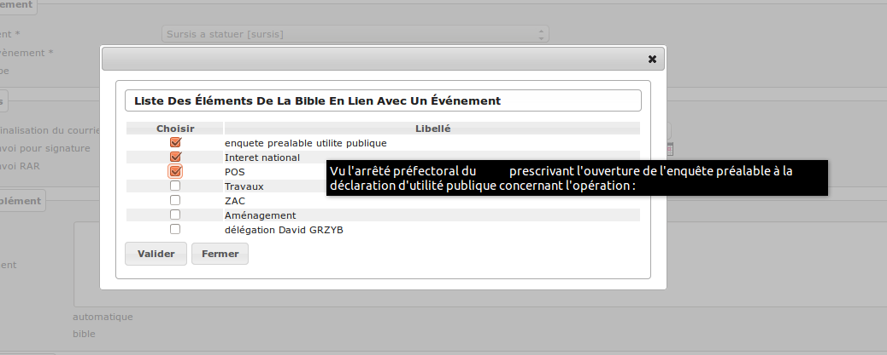

Il suffit de choisir l'élément que l'on désire voir apparaître dans le champ 
complément.
En laissant la souris sur le libellé une infobulle affichera le texte qui sera 
affiché.

(Pour plus d'information sur la bible voir :ref:`parametrage_dossiers_bible`.)

Suppression
===========

Il est possible de supprimer le dernier événement d'instruction créé s'il remplit
ces critères :

 - le dossier d'instruction rattaché n'est pas clôturé
 - l'événement d'instruction n'est pas finalisé
 - les dates suivantes ne sont pas renseignées : envoi pour signature, retour de signature, envoi RAR, re­tour RAR, envoi au contrôle légalité, retour du contrôle légalité
 - l'événement lié n’est pas de type « retour »

.. _instruction_complement:

============
Finalisation
============

Finalisation des documents de l'instruction
===========================================

Le principe
###########

Pour finaliser l'édition de l'instruction, il faut cliquer sur le lien "Finaliser le document" du portlet d'actions contextuelles de la visualisation.

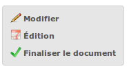

Au clic sur le lien de l'édition dans le portlet d'actions contextuelles de la visualisation de l'instruction, le document sera ouvert depuis le stockage au format PDF.

L'instruction n'est plus ni modifiable, ni supprimable.

Il est aussi possible de dé-finaliser le document au clic sur le lien "Reprendre la rédaction du document".

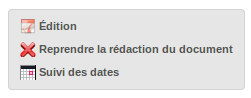

Lorsque le document est finalisé certaines informations concernant le dossier
lui sont associées lors de l'enregistrement.

Il est aussi possible de dé-finaliser le document au clic sur le lien "Reprendre la rédaction du document".

Le clic sur le lien de l'édition dans le portlet d'actions contextuelles de la visualisation de l'instruction ouvrira le document généré à la volée au format PDF.

L'instruction est à nouveau modifiable et supprimable.

La mise à jour des dates de suivi depuis l'instruction
######################################################

Les dates de suivi n'étant pas affichées dans le document PDF de l'instruction, elles sont modifiables une fois l'instruction finalisée. Il faut pour cela cliquer sur le bouton du portlet d'actions contextuelles "Suivi des dates".

On arrive alors sur la page suivante où seules les dates de suivi sont modifiables.

.. image:: maj_date_instruction.png

.. note::

  Pour avoir accès à cette action il faut que le dossier ne soit pas clôturé et :
   - si on est instructeur, soit être celui du dossier ou tout au moins de sa division, soit être un instructeur polyvalent de la commune du dossier dont l'instruction a été déléguée à la communauté ;
   - sinon être soit de la communauté (par exemple un administrateur), soit de la commune du dossier (par exemple le profil *GUICHET SUIVI*).

Finalisation des documents du rapport d'instruction
===================================================

Pour finaliser l'édition du rapport d'instruction, il faut cliquer sur le lien "Finaliser le document" du portlet d'actions contextuelles de la visualisation.

Lorsque le document est finalisé certaines informations concernant le dossier
lui sont associées lors de l'enregistrement.

Au clic sur le lien de l'édition dans le portlet d'actions contextuelles de la visualisation du rapport d'instruction, le document sera ouvert depuis le stockage au format PDF.

Le rapport d'instruction n'est plus ni modifiable, ni supprimable.

Il est aussi possible de dé-finaliser le document en cliquant sur le lien "Reprendre la rédaction du document".

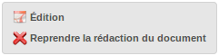

Le clic sur le lien de l'édition dans le portlet d'actions contextuelles de la visualisation du rapport d'instruction ouvrira le document généré à la volée au format PDF.

Le rapport d'instruction est à nouveau modifiable et supprimable.

Finalisation des documents de la consultation
=============================================

Pour finaliser l'édition de la consultation, il faut cliquer sur le lien "Finaliser le document" du portlet d'actions contextuelles de la visualisation.

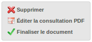

Lorsque le document est finalisé certaines informations concernant le dossier
lui sont associées lors de l'enregistrement.

Au clic sur le lien de l'édition dans le portlet d'actions contextuelles de la visualisation 
de la consultation, le document sera ouvert depuis le stockage au format PDF.

La consultation n'est plus supprimable.

Il est aussi possible de dé-finaliser le document en cliquant sur le lien "Reprendre la rédaction du document".

Le clic sur le lien de l'édition dans le portlet d'actions contextuelles de la visualisation 
de la consultation ouvrira le document généré à la volée au format PDF.

La consultation est à nouveau supprimable.

Notifier la commune par courriel
================================

Un événement d'instruction est notifiable par courriel aux communes.

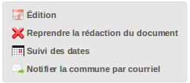

Les quatre conditions suivantes doivent être satisfaites pour rendre l'action disponible :

* :ref:`paramétrage <parametrage_parametre>` renseigné ;
* événement d'instruction finalisé ;
* être rattaché à la communauté de communes ;
* disposer du profil instructeur polyvalent ou administrateur général.

.. _instruction_dossier_contrainte:

=============================
Contraintes liées au dossier
=============================

Des contraintes (ou risques) peuvent être ajoutées à un dossier.

.. _instruction_dossier_contrainte_view:

Visualisation des contraintes liées au dossier
===============================================

Les contraintes affichées dans le tableau de données sont groupées par groupe et
sous-groupe et sont classées par le numéro d'ordre d'affichage.

Chaque contrainte possède un bouton raccourci pour ouvrir le formulaire en 
modification et un autre en mode suppression.
Seulement le champ **texte complété** est modifiable.

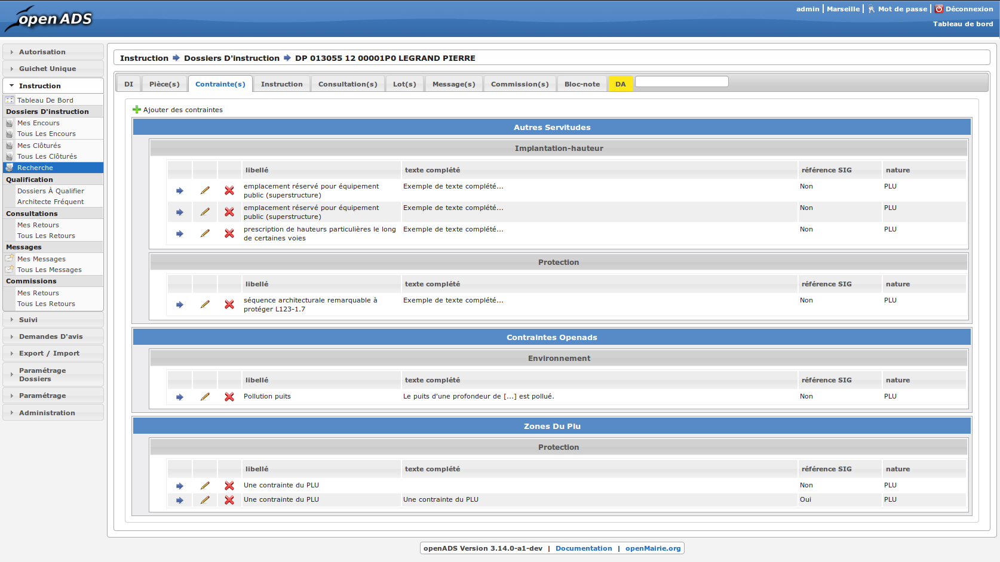

.. _instruction_dossier_contrainte_add_man:

Ajouter des contraintes manuellement
====================================

En cliquant sur le bouton **Ajouter des contraintes**, un formulaire présentant
toutes les contraintes de l'application apparaît.

Les contraintes sont triées comme dans le tableau de données, par groupe, sous-groupe et par ordre d'affichage. Par défaut chaque groupe et sous-groupe est
replié.

Il suffit de cliquer sur un contrainte pour la sélectionner et de valider le
formulaire pour que celle-ci soit ajoutée au dossier. Un message de validation 
apparait.

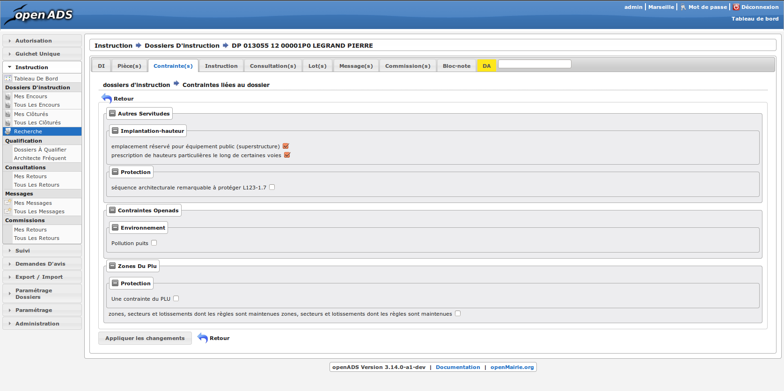

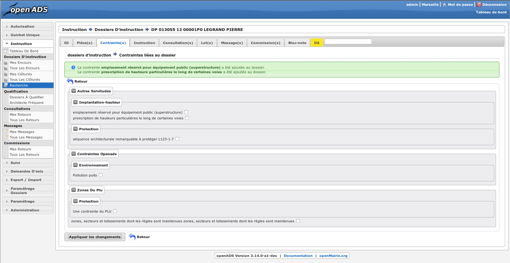

Les contraintes peuvent aussi être récupérées automatiquement à partir d'un SIG si
celui-ci est configuré, (voir :ref:`instruction_geolocalisation` ).

====
Lots
====

L'onglet **Lot(s)** permet de lister et consulter tous les lots du dossier d'instruction. Ces lots sont créés manuellement pas l'instructeur sur un permis valant division.
La gestion des lots permet lors d'une demande de transfert partiel d'affecter le ou les pétitionnaire à un ou plusieurs lots.

L'instructeur du dossier peut :

- ajouter des lots
- modifier des lots
- supprimer des lots
- éditer les données techniques des lots
- tranférer le ou les pétitionnaire à un ou plusieurs lots

.. _instruction_dossier_message:

========
Messages
========

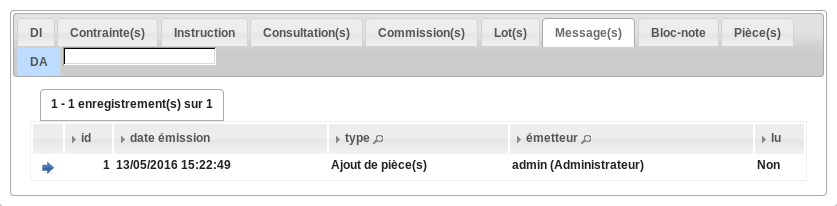

L'onglet **Message(s)** permet de lister et consulter tous les messages du dossier.

Les messages sont automatiquement ajoutés suite à des actions spécifiques, comme par exemple l'ajout de pièce numérisée, à condition que l'option :ref:`'option_notification_piece_numerisee' <parametrage_parametre>` soit activée.
Lorsqu'une action notifiée est réalisée par un utilisateur différent de l'instructeur du dossier, alors le message de notification sera destiné à l'instructeur.
Si cette action est réalisée par l'instructeur du dossier et que celui-ci fait partie de la même collectivité que celle du dossier, alors il n'y a pas besoin de message de notification.
Dernier cas, si l'action est réalisée par l'instructeur du dossier et celui-ci n'est pas de la même collectivité que celle du dossier, alors le message de notification sera destinée à la collectivité du dossier.
Pour éviter de multiplier les notifications, ne seront pas ajoutés les messages traitant d'une même action à la même date et dont le destinataire est identique à un message déjà existant et non lu.

Une action disponible depuis son formulaire de consultation permet de le marquer comme lu :

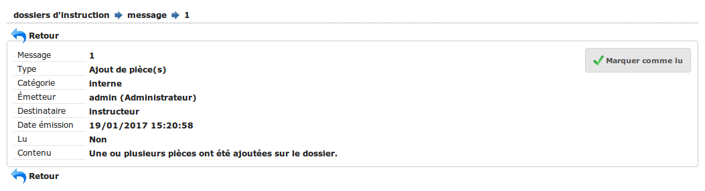

Les messages marqués comme 'non lu' sont listés dans les tableaux du menu *Instruction* > *Messages* :

* *Mes Messages*
* *Messages De Ma Division*
* *Tous Les Messages*

Un clic sur une ligne de résultat redirige directement vers le message non lu dans le contexte du dossier d'instruction.

.. note::

  Certains messages sont susceptibles d'être accompagnés d'une édition. Lorsque c'est le cas une action spécifique est disponible depuis le portlet d'actions contextuelles. Ci-après leur liste avec leur message correspondant :

  * *Accusé de réception* pour :ref:`[213](Échange ERP → ADS) Dossier PC Accusé de réception de consultation officielle<echange_erp_ads_213>`.

=============
Dossiers liés
=============

.. image:: instruction_dossiers_lies.png

L'onglet **Dossiers liés** permet d'obtenir tous les dossiers liés au dossier d'instruction courant.
Il existe plusieurs types de liaison entre les dossiers :

    * dans l'encadré orange, il s'agit du lien vers le dossier d'autorisation ;
    * dans l'encadré violet, les dossiers d'instruction liés manuellement ou implicitement par le dossier d'autorisation ;
    * dans l'encadré vert, les dossiers d'autorisation liés géographiquement, c'est-à-dire ayant au moins une parcelle commune.

.. note::
    Lors de liaisons manuelles entre dossiers d'instruction, seulement le dossier courant liste les dossiers d'instruction liés.
    Le dossier d'instruction ciblé par la liaison ne verra pas sur son tableau le dossier d'instuction source, c'est-à-dire celui depuis lequel la liaison a été faite.

Il est possible depuis l'action d'ajout "+" dans le tableau des dossiers d'instruction liés (encadré violet), d'ajouter des liaisons avec d'autres dossiers d'instruction.
Il n'est pas possible de lier le dossiers d'instruction courant deux fois à un même DI ou de le lier manuellement à un DI déjà lié implicitement par le dossier d'autorisation.

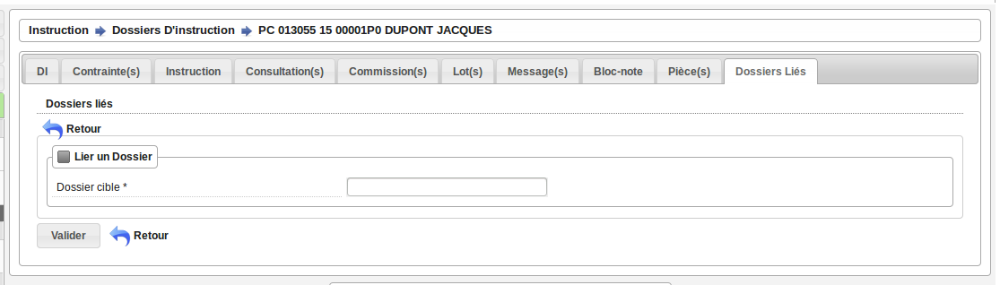

Les liaisons manuelles peuvent être supprimées depuis le tableau grâce à l'action de suppression "X" disponible sur chaque ligne.

.. note::
    Dans le cas des recours (contentieux), il existe une notion de liaison principale avec un dossier d'instruction.
    Cette liaison n'est modifiable que par les profils ayant une permission spécifique.

.. _instruction_geolocalisation:

==================
La géolocalisation
==================

L'action Géolocalisation est disponible seulement pour les communes paramétrées. Elle 
permet, pour les dossiers qui ont des références cadastrales renseignées, de récupérer des
données géographiques à partir du SIG paramétré.

Pour ouvrir l'overlay de géolocalisation, cliquer sur le bouton "Géolocalisation" sur
l'onglet principal du DI.

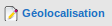

L'overlay de géolocalisation est le suivant.

.. image:: instruction_geolocalisation_view.png

Vérifier les parcelles
======================

Cette action permet de vérifier si les parcelles définies dans le dossier existent au
niveau du SIG. Cette étape est nécessaire a l'exécution des autres traitements.

Calculer l'emprise
==================

L'emprise est le total de la surface des parcelles. Le calcul de l'emprise est requis pour
pouvoir calculer le centroïde des parcelles.

Dessiner l'emprise
==================

Dans le cas où le calcul de l'emprise a échoué du côté du SIG, cette action permet d'être
redirigé sur le SIG, sur lequel il est alors possible de dessiner l'emprise à la main.

Calculer le centroïde
=====================

Le centroïde est le point représentatif de l'emprise calculée précedement. Il est ensuite
récupéré et stocké dans le dossier d'instruction.

Récupérer les contraintes
=========================

Cette action permet de récupérer les contraintes du SIG qui sont applicables aux parcelles
du dossier. Ces contraintes peuvent appartenir à la communauté de communes aussi bien qu'à
la commune.

L'action "J'ai de la chance"
============================

Ce bouton permet un lancement automatique, à la chaine, de toutes les actions de
géolocalisation d'un dossier décrites précedement. Il permet de gagner du temps.

=============
Consultations
=============

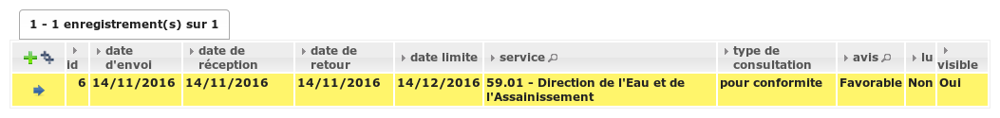

L'onglet **Consultation(s)** permet de lister et consulter toutes les consultations du dossier
d'instruction. Les consultations de type *pour conformité* sont surlignées en jaune.

Modifier la visibilité d'une consultation dans les éditions
===========================================================

Il est possible de masquer une consultation dans les éditions qui y font référence,
comme le *Récapitulatif du dossier* ou le *Rapport d'instruction*.

Depuis le portlet d'actions contextuelles
#########################################

Pour masquer une consultation depuis le portlet d'actions contextuelles
il faut cliquer sur l'action *Masquer dans les éditions*.

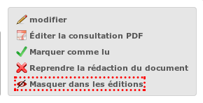

La consultation n’apparaîtra plus dans les éditions qui affichent leur liste.
Pour l'afficher à nouveau cliquer sur l'action *Afficher dans les éditions*.

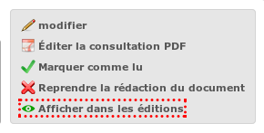

Depuis la liste de consultations
################################

Depuis le listing des consultations, il est possible de modifier la visibilité
des consultations dans les éditions.

Si la consultation est visible, cliquer sur l'icône en forme d'oeil rouge permet de la masquer.

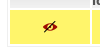

Si la consultation est masquée, cliquer sur l'icône en forme d'oeil vert permet de la rendre visible.

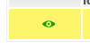
