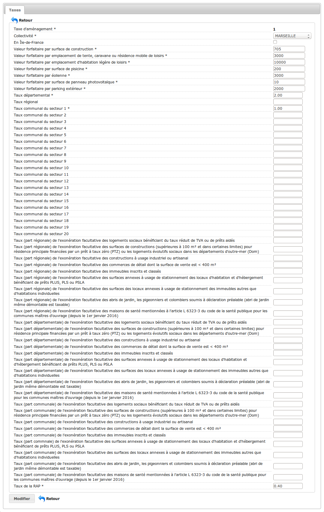
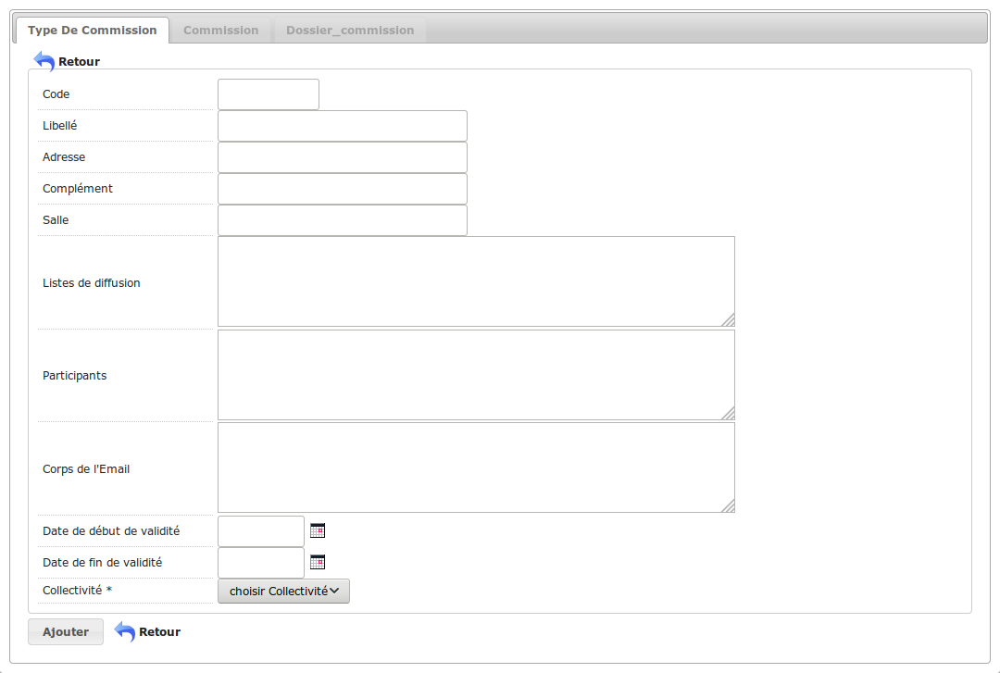
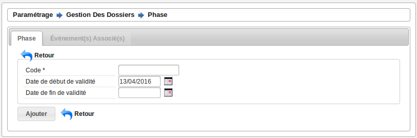
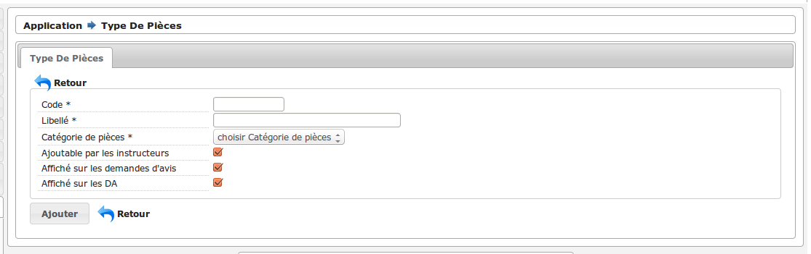
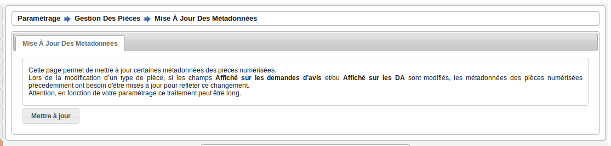
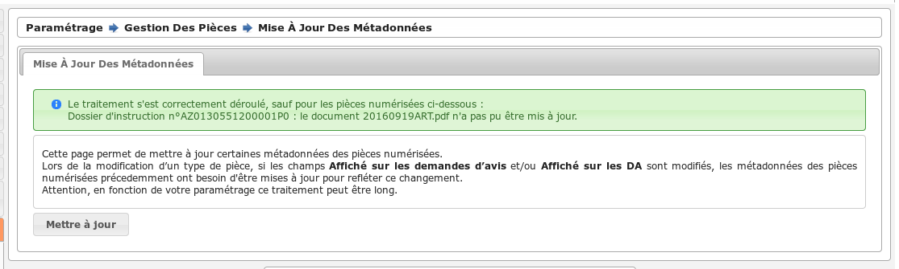

.. _parametrage:

###########
Paramétrage
###########

Libellés
########

.. _parametrage_civilite:

=============
Les civilités
=============

(:menuselection:`Paramétrage --> Civilité`)

Édition des civilités présentes dans l'application.

.. _parametrage_arrondissement:

===================
Les arrondissements
===================

(:menuselection:`Paramétrage --> Arrondissement`)

Édition des arrondissements disponibles dans l'application.

.. _parametrage_quartier:

=============
Les quartiers
=============

(:menuselection:`Paramétrage --> Quartier`)

Édition des quartiers disponibles dans l'application.

Organisation
############

.. _parametrage_genre:

==========
Les genres
==========

(:menuselection:`Paramétrage --> Organisation --> Genre`)

Édition des genres de dossiers (ERP, URBA).

.. _parametrage_groupe:

===========
Les groupes
===========

(:menuselection:`Paramétrage --> Organisation --> Groupe`)

Édition des groupes de dossiers (ERP, ADS, Contentieux, Changement d'usage, ...).

.. _parametrage_direction:

============
La direction
============

(:menuselection:`Paramétrage --> Organisation --> Direction`)

Édition des informations concernant la direction du service ADS.

.. _parametrage_division:

=============
Les divisions
=============

(:menuselection:`Paramétrage --> Organisation --> Division`)

Éditions des différentes divisions traitant les demandes.

.. _parametrage_instructeur_qualite:

==========================
Les qualités d'instructeur
==========================

(:menuselection:`Paramétrage --> Organisation --> Qualité d'instructeur`)

Éditions des qualités d'instructeur.

.. _parametrage_instructeur:

================
Les instructeurs
================

(:menuselection:`Paramétrage --> Organisation --> Instructeur`)

Éditions des différents instructeurs traitant les demandes.

.. _parametrage_signataire_arrete:

===============
Les signataires
===============

(:menuselection:`Paramétrage --> Organisation --> Signataire Arrêté`)

Éditions des signataires d'arrêtés.
En cochant la case "défaut" le signataire sera préselectionné lors de l'ajout d'une instruction.

.. _parametrage_taxe_amenagement:

=========
Les taxes
=========

(:menuselection:`Paramétrage --> Organisation --> Taxes`)

Ce menu de paramétrage des taxes permet de renseigner les valeurs forfaitaires, le taux communale, le taux départementale, le taux régionale et les taux des exonérations facultatives de la taxe d'aménagement. Il permet également de définir le taux de la redevance d'archéologie préventive.
Il ne peut y avoir qu'un seul paramétrage de taxe par collectivité. Sans ce paramétrage il n'est pas possible d'estimer les montants des taxes sur un dossier d'instruction. Les collectivités de niveau 1 récupère le paramètrage des taxes associé à la collectivité de niveau 2 si celui-ci existe.

Gestion des commissions
#######################

.. _parametrage_type_commission:

========================
Les types de commissions
========================

(:menuselection:`Paramétrage --> Gestion des commissions --> Type De Commission`)

Éditions des différents types de commissions (Commission technique d'urbanisme).

Le champ 'Liste de diffusion' est la liste d'adresses email pour lesquelles un courriel va être envoyé à chaque diffusion.
Elles doivent être séparées par un retour à la ligne.

Le champ 'Participants' est est de type texte libre, les participants ne sont pas obligés d'avoir un compte sur l'application.

Les champs qui peuvent être repris pour une édition sont le 'libellé', la 'salle',  l' 'adresse' et son 'complement'.

Le champ 'Collectivité' permet de saisir des collectivités de niveau mono uniquement : les commissions intercommunales ne sont pas gérées.

Gestion des consultations
#########################

.. _parametrage_avis_consultation:

=========================
Les avis de consultations
=========================

(:menuselection:`Paramétrage --> Gestion des consultations --> Avis Consultation`)

Éditions des différents avis possibles en réponse aux consultations de services

.. _parametrage_service:

============
Les services
============

(:menuselection:`Paramétrage --> Gestion des consultations --> Service`)

Ce menu sert au paramétrage des services consultés de l'application.

.. image:: service_parametrage.png

Dans le cadre 'Coordonnées', il faut saisir les coordonnées du service.

Le champ 'notification par mail' sert à indiquer si le service souhaite être 
notifié par mail lors de l'ajout d'une nouvelle demande de consultation. Le mail envoyé
au service consulté contient 2 liens d'accès à openADS, qui sont :ref:`paramétrables <parametrage_parametre_mails_services_consultes>`.

Le champ 'type de délai' spécifie le type du délai, c'est-à-dire si le calcul de la date limite doit être fait en mois ou en jours.

Le champ 'délai' indique le temps dont dispose le service pour répondre à une 
demande de consultation.

Le champ 'consultation papier' indique si un PDF doit être généré pour 
l'instructeur au moment de la demande de consultation.

Dans le cadre 'Validité' peuvent être indiquées les dates pour lesquelles une 
demande de consultation à ces services est possible.

Le champ 'type de consultation' spécifie le type de la consultation. Le type 
choisi a un impact sur le logiciel :

- "Pour information", qui permet à l'instructeur de signaler à un service l'existence d'une opération en cours. Elle est strictement « informative » et n'implique pas de retour d'avis de la part du service concerné.
- "Avec avis attendu", que l'instructeur déclenche lorsqu'il attend un retour d'avis de la part du service consulté. Elles s'afficheront avec un fond jaune dans le tableau listant les demandes de consultation du dossier d'instruction
- "Pour conformité", similaire à la précédente, mais qui n'intervient pas au même moment au cours du processus métier : le contenu de la demande de consultation et le délai associé différent.

Le champ 'type d'édition de la consultation' sert à indiquer le type d'édition
lié à la demande de consultation. Ce select est populé grâce aux états. 

Pour qu'un état apparaisse dans la liste des types d'édition possibles, il faut 
que le libellé de l'état soit préfixé par 'consultation\_'.

.. _parametrage_thematique_services:

===========================
Les thématiques de services
===========================

(:menuselection:`Paramétrage --> Gestion des consultations --> Thématique Des Services`)

Éditions des groupes de services.

.. _parametrage_lien_service_thematique:

===============================================
Les liens entre les services et les thématiques
===============================================

(:menuselection:`Paramétrage --> Gestion des consultations --> Lien Service / Thématique`)

Liaison des services aux différents groupes de services.

Gestion des dossiers
####################

.. _parametrage_etat_dossier_autorisation:

=====================================
Les états des dossiers d'autorisation
=====================================

(:menuselection:`Paramétrage --> Gestion des dossiers --> États Des Dossiers D'autorisation`)

Liste des états de dossiers d'autorisation possibles.

.. _parametrage_lien_evenement_da:

======================================================================
Les liens entre les évènements et les types de dossiers d'autorisation
======================================================================

(:menuselection:`Paramétrage --> Gestion des dossiers --> Lien Événement Dossier Autorisation Type`)

Liens entre les événements et les types de dossiers d'autorisation.

.. _parametrage_affectation_autmatique:

=============================
Les affectations automatiques
=============================

(:menuselection:`Paramétrage --> Gestion des dossiers --> Affectation Automatique`)

Configuration de l'affectation automatique des instructeurs aux dossiers d'instruction par le type de dossier d'autorisation détaillé, l'arrondissement, le quartier et/ou la section.

.. _parametrage_autorite_competente:

=========================
Les autorités compétentes
=========================

(:menuselection:`Paramétrage --> Gestion des dossiers --> Autorité Compétentes`)

Édition des autorités compétentes possibles pour les dossiers de l'application.

.. _parametrage_phase:

==========
Les phases
==========

(:menuselection:`Paramétrage --> Gestion des dossiers --> Phase`)

La phase est un indicateur permettant un pré-aiguillage des courriers lors d'un retour d'avis de réception d'une :ref:`lettre recommandée <suivi_envoi_lettre_rar>`.
Son affichage ne se fera que si elle est paramétrée sur l':ref:`événement <parametrage_dossiers_evenement>` qui génère une édition adressée au demandeur.

Le formulaire est constitué de seulement trois champs :

  * **code** : code de la phase sur 15 caractères, c'est la valeur affichée sur les lettres recommandées ;
  * **date de début de validité** : date de la mise en service de la phase (par défaut la date courante) ;
  * **date de fin de validité** : date de fin de service de la phase, après cette date la phase ne sera plus sélectionnable depuis les événements.

.. _parametrage_gestion_pieces:

Gestion des pièces
##################

.. _parametrage_document_numerise_type_categorie:

====================
Catégorie des pièces
====================

(:menuselection:`Paramétrage --> Gestion des pièces --> Catégorie des pièces`)

Paramétrage des catégories de pièces possibles.

.. _parametrage_document_numerise_type:

===============
Type des pièces
===============

(:menuselection:`Paramétrage --> Gestion des pièces --> Type des pièces`)

Paramétrage des types de pièces possibles.

Les champs du formulaire lors de l'ajout :

  * **Code** : Code du type de pièce, champ obligatoire et unique utilisé pour composer le nom des pièces ;
  * **Libellé** : Libellé du type de pièce, champ obligatoire utilisé dans la liste à choix lors de l'ajout d'une pièce ;
  * **Catégorie de pièces** : Catégorie du type de pièce, champ obligatoire utilisé pour organiser les pièces sur tous les affichages ;
  * **Ajoutable par les instructeurs** : Permet de définir si le type de pièce peut être ajouté par un instructeur, par défaut coché ;
  * **Affiché sur les demandes d'avis** : Permet de définir si les pièces de ce type peuvent être visualisées sur les demandes d'avis des services consultés, par défaut coché ;
  * **Affiché sur les DA** : Permet de définir si les pièces de ce type peuvent être visualisées sur les dossiers d'autorisation, par défaut coché.

Lors de la modification d'un type de pièce, si les champs **Affiché sur les demandes d'avis** et/ou **Affiché sur les DA** sont modifiés, alors les métadonnées correspondantes sur les fichiers de ce type seront mises à jour lors de la prochaine :ref:`mise à jour des métadonnées <parametrage_document_numerise_type_traiter_metadonnees>`.

.. _parametrage_document_numerise_type_traiter_metadonnees:

===========================
Mise à jour des métadonnées
===========================

(:menuselection:`Paramétrage --> Gestion des pièces --> Mise à jour des métadonnées`)

Mise à jour des métadonnées des fichiers stockés dont le type de pièce a été modifié.

Lors de la modification d'un type de pièce, si les champs **Affiché sur les demandes d'avis** et/ou **Affiché sur les DA** sont modifiés, un marqueur identifie le changement, mais les fichiers des pièces ciblées ne sont pas mis à jour.
Ce changement peut être appliqué ensuite à l'intégralité des fichiers des pièces de ce type par deux méthodes :

  * depuis l'interface réservée aux administrateurs ;
  * de manière désynchronisée, en tâche de fond, par un appel à un :ref:`service web de maintenance <web_services_ressource_maintenance_maj_metadonnees_documents_numerises>`.

Depuis l'interface
==================

Il suffit de cliquer sur le bouton **Mettre à jour** pour lancer le traitement.

Lorsque certaines pièces numérisées n'ont pas pu être mises à jour, le message de validation présente la liste des pièces en erreur ainsi que le dossier d'instruction correspondant.

.. _parametrage_gestion_contentieux:

Gestion des contentieux
#######################

.. _parametrage_objet_recours:

=====================
Les objets de recours
=====================

(:menuselection:`Paramétrage --> Gestion des contentieux --> Objet de recours`)

Paramétrage des objets de recours possibles.

.. _parametrage_moyen_souleve:

===================
Les moyens soulevés
===================

(:menuselection:`Paramétrage --> Gestion des contentieux --> Moyen soulevé`)

Paramétrage des moyens soulevés possibles.

.. _parametrage_moyen_retenu_juge:

================================
Les moyens retenus par les juges
================================

(:menuselection:`Paramétrage --> Gestion des contentieux --> Moyen retenu par le juge`)

Paramétrage des moyens possibles retenus par les juges.
