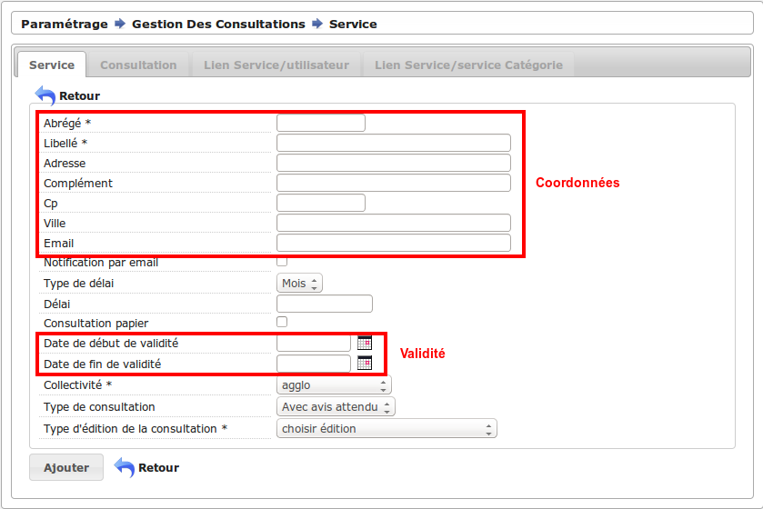

.. _parametrage:

###########
Paramétrage
###########

Libellés
########

.. _parametrage_civilite:

=============
Les civilités
=============

(:menuselection:`Paramétrage --> Civilité`)

Édition des civilités présentes dans l'application.

.. _parametrage_arrondissement:

===================
Les arrondissements
===================

(:menuselection:`Paramétrage --> Arrondissement`)

Édition des arrondissements disponibles dans l'application.

.. _parametrage_quartier:

=============
Les quartiers
=============

(:menuselection:`Paramétrage --> Quartier`)

Édition des quartiers disponibles dans l'application.

Organisation
############

.. _parametrage_genre:

==========
Les genres
==========

(:menuselection:`Paramétrage --> Organisation --> Genre`)

Édition des genres de dossiers (ERP, URBA).

.. _parametrage_groupe:

===========
Les groupes
===========

(:menuselection:`Paramétrage --> Organisation --> Groupe`)

Édition des groupes de dossiers (ERP, ADS, Contentieux, Changement d'usage, ...).

.. _parametrage_direction:

============
La direction
============

(:menuselection:`Paramétrage --> Organisation --> Direction`)

Édition des informations concernant la direction du service ADS.

.. _parametrage_division:

=============
Les divisions
=============

(:menuselection:`Paramétrage --> Organisation --> Division`)

Éditions des différentes divisions traitant les demandes.

.. _parametrage_instructeur:

================
Les instructeurs
================

(:menuselection:`Paramétrage --> Organisation --> Instructeur`)

Éditions des différents instructeurs traitant les demandes.

.. _parametrage_signataire_arrete:

===============
Les signataires
===============

(:menuselection:`Paramétrage --> Organisation --> Signataire Arrêté`)

Éditions des signataires d'arrêtés.
En cochant la case "défaut" le signataire sera préselectionné lors de l'ajout d'une instruction.

.. _parametrage_taxe_amenagement:

=====================
La taxe d'aménagement
=====================

(:menuselection:`Paramétrage --> Organisation --> Taxe D'aménagement`)

Éditions de la taxe d'aménagement par collectivité.
Il ne peut y avoir qu'un seul paramétrage de taxe par collectivité. Sans ce paramétrage il n'est pas possible de simuler la taxe d'aménagement sur un dossier d'instruction.

Gestion des commissions
#######################

.. _parametrage_type_commission:

========================
Les types de commissions
========================

(:menuselection:`Paramétrage --> Gestion des commissions --> Type De Commission`)

Éditions des différents types de commissions (Commission technique d'urbanisme).

Gestion des consultations
#########################

.. _parametrage_avis_consultation:

=========================
Les avis de consultations
=========================

(:menuselection:`Paramétrage --> Gestion des consultations --> Avis Consultation`)

Éditions des différents avis possibles en reponse aux consultations de services

.. _parametrage_service:

============
Les services
============

(:menuselection:`Paramétrage --> Gestion des consultations --> Service`)

Ce menu sert au paramétrage des services consultés de l'application.

Dans le cadre 'Coordonnées', il faut saisir les coordonnées du service.

Le champ 'notification par mail' sert à indiquer si le service souhaite être 
notifié par mail lors de l'ajout d'une nouvelle demande de consultation.

Le champ 'type de délai' spécifie le type du délai, c'est-à-dire si le calcul de la date limite doit être fait en mois ou en jours.

Le champ 'délai' indique le temps dont dispose le service pour répondre à une 
demande de consultation.

Le champ 'consultation papier' indique si un PDF doit être généré pour 
l'instructeur au moment de la demande de consultation.

Dans le cadre 'Validité' peuvent être indiquées les dates pour lesquelles une 
demande de consultation à ces services est possible.

Le champ 'type de consultation' spécifie le type de la consultation. Le type 
choisi a un impact sur le logiciel.
"Pour information", qui permet à l'instructeur de signaler à un service
l'existence d'une opération en cours. Elle est strictement « informative » et
n'implique pas de retour d'avis de la part du service concerné.
"Avec avis attendu", que l'instructeur déclenche lorsqu'il attend un
retour d'avis de la part du service consulté. Elles s'afficheront avec un fond
jaune dans le tableau listant les demandes de consultation du dossier d'instruction
"Pour conformité", similaire à la précédente, mais qui n'intervient
pas au même moment au cours du processus métier : le contenu de la demande
de consultation et le délai associé diffèrent.

Le champ 'type d'édition de la consultation' sert à indiquer le type d'édition
lié à la demande de consultation. Ce select est populé grâce aux états. 

Pour qu'un état apparaisse dans la liste des types d'édition possible, il faut 
que le libellé de l'état soit préfixé par 'consultation\_'.

.. _parametrage_thematique_services:

===========================
Les thématiques de services
===========================

(:menuselection:`Paramétrage --> Gestion des consultations --> Thématique Des Services`)

Éditions des groupes de services.

.. _parametrage_lien_service_thematique:

===============================================
Les liens entre les services et les thématiques
===============================================

(:menuselection:`Paramétrage --> Gestion des consultations --> Lien Service / Thématique`)

Liaison des services aux différents groupes de services.

Gestion des dossiers
####################

.. _parametrage_etat_dossier_autorisation:

=====================================
Les états des dossiers d'autorisation
=====================================

(:menuselection:`Paramétrage --> Gestion des dossiers --> États Des Dossiers D'autorisation`)

Liste des états de dossiers d'autorisation possible.

.. _parametrage_lien_evenement_da:

======================================================================
Les liens entre les évènements et les types de dossiers d'autorisation
======================================================================

(:menuselection:`Paramétrage --> Gestion des dossiers --> Lien Événement Dossier Autorisation Type`)

Liens entre les événements et les types de dossiers d'autorisation.

.. _parametrage_affectation_autmatique:

=============================
Les affectations automatiques
=============================

(:menuselection:`Paramétrage --> Gestion des dossiers --> Affectation Automatique`)

Configuration de l'affectation automatique des instructeurs aux dossiers par
arrondissement, quartier et/ou section.

.. _parametrage_autorite_competente:

=========================
Les autorités compétentes
=========================

(:menuselection:`Paramétrage --> Gestion des dossiers --> Autorité Compétentes`)

Édition des autorités compétentes possible pour les dossiers de l'application.
