.. _parametrage_dossiers:

####################
Paramétrage dossiers
####################

Les dossiers
############

.. _parametrage_dossiers_dossier_autorisation_type:

===================================
Les types de dossier d'autorisation
===================================

(:menuselection:`Paramétrage Dossiers --> Dossiers --> Type DA`)

Le principe
===========

Ce type de dossier d'autorisation peut également être appelé la série. C'est à
ce niveau que la numérotation des dossiers est gérée.
Lorsqu'un type de dossier d'autorisation est créé, modifié ou supprimé, la série
correspondante est créée, mise à jour ou supprimée.

Saisir un type de dossier d'autorisation
========================================

Les informations à saisir sont :

* **code** : c'est le code à deux chiffres utilisé pour composer le numéro de
  dossier d'instruction (par exemple : PC).
* **libellé** : texte à afficher dans l'interface lors de la sélection
  d'un type de dossier d'autorisation.
* **description** : c'est un texte qui n'est pas utilisé dans les autres
  interfaces de l'application, mais il permet de décrire l'élément de
  paramétrage en détail dans un objectif de le documenter.
* **confidentiel** : permet de modifier le comportement standard de la
  confidentialité. Un dossier qui possède cet attribut sera uniquement visible
  et modifiable par les instructeurs de la division positionnée sur le dossier
  (ce comportement est là par exemple pour gérer la confidentialité des dossiers
  du module contentieux).
* **groupe** : (voir :ref:`parametrage_groupe`).

.. _parametrage_dossiers_dossier_autorisation_type_detaille:

=============================================
Les types de dossier d'autorisation détaillés
=============================================

(:menuselection:`Paramétrage Dossiers --> Dossiers --> Type DA Détaillé`)

Le principe
===========

Le type de dossier d'autorisation détaillé est utile pour faire la distinction
entre plusieurs cas d'utilisations d'un même type de dossier d'autorisation.
Par exemple, il existe deux catégories de type de dossier d'autorisation "Permis
de Construire", un spécifique pour les maisons individuelles et un pour les
autres constructions. Il existe un seul type de dossier d'autorisation
"Déclaration Préalable", il faut tout de même le saisir comme type de dossier
d'autorisation détaillé.

Saisir un type de dossier d'autorisation détaillé
=================================================

Les informations à saisir sont :

* **code** : c'est un code utilisé pour identifier rapidement le type de dossier
  d'autorisation détaillé. Généralement il se compose des deux caractères du
  type de dossier d'autorisation auquel on rajoute un ou plusieurs caractères
  spécifiques.
* **libellé** : texte à afficher dans l'interface lors de la sélection
  d'un type de dossier d'autorisation détaillé.
* **description** : c'est un texte qui n'est pas utilisé dans les autres
  interfaces de l'application, mais il permet de décrire l'élément de
  paramétrage en détail dans un objectif de le documenter.
* **type de dossier d'autorisation** : (voir
  :ref:`parametrage_dossiers_dossier_autorisation_type`).
* **cerfa** : sélection du cerfa correspondant au dossier d'autorisation (voir :ref:`parametrage_dossiers_cerfa`).
* **cerfa pour lots** : sélection du cerfa correspondant aux lots du dossier d'autorisation (voir :ref:`parametrage_dossiers_cerfa`).
* **durée de validité** : durée de validité des dossiers d'autorisation (voir :ref:`parametrage_dossiers_incompletude`).

.. _parametrage_dossiers_dossier_instruction_type:

==================================
Les types de dossier d'instruction
==================================

(:menuselection:`Paramétrage Dossiers --> Dossiers --> Type DI`)

Le principe
===========

Le type de dossier d'instruction permet de déterminer pour chaque type de
dossier d'autorisation détaillé les différentes possibilités (initial,
modificatif, transfert, DOC, ...). Par exemple, sur le type de dossier
d'autorisation "Permis de Construire", il peut y avoir : un initial, un
modificatif, un transfert, une DOC et une DAACT alors que sur le type de dossier
d’autorisation "Déclaration d'Autorisation de Travaux", il peut y avoir : un
initial, une DAACT.

Saisir un type de dossier d'instruction
=======================================

Les informations à saisir sont :

* **code** : c'est un code utilisé pour identifier rapidement le type de dossier
  d'instruction. 
* **libellé** : texte à afficher dans l'interface lors de la sélection
  d'un type de dossier d'instruction.
* **description** : c'est un texte qui n'est pas utilisé dans les autres
  interfaces de l'application, mais il permet de décrire l'élément de
  paramétrage en détail dans un objectif de le documenter.
* **type de dossier d'autorisation détaillé** : (voir
  :ref:`parametrage_dossiers_dossier_autorisation_type_detaille`)
* **suffixe** : precise le numéro de dossier doit prendre un suffixe
* **mouvement sitadel** : type de mouvement sitadel, seul les dossiers dont le 
  type de mouvement sitadel est défini seront exportés.

.. _parametrage_dossiers_contrainte:

===============
Les contraintes
===============

(:menuselection:`Paramétrage Dossiers --> Dossiers --> Contrainte`)

Le principe
===========

Les contraintes peuvent être appliquées sur un dossier (voir :ref:`instruction_dossier_contrainte`). 
Certaines contraintes peuvent être ajoutées manuellement et d'autres sont récupérées depuis le SIG (voir 
:ref:`parametrage_dossiers_synchronisation_contrainte`).

Saisir une contrainte
=====================

Les informations à saisir sont :

* **libellé** : le libellé de la contrainte.
* **nature** : la nature de la contrainte (POS ou PLU).
* **ordre d'affichage** : positionnement lors de l'affichage des contraintes.
* **groupe** : groupe de la contrainte.
* **sous-groupe** : sous-groupe de la contrainte.
* **texte** : texte de la contrainte.
* **présentée aux services consultés** : la contrainte est visible par les 
  services consultés.
* **date de début de validité** : date de début de validité de la contrainte.
* **date de fin de validité** : date de fin de validité de la contrainte.

.. _parametrage_dossiers_synchronisation_contrainte:

===============================
Synchronisation des contraintes
===============================

(:menuselection:`Paramétrage Dossiers --> Dossiers --> Synchronisation Des Contraintes`)

Le principe
===========

Ce menu permet de synchroniser les contraintes du SIG avec celles de 
l'application. Cette action va d'abord rapatrier toutes les contraintes du SIG,
et les comparer avec les contraintes déjà présentes dans openADS. Les contraintes
présentes sur le SIG ne seront pas modifiées par openADS.

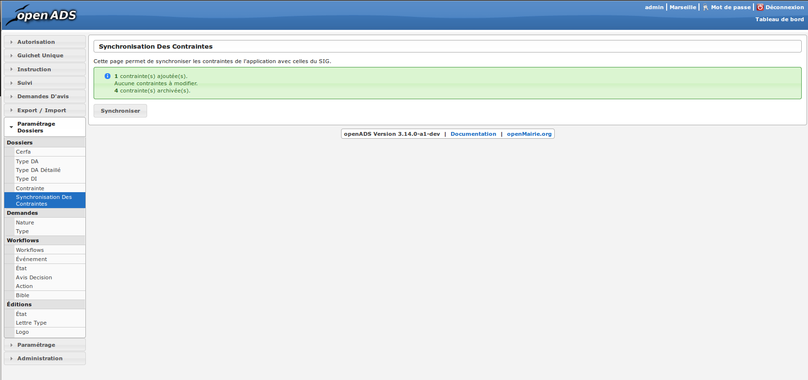

* **X contrainte(s) ajoutée(s)** : Contraintes importées dans openADS à partir du SIG
* **X contraintes à modifier** : Contraintes ayant subi une modification de groupe, sous-groupe ou libelle etc. sur le SIG
* **X contrainte(s) archivée(s)** : Contraintes n'étant plus valides

Les contraintes référencées comme venant du SIG
===============================================

Lorsque des contraintes sont importées dans openADS via la synchronisation des
contraintes, elles sont marquées comme ayant été importées à partir du SIG.

Quand on effectue une nouvelle synchronisation des contraintes, 3 cas de figure se
présentent :

* Les contraintes existent sur le SIG mais pas dans openADS : elles seront ajoutées.
* Les contraintes existent sur le SIG ET dans openADS : les libellés, groupes et sous-groupes seront mis à jour avec les informations du SIG.
* Les contraintes n'existent plus sur le SIG mais sont toujours présentes dans l'application : elles seront archivées en mettant la date du jour de la synchronisation dans le champ **date de fin de validité**.

Les contraintes n'étant pas référencées comme venant du SIG
===========================================================

Les contraintes créées manuellement dans l'application ne sont pas référencées
comme provenant du SIG.

Quand une synchronisation des contraintes est lancée, ces contraintes sont ignorées et
restent dans le même état, même si elles ont le même groupe, sous-groupe ou libellé
qu'une contrainte importée du SIG. Des contraintes peuvent donc être en doublon.

.. _parametrage_dossiers_demandes:

Les demandes
############

.. _parametrage_dossiers_demande_nature:

======================
Les natures de demande
======================

(:menuselection:`Paramétrage Dossiers --> Demandes --> Nature Demande`)

Le principe
===========

Chaque demande est reliée à une nature qui définit si la demande doit donner
lieu à la création d'un nouveau dossier d'autorisation ou si au contraire, elle
doit être rattachée à un dossier d'autorisation existant.

Saisir une nature de demande
============================

Les informations à saisir sont :

* **code** : c'est un code utilisé pour identifier rapidement la nature de la
  demande.
  Il faut utiliser "NOUV" si c'est pour une nouvelle demande et "EXIST" si c'est sur
  une demande existante.
* **libellé** : texte à afficher dans l'interface lors de la sélection
  d'une nature de demande.
* **description** : c'est un texte qui n'est pas utilisé dans les autres
  interfaces de l'application, mais il permet de décrire l'élément de
  paramétrage en détail dans un objectif de documenter le paramétrage.

.. _parametrage_dossiers_demande_type:

====================
Les types de demande
====================

(:menuselection:`Paramétrage Dossiers --> Demandes --> Type Demande`)

Le principe
===========

Chaque demande est d'un type en particulier, cela permet de confitionner
lorsque celle-ci sera disponible dans les interfaces et les traitements
qui seront appliqués lors de sa création. Par exemple : la création ou non d'un
dossier d'instruction, le besoin de qualification.

Saisir un type de demande
=========================

Les informations à saisir sont :

* **code** : c'est un code utilisé pour identifier rapidement le type de la
  demande.
* **libellé** : texte à afficher dans l'interface lors de la sélection
  d'un type de demande.
* **description** : c'est un texte qui n'est pas utilisé dans les autres
  interfaces de l'application, mais il permet de décrire l'élément de
  paramétrage en détail dans un objectif de le documenter.
* **groupe** : (voir :ref:`parametrage_groupe`).
* **type de dossier d'autorisation détaillé** : le type de dossier d'autorisation
  à créer si il doit en être créé un.
* **nature de la demande** : (voir :ref:`parametrage_dossiers_demande_nature`).
* **états du dernier dossier d'instruction** : état à partir du quel il est possible
  de créer la demande.
* **contraintes** : avec ou sans récupération des demandeurs du dernier dossier
  d'instruction.
* **type de dossier d'instruction à créer** : le type de dossier d'instruction
  à créer si il doit en être créé un (initial, modificatif, daact, ...) (voir
  :ref:`parametrage_dossiers_dossier_instruction_type`).
* **qualification** : lors de la saisie d'une nouvelle demande, le dossier
  concerné par cette demande est marqué comme à qualifier si le type de demande
  est configuré comme nécessitant une qualification.
* **événement** : c'est le type de l'événement d'instruction qui va être
  ajouté sur le dossier d'instruction au moment de la validation de la demande.
  Il est utilisé pour associer à la demande le bon récépissé, pour historiser
  la demande dans l'onglet "instruction" du dossier d'instruction et pour
  éventuellement modifier l'état du dossier d'instruction (voir
  :ref:`parametrage_dossiers_evenement`).
* **documents obligatoires** : liste des documents obligatoires à la saisie de la demande.
  Un document par ligne, si aucun document n'est saisi, aucun document ne sera demandé
  lors de la demande.

.. _parametrage_dossiers_cerfa:

Les CERFA
#########

(:menuselection:`Paramétrage Dossiers --> Dossiers --> Cerfa`)

.. image:: parametrage_cerfa_form.png

Formulaire de configuration des Cerfa.

Les informations à saisir sont :

* **libellé** : texte à afficher dans l'interface lors de la sélection
  d'un cerfa dans le formulaire d'édition des types détaillés de dossiers d'autorisation.
* **code** : c'est un code utilisé pour identifier rapidement le cerfa.
* **durée de validité** : durée de validité des cerfa.

.. note::

    Dans le formulaire, il suffit de cliquer sur le libellé du champ pour cocher
    la case correspondante.

.. _parametrage_dossiers_workflows:

Les workflows
#############

.. _parametrage_dossiers_evenement:

==============
Les événements
==============

(:menuselection:`Paramétrage Dossiers --> Workflows --> Événement`)

Le principe
===========

.. note::

    Il est nécessaire de distinguer deux éléments concernant l'événement. On
    parlera d'"événements d'instruction" pour tous les événements créés dans
    l'onglet "Instruction" du dossier d'instruction, et on parlera
    d'"événements" pour le paramétrage.

Le paramétrage de l'événement permet, lors de la création d'un événement
d'instruction, de :

* déclencher une action (recalcul d'informations du dossier d'instruction),
* modifier l'état du dossier d'instruction,
* générer un document PDF, lettre au pétitionnaire ou acte, au moyen d'une
  lettre type,
* déclencher des suivis de dates et des actions spécifiques pour les arrêtés.

Les événements d'instruction disponibles dans l'interface dépendent de l'état
dans lequel est le dossier d'instruction.

.. _parametrage_dossiers_saisir_evenement:

Saisir un événement
===================

Les informations à saisir sont  :

* **libellé** : texte affiché dans l'interface lors du choix d'un événement à
  créer.
* **type** : permet de qualifier un type d'événement. Les valeurs disponibles
  sont : "arrêté" pour permettre une gestion propre aux arrêtés, ou
  "incomplétude" ou "majoration de délais" pour permettre certains calculs dans
  les tableaux de bord de l'instructeur.
* **non verrouillable** : permet d'identifier un événement comme non 
  verrouillable. C'est-à-dire que l'événement d'instruction sera toujours
  modifiable même si le dossier d'autorisation est clôturé.
* **retour** : permet de distinguer un événement "retour", c'est-à-dire un 
  événement qui ne sera utilsé qu'en tant qu'événement retour AR ou événement
  retour de signature. Ce champ n'est plus modifiable après validation du
  formulaire d'ajout.
* **état(s) source** : liste des états depuis lequel cet événement est
  disponible(voir :ref:`parametrage_dossiers_etat`).
* **type(s) de DI concerné(s)** : liste des types de dossier d'instruction pour
  lesquels cet événement est disponible (voir
  :ref:`parametrage_dossiers_dossier_instruction_type`).
* **restriction** : condition optionnelle permettant de refuser la validation du
  formulaire d'ajout d'événement d'instruction si le résultat est faux. Il est
  possible de vérifier deux conditions simultanément avec un OU logique ou un ET
  logique (cf. ci-après les types d'opérateurs et exemples).

  Champs utilisables : [archive_date_dernier_depot] [archive_date_complet]
  [archive_date_rejet] [archive_date_limite]
  [archive_date_notification_delai] [archive_date_decision]
  [archive_date_validite] [archive_date_achevement]
  [archive_date_conformite] [archive_date_chantier]
  [archive_date_limite_incompletude]
  [archive_delai_incompletude]
  [duree_validite] [delai]
  [delai_notification] [date_evenement]
  [duree_validite_parametrage][date_depot].

  Trois types d'opérateurs sont disponibles :

  * de comparaison :  >=, <=, == et != ;
  * d'affectation : + et - ;
  * logiques : && et ||.

  Exemples :

  * date_evenement <= archive_date_dernier_depot + 1

  * date_evenement <= archive_date_dernier_depot && archive_date_complet == date_depot

* **action** : c'est l'action déclenchée par cet événement. Les valeurs
  disponibles sont les valeurs du paramétrage des actions (voir
  :ref:`parametrage_dossiers_action`).
* **état** : paramètre disponible dans les règles de l'action. (voir
  :ref:`parametrage_dossiers_etat`).
* **délai** : paramètre disponible dans les règles de l'action.
* **tacite** : paramètre disponible dans les règles de l'action.
* **délai notification** : paramètre disponible dans les règles de l'action.
* **avis** : paramètre disponible dans les règles de l'action. Choix de l'avis
  correspondant à l'événement à utiliser dans les règles de l'action. Les
  valeurs disponibles sont les valeurs du paramétrage des avis (voir
  :ref:`parametrage_dossiers_avis_decision`).
* **lettre type** : (voir :ref:`parametrage_dossiers_om_etat_lettretype`).
* **consultation** : cette case à cocher est présente pour afficher la liste
  des consultations dans l'édition.
* **phase** : liste à choix des :ref:`phases <parametrage_phase>` à afficher sur la lettre recommandée.
* **autorité compétente** : liste des autorité possible
  des consultations dans l'édition.
* **événement suivant tacite** : événement déclenché automatiquement lorsque la
  date de tacite est dépassée.
* **évènement suivant AR** : événement déclenché par un retour AR, si l'état du
  dossier d'instruction est bien lié à l'événement (état « compatible ») et si
  la restriction est valide. Cet événement peut donc déclencher un changement
  d'état du dossier d'instruction et une action.
* **évènement retour signature** : événement déclenché par la signature par l'autorité compétente de l'arrété.

.. _parametrage_dossiers_evenement_retour:

Paramétrage d'un événement ayant un "événement retour signature" ou un "événement retour AR"
============================================================================================

Contexte : lorsqu'un événement possède un événement retour AR ou un événement
retour de signature, c'est, en général, cet événement lié qui effectue le
recalcul des dates. Pour cela il lui faut les mêmes paramètres que son
événement principal.

Dans un premier temps, il va falloir saisir l'événement retour signature et/ou 
l'événement retour AR lié. Pour cela, se reporter à la section :ref:`parametrage_dossiers_saisir_evenement`. 

N.B. : Il est important de cocher la case "retour" lors de la saisie de l'événement 
lié. C'est cette option qui va servir à distinguer cet événement des autres.

N.B. : Une fois la case "retour" cochée, les champs délai, accord tacite, délai 
notification, avis, événement retour AR et événement lors du retour de signature
ne seront plus modifiables.

Une fois le(s) événement(s) lié(s) saisie(s), l'événement principal (celui qui 
précéde l'événement retour signature et/ou l'événement retour AR) peut être saisi 
à son tour avec les bonnes règles de gestions :ref:`parametrage_dossiers_saisir_evenement`. 

N.B. : Dans la liste déroulante "événement retour AR" et "événement lors du 
retour de signature", choisir les événements liés.

Une fois validé, le paramétrage saisie dans l'événement principal sera répercuté 
vers ses événements liés. 

Les paramètres répercutés de l'événement principal vers l'événement retour :

- le délai ;

- la décision tacite ;

- l'avis ;

- la restriction ;

- le délai de notification.

Un même événement ne peut pas être à la fois l'événement retour signature et 
l'événement retour AR d'un événement principal et ne peut être utilisé que pour 
un seul événement.

.. _parametrage_dossiers_etat:

=========
Les états
=========

(:menuselection:`Paramétrage Dossiers --> Workflows --> État`)

Le principe
===========

Un état est la situation dans laquelle se trouve un dossier d'instruction à un
moment précis. Un dossier d'instruction est toujours dans un état. Cet état
existe dès la création du dossier d'instruction. Il va évoluer au cours de
l'instruction du dossier. C'est l'état du dossier d'instruction qui détermine
les événements possibles.

Saisir un état
==============

Les informations à saisir sont :

* **état** : c'est l'identifiant de l'état (dans le sens clé primaire de
  l'enregistrement), il est recommandé de saisir ici une chaine de caractères
  dans laquelle les espaces, les apostrophes ou tout caractère spécial sont
  remplacés par des "_", les caractères accentués par leur caractère non
  accentué et les majuscules remplacés par des minuscules (exemple : si le
  libellé de l'état est "Initialisé", la valeur à saisir ici serait
  "initialisé").
* **libellé** : texte à afficher dans l'interface lors de la sélection d'une
  état.
* **statut** : permet de catégoriser l'état pour permettre de gérer le statut du
  dossier "en cours" ou "clôturé".

.. _parametrage_dossiers_action:

===========
Les actions
===========

(:menuselection:`Paramétrage Dossiers --> Workflows --> Action`)

Le principe
===========

Une action permet de recalculer des informations du dossier d'instruction. Elle
est composée d'une série de règles de calculs. Chaque règle de calcul vise à
modifier la valeur du champ lié dans le dossier d'instruction.

Elle accepte en paramètre de calcul :

* la valeur initiale de l'un des champs disponibles pour le dossier
  d'instruction,
* les valeurs du précédent dossier d'instruction (si ce n'est pas un 
  dépôt inital, exemple dans le cas d'une prorogation),
* des valeurs fixées dans le paramétrage de l'action,
* des valeurs fixées dans le paramétrage de l'événement déclenchant l'action,
* des formules de calcul.

La valeur "null" vide la valeur du champ dans le Dossier d'Instruction.

Saisir une action
=================

Les informations à saisir sont :

* **action** : c'est l'identifiant de l'action (dans le sens clé primaire de
  l'enregistrement), il est recommandé de saisir ici une chaine de caractères
  dans laquelle les espaces, les apostrophes ou tout caractère spécial sont
  remplacés par des "_", les caractères accentués par leur caractère non
  accentué et les majuscules remplacés par des minuscules (exemple : si le
  libellé de l'action est "Prolonger le délai de validité", la valeur à saisir
  ici serait "prolonger_le_delai_de_validite").
* **libellé** : texte à afficher dans l'interface lors de la sélection
  d'une action.
* **pour tous les champs règle** : règle rattaché au champ du dossier
  d'instruction du même nom.
* **méthode à appeler** : ce champ permet de sélectionner une des méthodes de
  mise à jour des informations du dossier d'autorisation.

Les champs disponibles pour la saisie des règles sont :

**Valeurs du dossier avant l'évènement**

[archive_etat] [archive_delai] [archive_accord_tacite] 
[archive_avis]
[archive_date_dernier_depot] [archive_date_complet] 
[archive_date_rejet] [archive_date_limite] 
[archive_date_notification_delai] [archive_date_decision] 
[archive_date_validite] [archive_date_achevement] 
[archive_date_conformite] [archive_date_chantier] 
[archive_etat_pendant_incompletude] [archive_date_limite_incompletude]
[archive_delai_incompletude] [archive_autorite_competente] 
[duree_validite]

**Paramètres de l'évènement**

[etat] [delai] [accord_tacite] [avis_decision] 
[delai_notification] [date_evenement] [autorite_competente]

**Valeurs de l'événement d'instruction principal**

[date_envoi_signature] [date_retour_signature] [date_envoi_rar] 
[date_retour_rar] [date_envoi_rar] [date_retour_rar] 
[date_envoi_controle_legalite] [date_retour_controle_legalite]

**Paramètres du type detaillé du dossier d'autorisation**

[duree_validite_parametrage]

**Suppression de la valeur**

[null]

Exemples de règles :

* exemple avec 3 opérandes : date_evenement+delai+3
* exemple avec 2 opérandes : archive_date_complet+4
* exemple avec 1 opérande : null

.. _parametrage_dossiers_incompletude:

========================
Gestion de la péremption
========================

Un dossier d'autorisation passera à l'état **Périmé** automatiquement grâce 
à une vérification périodique des conditions suivantes :

        * le DA est **accordé**,
        * la date de décision est renseignée,
        * le DI est **accepté**,
        * il n'y a ni **DOC** ni **DAACT** valide,
        * la date de validité du DA est inférieure à la date du jour.

=========================
Gestion de l'incomplétude
=========================

Le principe
===========

Pour les instructeurs, il y a deux problématiques distinctes : l'instruction des dossiers avec le suivi des dates et la gestion de l'incomplétude.
En cas d'incomplétude, les délais d'instruction sont suspendus. Par contre il peut y avoir des événements d'instruction, notamment concernant les prolongations de délais d'instruction.
Les événements d'incomplétude et de prolongation de délais ne sont pas activés dans un ordre déterminé : ils peuvent être activés par l'instructeur dès qu'il juge opportun de le faire.

Exemple de déroulement :

.. sidebar:: Note :

    État initial : les délais, date limite d'instruction, état et événement suivant tacite sont initialisés en fonction de l'action choisi pour ce type d'événement.

- dépôt de dossier PCI initial le 01/01/2013

    - délai d'instruction = 3
    - date limite de complétude = date_depot + 1
    - événement tacite = accord tacite
    - date limite d'instruction = date_depot + delai

.. sidebar:: Note :

    Pendant l'envoi du courrier de la consultation l'incomplétude du dossier est détectée, cela entraine une modification de l'état et envoi du courrier de notification de l'incomplétude.

- envoi d'un courrier de majoration de délai pour consultation ABF

    - délai = 5
    - événement après RAR = majoration_delai_abf_ar

- envoi notification de pièces manquantes

    - état = incomplet
    - événement après RAR = incompletude_ar

.. sidebar:: Note :

    Une fois le retour de l'accusé de réception du courrier de notification de l'incomplétude un événement suivant tacite sur le dossier d'instruction est défini.

- Retour de l'AR incomplétude

    - état = incomplétude notifiée
    - date de complétude = NULL
    - délai = 3
    - date limite d'instruction = date_evenement + delai
    - événement suivant tacite = rejet tacite

    .. tip:: À ce moment de l'instruction des événements d'instruction peuvent être ajoutés. Malgré que les délais de l'instruction soient suspendus, ils sont sauvegardés et peuvent être mis à jour.

.. sidebar:: Note :

    À ce moment le dossier d'instruction passe à l'état "incomplet", l'état précédent est sauvegardé pour qu'il soit mis à jour et qu'il soit retrouvé à la sortie de l'incomplétude.

- Retour de l'AR de majoration de délai consultation ABF

    - état = incompletude notifiée
    - date limite d'instruction : non modifié car en incomplétude
    - délai = archive_delai + 5 (5 mois est le délai de majoration_délai_abf)
    - événement suivant tacite = refus tacite

.. sidebar:: Note :

    Cet événement d'instruction correspond à la sortie de l'état d'incomplétude : les délais, dates limites, état et événement suivant tacite définis avant et pendant l'incomplétude sont de nouveau actifs.
    Un événement avec avis permet aussi de sortir d'incomplétude.

- Dépôt de pièces complémentaires (événement = depot_pieces_complementaires)
    
    - date de dernier dépôt = date_evenement
    - état = en cours
    - date de complétude = date_evenement
    - date de notification délai = date_depot + 1
    - date de limite de complétude = NULL
    - date limite de l'instruction = date_evenement + delai (le délai majoré de 3 mois du délai initial + 5 mois de majoration -> 8 mois)
    - événement suivant tacite = accord tacite

Configuration de l'incomplétude
===============================

---------------------
Saisie des événements
---------------------

(:menuselection:`Paramétrage Dossiers --> Workflows --> Événements`)

- notification de pièces manquantes :

    - type = incomplétude
    - état = dossier incomplet
    - événement après RAR = incomplétude après accusé de réception

- incomplétude après accusé de réception :

    - type = incomplétude
    - état = incomplétude notifiée
    - action = instruction suspendue, dossier incomplet
    - délai = 3
    - événement suivant tacite = rejet tacite

- dépôt de pièces complémentaires :

    - type = retour de pièces : ce type d'événement sort le dossier d'incomplétude

- rejet tacite

    - accord tacite = Non : permet de ne pas ré-executer l'événement suivant tacite du dossier d'instruction
    - l'avis doit être défini dans l'action correspondante

------------------
Saisie de l'action
------------------

(:menuselection:`Paramétrage Dossiers --> Workflows --> Action`)

- instruction suspendue, dossier incomplet :

    - règle état = etat
    - règle date limite d'incomplétude = date_evenement + delai
    - règle délai d'incomplétude  = delai

.. _parametrage_dossiers_avis_decision:

=================================
Gestion de la majoration de délai
=================================

Le principe
===========

Pour la consultation de certains services, l'instructeur a besoin de prolonger le
délai d'instruction.

Exemple de déroulement :

.. sidebar:: Note :

    État initial : les délais, date limite d'instruction, état et événement suivant tacite sont initialisés en fonction de l'action choisie pour ce type d'événement.

- dépôt de dossier PCI initial le 01/01/2013

    - délai d'instruction = 3
    - date limite de complétude = date_depot + 1
    - événement tacite = accord tacite
    - date limite d'instruction = date_depot + delai

- envoi d'un courrier de majoration de délai pour consultation ABF

    - type = majoration_delai
    - délai = 6
    - événement après RAR = majoration_delai_abf_ar

- Retour de l'AR de majoration de délai consultation ABF

    - date limite d'instruction : archive_date_dernier_depot + delai
    - délai = archive_delai + 6 (6 mois est le délai de majoration_délai_abf)
    - événement suivant tacite = accord tacite

Configuration de la majoration
==============================

---------------------
Saisie des événements
---------------------

(:menuselection:`Paramétrage Dossiers --> Workflows --> Événements`)

- Majoration de délai :

    - type = majoration_delai
    - délai = 6
    - accord tacite = oui
    - événement après RAR = majoration de délai après accusé de réception

- Majoration de délai après accusé de réception :

    - retour = oui
    - action = modifier le délai d'instruction
    - délai = 6
    - accord tacite = oui
    - événement suivant tacite = accord tacite

- Accord tacite

    - action = accepter un dossier tacitement
    - état = accepté tacite
    - accord tacite = Oui
    - avis = accord tacite

------------------
Saisie des actions
------------------

(:menuselection:`Paramétrage Dossiers --> Workflows --> Action`)

- Modifier le délai d'instruction :

    - règle délai = delai
    - règle accord tacite = accord_tacite
    - règle date_limite =  archive_date_dernier_depot + delai

- Accepter un dossier tacitement :

    - règle etat = etat
    - règle avis = avis_decision
    - règle date_validite = date_evenement + duree_validite
    - règle date_decision = date_evenement

========
Les avis
========

(:menuselection:`Paramétrage Dossiers --> Workflows --> Avis Décision`)

Le principe
===========

L'avis est un texte décrivant l'avis donné (par exemple "Favorable avec
réserves").

Saisir un avis
==============

Les informations à saisir sont :

* **libellé** : texte affiché dans l'interface lors du choix d'un avis.
* **type d'avis** : permet de catégoriser l'avis ("favorable", "défavorable" ou
  "annulation").
* **sitadel** : permet d'associer à cet avis un code pour les statistiques
  SITADEL.
* **sitadel_motif** : permet d'associer à cet avis un code pour les statistiques
  SITADEL.

.. _parametrage_dossiers_bible:

========
La bible
========

(:menuselection:`Paramétrage Dossiers --> Workflows --> Bible`)

...

.. _parametrage_dossiers_editions:

Les éditions
############

.. _parametrage_dossiers_om_etat_lettretype:

==========================
Les états et lettres types
==========================

(:menuselection:`Paramétrage Dossiers --> Éditions --> État`)
(:menuselection:`Paramétrage Dossiers --> Éditions --> Lettre Type`)

Paramétrage des informations générales de l'édition
===================================================

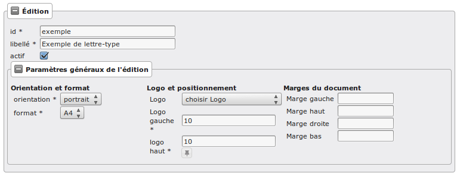

Les informations d'**édition** à saisir sont :

* **id** : identifiant de l'état/lettre type.
* **libellé** : libellé affiché dans l'application lors de la sélection d'une édition.
* **actif** : permet de définir si l'édition est active ou non.

.. note::

    Les champs **id** et **libellé** sont obligatoires, les **id** actif sont uniques.

Les champs de **paramètres généraux de l'édition** à saisir sont :

* **orientation** : orientation de l'édition (portrait/paysage).
* **format** : format de l'édition (A4/A3).
* **logo** : sélection du logo depuis la table des logos configurés.
* **logo haut/gauche** : position du coin haut/gauche du logo par rapport au coin
  haut/gauche de l'édition.
* **Marge gauche** : marge gauche de l'édition
* **Marge haut** : marge haute de l'édition
* **Marge droite** : marge droite de l'édition
* **Marge bas** : marge basse de l'édition

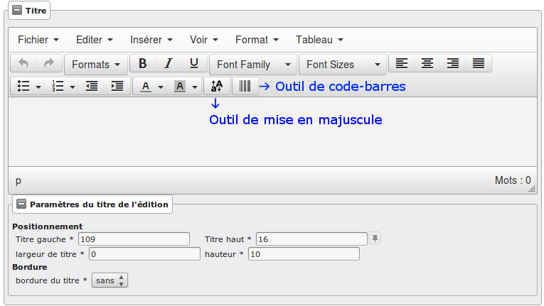

Paramétrage du titre de l'édition.
==================================

* **titre** : éditeur riche permettant une mise en page complexe.

---------------------------------
Paramètres du titre de l'édition.
---------------------------------

Positionnement :

* **titre gauche** : positionnement du titre par rapport à la marge gauche de l'édition.
* **titre haut** : positionnement du titre par rapport à la marge haute de l'édition.
* **largeur de titre** : taille de la largeur du titre.
* **hauteur** : hauteur minimum du titre.

Bordure :

* **bordure** : Affichage ou non d'une bordure.

----------------------------------
Paramétrage du corps de l'édition.
----------------------------------

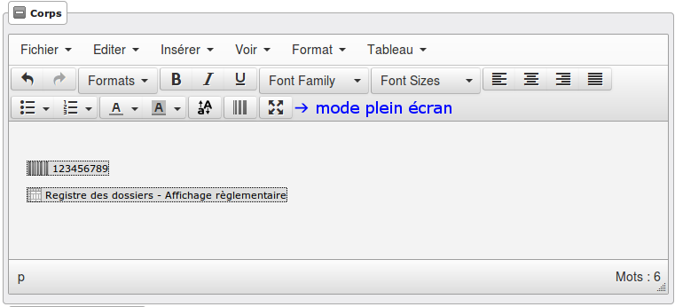

* **corps** : éditeur riche permettant une mise en page complexe.

.. note::

    Il est possible d'ajouter les sous-états paramétrés via le menu **Insérer->
    Sous-états**, un sous-état de chaque type peut être affiché.

    Vous pouvez également transformer en code-barres une sélection en cliquant
    sur l'icône correspondante ; de la même façon il est possible de 
    mettre en majuscule une sélection (champ de fusion).

    Enfin, lorsque le curseur de saisie se situe dans un tableau, l'icône du
    fichier découpé permet de le rendre sécable/insécable.

----------------------------------------------
Paramétrage des champs de fusions de l'édition
----------------------------------------------

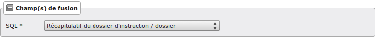

* **SQL** : sélection d'un jeu de champs de fusion.

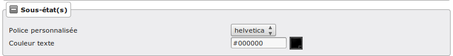

* **Police personnalisée** : sélection de la police des sous-états.
* **Couleur texte** : sélection de la couleur du texte des sous-états.

-------------------------------------
Paramétrage des tableaux des éditions
-------------------------------------
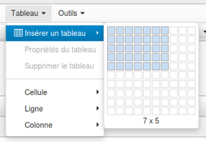

* **Créer un tableau** :

Choisir le nombre de lignes et de colonnes du tableau.

.. note::

    Il faut bien placer le curseur dans une des cellules du tableau que l'on 
    souhaite paramétrer.
    Idem pour le paramétrage des lignes et colonnes.

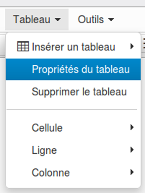

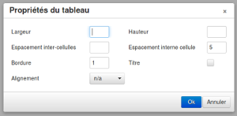

* **Paramétrage générale du tableau** :

    - Largeur :
     
    Ce champ sert à indiquer la largeur du tableau en % (UNIQUEMENT) par rapport 
    à la largeur du PDF.
         
    Par exemple, si le PDF fait une largeur de 30 cm et que la lageur du tableau    
    est de 10%, le tableau fera 3 cm de largeur sur le PDF.
     
    - Hauteur :
         
    Ce champ sert à indiquer la hauteur du tableau en % (UNIQUEMENT) par rapport 
    à la hauteur du PDF.
         
    Par exemple, si le PDF fait une hauteur de 50 cm et que la hauteur du tableau    
    est de 25%, le tableau fera 12.5 cm de hauteur sur le PDF.
     
    - Espacement inter-cellules :
    
    Espacement entre les cellules. En pixel.
    
    - Espace interne cellule :
    
    Espacement entre les bords de la cellule et son contenu. En pixel.
    
    - Bordure :
    
    Epaisseur des bordures du tableau. En pixel.
    
    - Titre :
    
    Lorsque cette case est cochée, elle permet de rajouter un titre au tableau.
    
    - Alignement :
    
    Permet de choisir le type d'alignement du texte dans le tableau. 
    Valeurs possibles : n/a (aucun), Gauche, Centré, Droite.

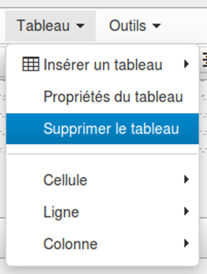

* **Supprimer un tableau**

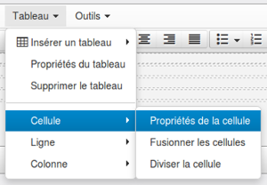

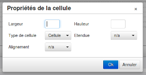

* **Paramétrage des cellules** :

    - Largeur :
    
    Ce champ sert à indiquer la largeur de la colonne en % (UNIQUEMENT) par 
    rapport à la largeur du tableau.
         
    Par exemple, si le tableau fait une largeur de 30 cm et que la largeur de la 
    colonne est de 10%, la colonne fera 3 cm de largeur.
    
    - Hauteur :
    
    Ce champ sert à indiquer la hauteur de la colonne en % (UNIQUEMENT) par 
    rapport à la hauteur du tableau.
         
    Par exemple, si le tableau fait une hauteur de 50 cm et que la hauteur de la
    colonne est de 25%, la colonne fera 12.5 cm de hauteur.
    
    - Type de cellule :
    
    Permet de définir si c'est une cellule "normale" ou une cellule qui va servir 
    d'en-tête dans le tableau.
    Valeurs possibles : Cellule, Cellule d'en-tête.
    
    - Étendue :
    
    Paramètre sur quoi doivent s'appliquer les paramètres renseignés.
    Valeurs possibles : n/a (aucun), Ligne, Colonne, Groupe de lignes, Groupe de 
    colonnes.
    
    - Alignement :
    
    Permet de choisir le type d'alignement du texte dans la cellule. 
    Valeurs possibles : n/a (aucun), Gauche, Centré, Droite.

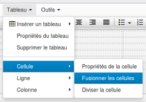

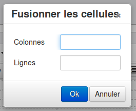

* **Fusionner des cellules** :

En sélectionnant les cellules à fusionner et en cliquant sur 
Tableau → Cellule → Fusionner les cellules les cellules seront fusionnées.

Si aucune cellule n'est sélectionnée, un menu apparaît :

    - Colonnes :
    
    Nombre de colonnes qui vont être fusionnées à partir de la cellule dans 
    laquelle le curseur est positionné.
    
    - Lignes :
    
    Nombre de lignes qui vont être fusionnées à partir de la cellule dans 
    laquelle le curseur est positionné.

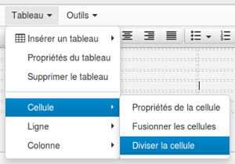

* **Diviser les cellules** :

Divise la cellule dans laquelle le curseur est positionné si elle avait été 
fusionnée avant.

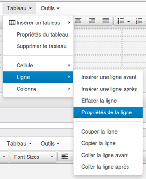

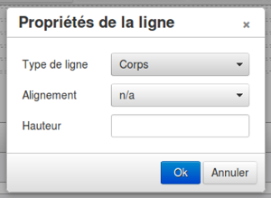

* **Paramétrage des lignes** :

    - Type de ligne :
    
    Permlet de définir le type de la ligne.
    Valeurs possibles : En-tête, Corps, Pied.
    
    - Alignement :

    Permet de choisir le type d'alignement du texte dans la ligne. 
    Valeurs possibles : n/a (aucun), Gauche, Centré, Droite.

    - Hauteur : 

    Ce champ sert à indiquer la hauteur de la ligne en % (UNIQUEMENT) par 
    rapport à la hauteur du tableau.
         
    Par exemple, si le tableau fait une hauteur de 50 cm et que la hauteur de la
    ligne est de 25%, la ligne fera 12.5 cm de hauteur.

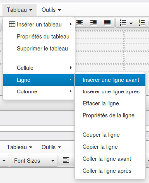

* **Insérer une ligne** :

Permet d'insérer une ligne avant ou après la ligne sur laquelle le curseur est 
positionné.

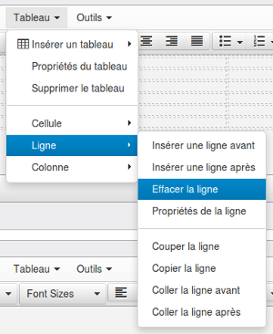

* **Éffacer une ligne** :

Supprimer la ligne sur laquelle le curseur est positionné.

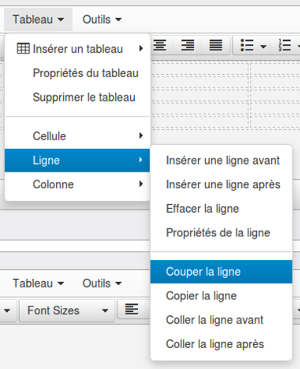

* **Couper une ligne** :

Coupe la ligne sur laquelle le curseur est positionné.

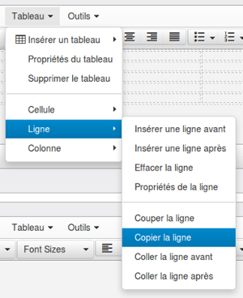

* **Copier une ligne** :

Copie la ligne sur laquelle le curseur est positionné.

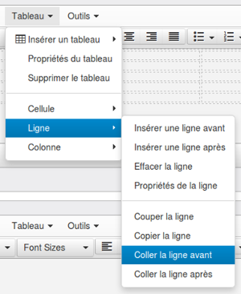

* **Coller une ligne** :

Colle la ligne qui avait été copiée/coupée avant ou après la ligne sur laquelle 
le curseur est positionné.

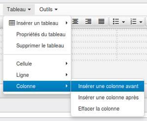

* **Insérer une colonne** :

Insère une colonne avant ou après la colonne sur laquelle le curseur est 
positionné.

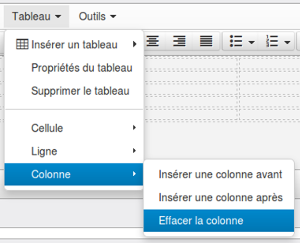

* **Effacer une colonne** :

Supprime la colonne sur laquelle le curseur est positionné.

----------------------------------------
Paramétrage des code-barres des éditions
----------------------------------------

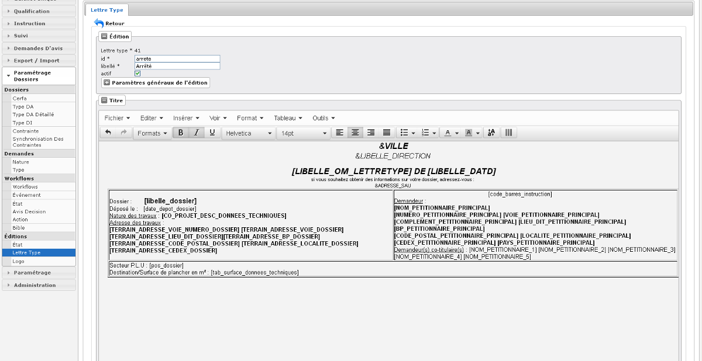

Saisir le champ de fusion

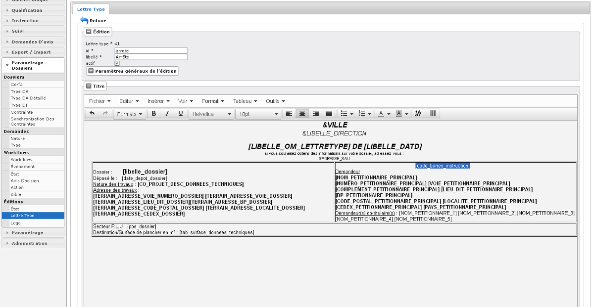

Sélectionner le champ de fusion

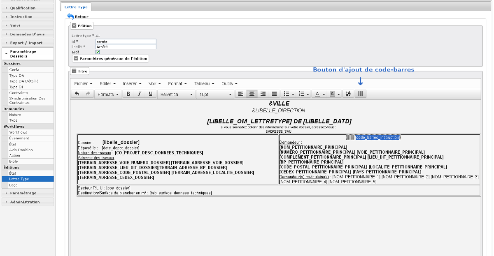

Cliquer sur le bouton de génération du code-barres puis valider le formulaire 
pour enregistrer les changements

--------------------------------------------
Ajout de paramètre spécifique dans l'édition
--------------------------------------------
Il est possible d'ajouter des paramètres spécifques dans les éditions.
Pour cela, il faut ajouter un paramètre à l'application.

(:menuselection:`Administration --> Paramètre`)

.. sidebar:: Note :

    Le paramètre ne doit pas commencer par option\_, ged\_, erp\_, sig\_ ou id\_.
    
Afin que le paramètre s'affiche dans l'édition, il faut l'ajouter précédé d'un &.

Par exemple, le paramètre se nommant mail\_contact s'utilisera comme ceci :

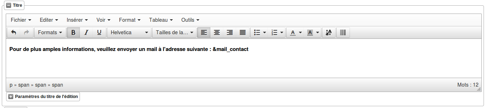

---------------------------------------------
Paramétrage des contraintes dans les éditions
---------------------------------------------

Pour afficher les contraintes du dossier, il faut saisir une variable de remplacement :

* **&contraintes** : Affiche toutes les contraintes.

* **&contraintes(liste_groupe=g1,g2...;liste_ssgroupe=sg1,sg2...;service_consulte=t;affichage_sans_arborescence=t)** : Toutes les options sont optionnelles. Les options liste_groupe et liste_ssgroupe peuvent contenir une valeur unique ou plusieurs valeurs separées par une virgule, sans espace. Chaque valeur est un texte qui va être recherché dans le nom de groupe ou de sous-groupe en fonction du critère.

Par exemple :

- &contrainte :
    liste de toutes les contraintes du dossier.

- &contrainte(groupe=zonage,servitudes)
    liste de toutes les contraintes de groupe 'zonage' ou 'servitudes'.

L'option service_consulte permet d'ajouter une condition sur le champ du même nom. Elle peut prendre t (Oui) ou f (Non) comme valeur.

La dernière option affichage_sans_arborescence permet d'avoir la liste des contraintes sans affichage des groupes, sous-groupes, et puces. Elle peut prendre t (Oui) ou f (Non) comme valeur.

=========
Les logos
=========

(:menuselection:`Paramétrage Dossiers --> Éditions --> Logo`)

...

