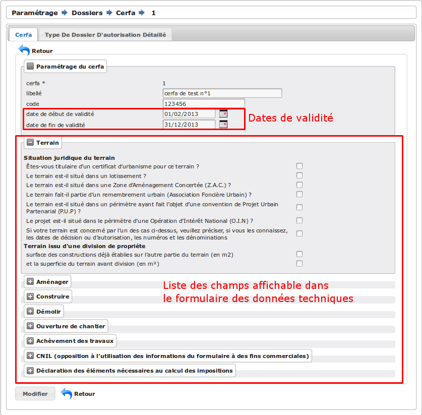

.. _parametrage_dossiers:

####################
Paramétrage dossiers
####################

Les dossiers
############

.. _parametrage_dossiers_dossier_autorisation_type:

===================================
Les types de dossier d'autorisation
===================================

(:menuselection:`Paramétrage --> Dossiers --> Type DA`)

Le principe
===========

Ce type de dossier d'autorisation peut également être appelé la série. C'est à
ce niveau que la numérotation des dossiers est gérée.
Lorsqu'un type de dossier d'autorisation est créé, modifié ou supprimé, la serie
correspondante est créée, mise à jour ou supprimée.

Saisir un type de dossier d'autorisation
========================================

Les informations à saisir sont :

* **code** : c'est le code à deux chiffres utilisé pour composer le numéro de
  dossier d'instruction (par exemple : PC).
* **libellé** : texte à afficher dans l'interface lors de la sélection
  d'un type de dossier d'autorisation.
* **description** : c'est un texte qui n'est pas utilisé dans les autres
  interfaces de l'application, mais il permet de décrire l'élément de
  paramétrage en détail dans un objectif de le documenter.
* **confidentiel** : permet de modifier le comportement standard de la
  confidentialité. Un dossier qui possède cet attribut sera uniquement visible
  et modifiable par les instructeurs de la division positionnée sur le dossier
  (ce comportement est là par exemple pour gérer la confidentialité des dossiers
  du module contentieux).
* **groupe** : (voir :ref:`parametrage_groupe`).

.. _parametrage_dossiers_dossier_autorisation_type_detaille:

=============================================
Les types de dossier d'autorisation détaillés
=============================================

(:menuselection:`Paramétrage --> Dossiers --> Type DA Détaillé`)

Le principe
===========

Le type de dossier d'autorisation détaillé est utile pour faire la distinction
entre plusieurs cas d'utilisations d'un même type de dossier d'autorisation.
Par exemple, il existe deux catégories de type de dossier d'autorisation "Permis
de Construire", un spécifique pour les maisons individuelles et un pour les
autres constructions. Il existe un seul type de dossier d'autorisation
"Déclaration Préalable", il faut tout de même le saisir comme type de dossier
d'autorisation détaillé.

Saisir un type de dossier d'autorisation détaillé
=================================================

Les informations à saisir sont :

* **code** : c'est un code utilisé pour identifier rapidement le type de dossier
  d'autorisation détaillé. Généralement il se compose des deux caractères du
  type de dossier d'autorisation auquel on rajoute un ou plusieurs caractères
  spécifiques.
* **libellé** : texte à afficher dans l'interface lors de la sélection
  d'un type de dossier d'autorisation détaillé.
* **description** : c'est un texte qui n'est pas utilisé dans les autres
  interfaces de l'application, mais il permet de décrire l'élément de
  paramétrage en détail dans un objectif de le documenter.
* **type de dossier d'autorisation** : (voir
  :ref:`parametrage_dossiers_dossier_autorisation_type`)
* **cerfa** : sélection du cerfa correspondant au dossier d'autorisation (voir :ref:`parametrage_dossiers_cerfa`)
* **cerfa pour lots** : sélection du cerfa correspondant aux lots du dossier d'autorisation (voir :ref:`parametrage_dossiers_cerfa`)
* **durée de validité** : durée de validité des dossiers d'autorisation,

  .. note::

      Si le DA est accepté et pas de DOC ou DAACT valide et date d'autorisation + délai DA inférieur à la date du jour alors le DA passe en état **périmé**

.. _parametrage_dossiers_dossier_instruction_type:

==================================
Les types de dossier d'instruction
==================================

(:menuselection:`Paramétrage --> Dossiers --> Type DI`)

Le principe
===========

Le type de dossier d'instruction permet de déterminer pour chaque type de
dossier d'autorisation détaillé les différentes possibilités (initial,
modificatif, transfert, DOC, ...). Par exemple, sur le type de dossier
d'autorisation "Permis de Construire", il peut y avoir : un initial, un
modificatif, un transfert, une DOC et une DAACT alors que sur le type de dossier
d’autorisation "Déclaration d'Autorisation de Travaux", il peut y avoir : un
initial, une DAACT.

Saisir un type de dossier d'instruction
=======================================

Les informations à saisir sont :

* **code** : c'est un code utilisé pour identifier rapidement le type de dossier
  d'instruction. 
* **libellé** : texte à afficher dans l'interface lors de la sélection
  d'un type de dossier d'instruction.
* **description** : c'est un texte qui n'est pas utilisé dans les autres
  interfaces de l'application, mais il permet de décrire l'élément de
  paramétrage en détail dans un objectif de le documenter.
* **type de dossier d'autorisation détaillé** : (voir
  :ref:`parametrage_dossiers_dossier_autorisation_type_detaille`)
* **suffixe** : precise le numéro de dossier doit prendre un suffixe
* **mouvement sitadel** : type de mouvement sitadel

.. _parametrage_dossiers_demandes:

Les demandes
############

.. _parametrage_dossiers_demande_nature:

======================
Les natures de demande
======================

(:menuselection:`Paramétrage --> Demandes --> Nature Demande`)

Le principe
===========

Chaque demande est reliée à une nature qui définit si la demande doit donner
lieu à la création d'un nouveau dossier d'autorisation ou si au contraire, elle
doit être rattachée à un dossier d'autorisation existant.

Saisir une nature de demande
============================

Les informations à saisir sont :

* **code** : c'est un code utilisé pour identifier rapidement la nature de la
  demande.
  Il faut utiliser "NOUV" si c'est pour une nouvelle demande et "EXIST" si c'est sur
  une demande existante.
* **libellé** : texte à afficher dans l'interface lors de la sélection
  d'une nature de demande.
* **description** : c'est un texte qui n'est pas utilisé dans les autres
  interfaces de l'application, mais il permet de décrire l'élément de
  paramétrage en détail dans un objectif de documenter le paramétrage.

.. _parametrage_dossiers_demande_type:

====================
Les types de demande
====================

(:menuselection:`Paramétrage --> Demandes --> Type Demande`)

Le principe
===========

Chaque demande est d'un type en particulier, cela permet de confitionner
lorsque celle-ci sera disponible dans les interfaces et les traitements
qui seront appliqués lors de sa création. Par exemple : la création ou non d'un
dossier d'instruction, le besoin de qualification

Saisir un type de demande
=========================

Les informations à saisir sont :

* **code** : c'est un code utilisé pour identifier rapidement le type de la
  demande.
* **libellé** : texte à afficher dans l'interface lors de la sélection
  d'un type de demande.
* **description** : c'est un texte qui n'est pas utilisé dans les autres
  interfaces de l'application, mais il permet de décrire l'élément de
  paramétrage en détail dans un objectif de le documenter.
* **groupe** : (voir :ref:`parametrage_groupe`).
* **type de dossier d'autorisation détaillé** : le type de dossier d'autorisation
  à créer si il doit en être créé un.
* **nature de la demande** : (voir :ref:`parametrage_dossiers_demande_nature`).
* **états du dernier dossier d'instruction** : état à partir du quel il est possible
  de créer la demande.
* **contraintes** : avec ou sans récupération des demandeurs du dernier dossier
  d'instruction.
* **type de dossier d'instruction à créer** : le type de dossier d'instruction
  à créer si il doit en être créé un (initial, modificatif, daact, ...) (voir
  :ref:`parametrage_dossiers_dossier_instruction_type`).
* **qualification** : lors de la saisie d'une nouvelle demande, le dossier
  concerné par cette demande est marqué comme à qualifier si le type de demande
  est configuré comme nécessitant une qualification.
* **événement** : c'est le type de l'événement d'instruction qui va être
  ajouté sur le dossier d'instruction au moment de la validation de la demande.
  Il est utilisé pour associer à la demande le bon récépissé, pour historiser
  la demande dans l'onglet "instruction" du dossier d'instruction et pour
  éventuellement modifier l'état du dossier d'instruction (voir
  :ref:`parametrage_dossiers_evenement`).

.. _parametrage_dossiers_cerfa:

Les CERFA
#########

(:menuselection:`Paramétrage --> Dossiers --> Cerfa`)

Formulaire de configuration des Cerfa.

Les informations à saisir sont :

* **libellé** : texte à afficher dans l'interface lors de la sélection
  d'un cerfa dans le formulaire d'édition des types détaillés de dossiers d'autorisation.
* **code** : c'est un code utilisé pour identifier rapidement le cerfa.
* **durée de validité** : durée de validité des cerfa.

.. note::

    Dans le formulaire, il suffit de cliquer sur le libellé du champ pour cocher
    la case correspondante.

.. _parametrage_dossiers_workflows:

Les workflows
#############

.. _parametrage_dossiers_evenement:

==============
Les événements
==============

(:menuselection:`Paramétrage --> Workflows --> Événement`)

Le principe
===========

.. note::

    Il est nécessaire de distinguer deux éléments concernant l'événement. On
    parlera d'"événements d'instruction" pour tous les événements créés dans
    l'onglet "Instruction" du dossier d'instruction, et on parlera
    d'"événements" pour le paramétrage.

Le paramétrage de l'événement permet, lors de la création d'un événement
d'instruction, de :

* déclencher une action (recalcul d'informations du dossier d'instruction),
* modifier l'état du dossier d'instruction,
* générer un document PDF, lettre au pétitionnaire ou acte, au moyen d'une
  lettre type,
* déclencher des suivi de dates et des actions spécifiques pour les arrêtés.

Les événements d'instruction disponibles dans l'interface dépendent de l'état
dans lequel est le dossier d'instruction.

Saisir un événement
===================

Les informations à saisir sont  :

* **libellé** : texte affiché dans l'interface lors du choix d'un événement à
  créer.
* **type** : permet de qualifier un type d'événement. Les valeurs disponibles
  sont : "arrêté" pour permettre une gestion propre aux arrêtés, ou
  "incomplétude" ou "majoration de délais" pour permettre certains calculs dans
  les tableaux de bord de l'instructeur.
* **état(s) source** : liste des états depuis lequel cet événement est
  disponible(voir :ref:`parametrage_dossiers_etat`).
* **type(s) de DI concerné(s)** : liste des types de dossier d'instruction pour
  lesquels cet événement est disponible (voir
  :ref:`parametrage_dossiers_dossier_instruction_type`).
* **restriction** : formule optionnelle permettant de refuser la validation du
  formulaire d'ajout d'événement d'instruction si le résultat de la formule est
  faux.

  Champs utilisable : [archive_date_dernier_depot] [archive_date_complet]
  [archive_date_rejet] [archive_date_limite]
  [archive_date_notification_delai] [archive_date_decision]
  [archive_date_validite] [archive_date_achevement]
  [archive_date_conformite] [archive_date_chantier]
  [archive_date_limite_incompletude]
  [archive_delai_incompletude]
  [duree_validite] [delai]
  [delai_notification] [date_evenement]
  [duree_validite_parametrage].

  Exemple : date_evenement <= archive_date_dernier_depot + 1.
* **action** : c'est l'action déclenchée par cet événement. Les valeurs
  disponibles sont les valeurs du paramétrage des actions (voir
  :ref:`parametrage_dossiers_action`).
* **état** : paramètre disponible dans les règles de l'action. (voir
  :ref:`parametrage_dossiers_etat`).
* **délai** : paramètre disponible dans les règles de l'action.
* **tacite** : paramètre disponible dans les règles de l'action.
* **délai notification** : paramètre disponible dans les règles de l'action.
* **avis** : paramètre disponible dans les règles de l'action. Choix de l'avis
  correspondant à l'événement à utiliser dans les règles de l'action. Les
  valeurs disponibles sont les valeurs du paramétrage des avis (voir
  :ref:`parametrage_dossiers_avis_decision`).
* **lettre type** : (voir :ref:`parametrage_dossiers_om_lettretype`).
* **consultation** : cette case à cocher est présente pour afficher la liste
  des consultations dans l'édition.
* **autorité compétente** : liste des autorité possible
  des consultations dans l'édition.
* **événement suivant tacite** : événement déclenché automatiquement lorsque la
  date de tacite est dépassée.
* **évènement suivant AR** : événement déclenché par un retour AR, si l'état du
  dossier d'instruction est bien lié à l'événement (état « compatible ») et si
  la restriction est valide. Cet événement peut donc déclencher un changement
  d'état du dossier d'instruction et une action.
* **évènement retour signature** : événement déclenché par la signature par l'autorité compétente de l'arrété.

.. _parametrage_dossiers_etat:

=========
Les états 
=========

(:menuselection:`Paramétrage --> Workflows --> État`)

Le principe
===========

Un état est la situation dans laquelle se trouve un dossier d'instruction à un
moment précis. Un dossier d'instruction est toujours dans un état. Cet état
existe dès la création du dossier d'instruction. Il va évoluer au cours de
l'instruction du dossier. C'est l'état du dossier d'instruction qui détermine
les événements possibles.

Saisir un état
==============

Les informations à saisir sont :

* **état** : c'est l'identifiant de l'état (dans le sens clé primaire de
  l'enregistrement), il est recommandé de saisir ici une chaine de caractères
  dans laquelle les espaces, les apostrophes ou tout caractère spécial sont
  remplacés par des "_", les caractères accentués par leur caractère non
  accentué et les majuscules remplacés par des minuscules (exemple : si le
  libellé de l'état est "Initialisé", la valeur à saisir ici serait
  "initialisé").
* **libellé** : texte à afficher dans l'interface lors de la sélection d'une
  état.
* **statut** : permet de catégoriser l'état pour permettre de gérer le statut du
  dossier "en cours" ou "clôturé".

.. _parametrage_dossiers_action:

===========
Les actions
===========

(:menuselection:`Paramétrage --> Workflows --> Action`)

Le principe
===========

Une action permet de recalculer des informations du dossier d'instruction. Elle
est composée d'une série de règles de calculs. Chaque règle de calcul vise à
modifier la valeur du champ lié dans le dossier d'instruction.

Elle accepte en paramètre de calcul :

* la valeur initiale de l'un des champs disponibles pour le dossier
  d'instruction,
* des valeurs fixées dans le paramétrage de l'action,
* des valeurs fixées dans le paramétrage de l'événement déclenchant l'action,
* des formules de calcul.

La valeur "null" vide la valeur du champ dans le Dossier d'Instruction.

Saisir une action
=================

Les informations à saisir sont :

* **action** : c'est l'identifiant de l'action (dans le sens clé primaire de
  l'enregistrement), il est recommandé de saisir ici une chaine de caractères
  dans laquelle les espaces, les apostrophes ou tout caractère spécial sont
  remplacés par des "_", les caractères accentués par leur caractère non
  accentué et les majuscules remplacés par des minuscules (exemple : si le
  libellé de l'action est "Prolonger le délai de validité", la valeur à saisir
  ici serait "prolonger_le_delai_de_validite").
* **libellé** : texte à afficher dans l'interface lors de la sélection
  d'une action.
* **pour tous les champs règle** : règle rattaché au champ du dossier
  d'instruction du même nom.
* **méthode à appeler** : ce champ permet de sélectionner une des méthodes de
  mise à jour des informations du dossier d'autorisation.

Les champs disponibles pour la saisie des règles sont :

**Valeurs du dossier avant l'évènement**

[archive_etat] [archive_delai] [archive_accord_tacite] 
[archive_avis]
[archive_date_dernier_depot] [archive_date_complet] 
[archive_date_rejet] [archive_date_limite] 
[archive_date_notification_delai] [archive_date_decision] 
[archive_date_validite] [archive_date_achevement] 
[archive_date_conformite] [archive_date_chantier] 
[archive_etat_pendant_incompletude] [archive_date_limite_incompletude]
[archive_delai_incompletude] [archive_autorite_competente] 
[duree_validite]

**Paramètres de l'évènement**

[etat] [delai] [accord_tacite] [avis_decision] 
[delai_notification] [date_evenement] [autorite_competente]

**Paramètres du type detaillé du dossier d'autorisation**

[duree_validite_parametrage]

**Suppression de la valeur**

[null]

Exemples de règles :

* exemple avec 3 opérandes : date_evenement+delai+3
* exemple avec 2 opérandes : archive_date_complet+4
* exemple avec 1 opérande : null

.. _parametrage_dossiers_incompletude:

========================
Gestion de la péremption
========================

Un dossier d'autorisation passera à l'état "Périmé" automatiquement grâce 
à une vérification périodique des conditions suivantes :

- l'état du dossier d'autorisation doit être à "Accordé",
- la date de décision du dossier d'autorisation ne doit pas être nul,
- l'état des dossiers d'instruction doivent être à "accepter",
- les dossiers d'instruction ne doivent pas être de type "DAACT" ou "DOC",
- la date de validité doit être antérieur à la date du jour.

=========================
Gestion de l'incomplétude
=========================

Le principe
===========

Pour les instructeurs, il y a deux problématiques distinctes : l'instruction des dossiers avec le suivi des dates et la gestion de l'incomplétude.
En cas d'incomplétude, les délais d'instruction sont suspendus. Par contre il peut y avoir des événements d'instruction, notamment concernant les prolongations de délais d'instruction.
Les événements d'incomplétude et de prolongation de délais ne sont pas activés dans un ordre déterminé : ils peuvent être activés par l'instructeur dès qu'il juge opportun de le faire.

Exemple de déroulement :

.. sidebar:: Note :

    État initial : les délais, date limite d'instruction, état et événement suivant tacite sont initialisés en fonction de l'action choisi pour ce type d'événement.

- dépôt de dossier PCI initial le 01/01/2013

    - délai d'instruction = 3
    - date limite de complétude = date_depot + 1
    - événement tacite = accord tacite
    - date limite d'instruction = date_depot + delai

.. sidebar:: Note :

    Pendant l'envoi du courrier de la consultation l'incomplétude du dossier est détectée, cela entraine une modification de l'état et envoi du courrier de notification de l'incomplétude.

- envoi d'un courrier de majoration de délai pour consultation ABF

    - délai = 5
    - événement après RAR = majoration_delai_abf_ar

- envoi notification de pièces manquantes

    - état = incomplet
    - événement après RAR = incompletude_ar

.. sidebar:: Note :

    Une fois le retour de l'accusé de réception du courrier de notification de l'incomplétude un événement suivant tacite sur le dossier d'instruction est défini.

- Retour de l'AR incomplétude

    - état = incomplétude notifiée
    - date de complétude = NULL
    - délai = 3
    - date limite d'instruction = date_evenement + delai
    - événement suivant tacite = rejet tacite

    .. tip:: À ce moment de l'instruction des événements d'instruction peuvent être ajouté. Malgré que les délais de l'instruction soient suspendus, ils sont sauvegardés et peuvent être mis à jour.

.. sidebar:: Note :

    À ce moment le dossier d'instruction passe à l'état "incomplet", l'état précédent est sauvegardé pour qu'il soit mis à jour et qu'il soit retrouvé à la sortie de l'incomplétude.

- Retour de l'AR de majoration de délai consultation ABF

    - état = incompletude notifiée
    - date limite d'instruction : non modifié car en incomplétude
    - délai = archive_delai + 5 (5 mois est le délai de majoration_délai_abf)
    - événement suivant tacite = refus tacite

.. sidebar:: Note :

    Cet événement d'instruction correspond à la sortie de l'état d'incomplétude : les délais, dates limites, état et événement suivant tacite définis avant et pendant l'incomplétude sont de nouveau actifs.
    Un événement avec avis permet aussi de sortir d'incomplétude.

- Dépôt de pièces complémentaires (événement = depot_pieces_complementaires)
    
    - date de dernier dépôt = date_evenement
    - état = en cours
    - date de complétude = date_evenement
    - date de notification délai = date_depot + 1
    - date de limite de complétude = NULL
    - date limite de l'instruction = date_evenement + delai (le délai majoré de 3 mois du délai initial + 5 mois de majoration -> 8 mois)
    - événement suivant tacite = accord tacite

Configuration de l'incomplétude
===============================

---------------------
Saisie des événements
---------------------

(:menuselection:`Paramétrage --> Workflows --> Événements`)

- notification de pièces manquantes :

    - type = incomplétude
    - état = dossier incomplet
    - événement après RAR = incomplétude après accusé de réception

- incomplétude après accusé de réception :

    - état = incomplétude notifiée
    - action = instruction suspendue, dossier incomplet
    - délai = 3
    - événement suivant tacite = rejet tacite

- dépôt de pièces complémentaires :

    - type = retour de pièces : ce type d'événement sort le dossier d'incomplétude

- rejet tacite

    - accord tacite = Non : permet de ne pas ré-executer l'événement suivant tacite du dossier d'instruction
    - l'avis doit être défini dans l'action correspondante

------------------
Saisie de l'action
------------------

(:menuselection:`Paramétrage --> Workflows --> Action`)

- instruction suspendue, dossier incomplet :

    - règle état = etat
    - règle date limite d'incomplétude = date_evenement + delai
    - règle délai d'incomplétude  = delai

.. _parametrage_dossiers_avis_decision:

========
Les avis
========

(:menuselection:`Paramétrage --> Workflows --> Avis Décision`)

Le principe
===========

L'avis est un texte décrivant l'avis donné (par exemple "Favorable avec
réserves").

Saisir un avis
==============

Les informations à saisir sont :

* **libellé** : texte affiché dans l'interface lors du choix d'un avis.
* **type d'avis** : permet de catégoriser l'avis ("favorable", "défavorable" ou
  "annulation").
* **sitadel** : permet d'associer à cet avis un code pour les statistiques
  SITADEL.
* **sitadel_motif** : permet d'associer à cet avis un code pour les statistiques
  SITADEL.

.. _parametrage_dossiers_bible:

========
La bible
========

(:menuselection:`Paramétrage --> Workflows --> Bible`)

...

.. _parametrage_dossiers_editions:

Les éditions
#############

.. _parametrage_dossiers_om_etat:

=========
Les états
=========

(:menuselection:`Paramétrage --> Éditions --> État`)

...

.. _parametrage_dossiers_om_lettretype:

=================
Les lettres types
=================

(:menuselection:`Paramétrage --> Éditions --> Lettre Type`)

...

.. _parametrage_dossiers_om_logo:

=========
Les logos
=========

(:menuselection:`Paramétrage --> Éditions --> Logo`)

...

