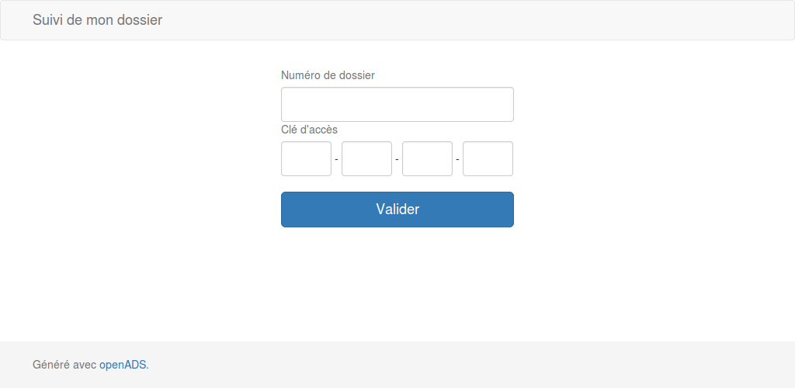
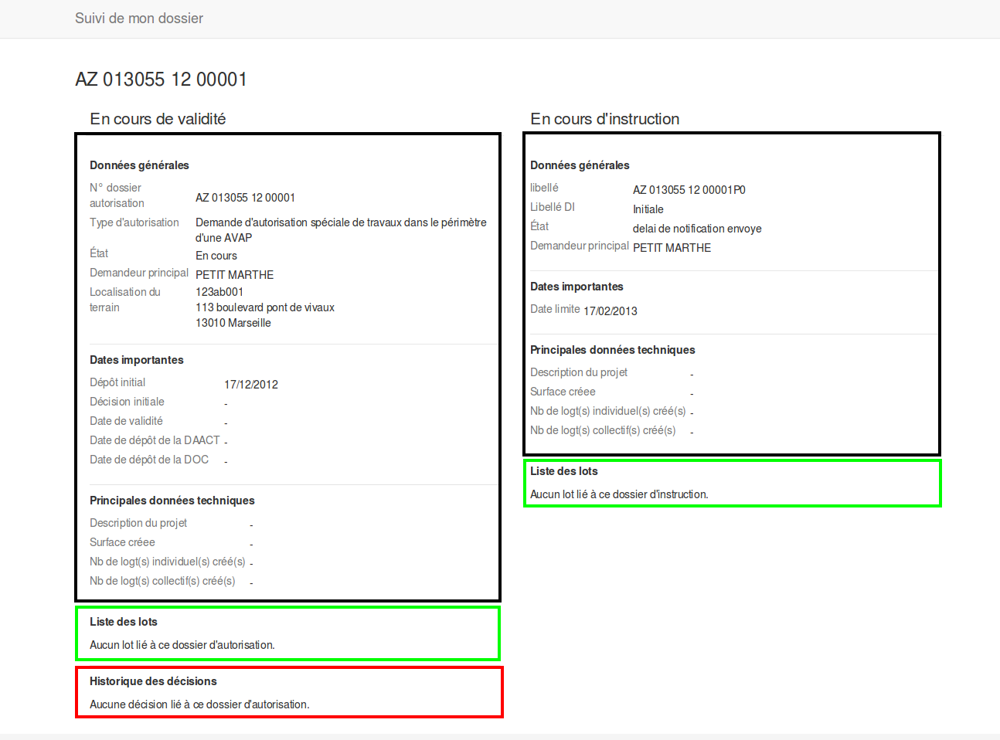

.. _portail_citoyen:

###############
Portail citoyen
###############

.. _portail_citoyen_page_acces:

Le formulaire d'accès au suivi de dossier
#########################################

Si l'option accès portail citoyen détaillée dans :ref:`cette rubrique <parametrage_parametre>`
est activée, les pétitionnaires ont la possibilité de suivre l'avancement de leur demande
en temps réel par le biais du portail citoyen, en se munissant simplement de leurs
identifiants.

Les informations à saisir sont :

* **Numéro de dossier** : Le numéro de dossier d'autorisation ou de dossier d'instruction,
  qui apparaît sur tous les documents: récépissés, arrêtés etc.

* **Clé d'accès** : La clé d'accès au portail citoyen qui est par défaut présente sur tous
  les récépissés, sur la lettre type "information d'accès citoyen", ou encore sur la fiche
  détaillée du dossier d'instruction, dans le champ pétitionnaire.

La fiche "Suivi de mon dossier"
###############################

La visualisation contient deux blocs d'informations :

- **En cours de validité** : informations des dossiers d'instructions soumis à un arrété.

    * En noir : les informations importantes en cours de validité
    * En vert : la liste des lots et leurs petitionnaire principal en cours de validité
    * En rouge : la liste des décisions en cours de validité

- **En cours d'instruction** : données du dossier d'instruction en cours d'instruction.

    * En noir : les informations importantes en cours d'instruction
    * En vert : la liste des lots et leur pétitionnaire principal en cours d'instruction
