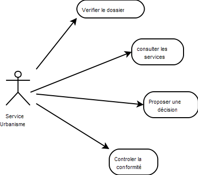
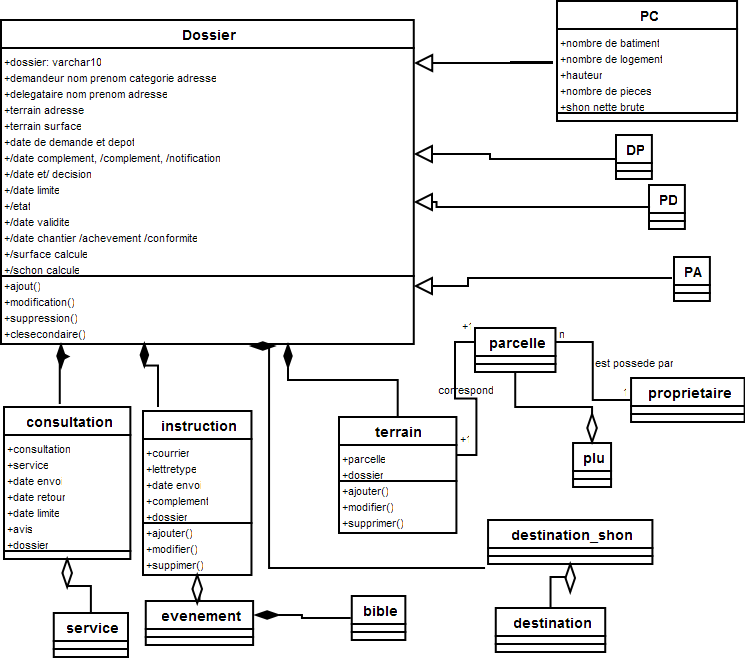

.. _principes:

#############
Les principes
#############

openFoncier a pour but d'instruire les autorisations du droit du sol (ADS) suivant la loi
applicable au 1er octobre 2007.

Dans la version 3.0.0, il est traité les permis de construire, permis d'aménager,
les déclarations de travaux et les permis de démolir.

Les principes sont les suivants :

- la mise en oeuvre d'un workflow paramétrable pour l'instruction

- l'édition de lettre type

- le transfert des données aux administrations partennaires

- la géolocalisation automatique (parcelle, pos) et manuelle

- la situation sur des fonds de carte internet

- l'intégration dans le sig local : cadastre, pos/plu, adresse, servitudes, lotissement ...

Les évolutions de la version 3.0.0
==================================

La version 3.0.0 utilise openMairie 4.0.1 avec :

- l'ergonomie jquery

- les tableaux de bord individualisable avec widget

- l'information géographique en interne avec openLayers

- le générateur openMairie (depuis la version OM 3.0.0)

Cette version ne fonctionne qu'avec postgresql complété par postgis (pour la partie SIG)
et dblink (pour les vues sur les bases externes)

La ville de Marseille va proposer en 2012 :

- la dématérialisation des dossiers (dans un module à part de gestion des demandes)

- la déclaration de travaux pour les ERP (etablissement recevant du public)

- la multi collectivité (gestion par secteur)

- la vision globale du dossier et des modificatifs

- le verouillage de l'instruction, une fois la décision prise

- la saisie par code barre des retours de consultation

- la gestion des taxes

- la gestion du contentieux

Il reste à mettre en oeuvre suivant les moyens des collectivités :

- le CU : certificat d urbanisme (transfert depuis la version 2.0.0)

- la DIA : déclaration d'intention d'aliéner

les fonctions 2.0.0 abandonnées
===============================

Les fonctions suivantes de la version 2.0.0 (juillet 2009) sont ne sont pas reprises dans la version 3.0.0 :

- lien géographique dans les formulaires : dossier, terrain.

- l'ouverture d'une fenetre "architecte" dans "dossier". La création de nouveaux
architecte se fait dans paramétrage/architecte

- le webservice avec nusoap et les bibliothéques dynmap qui sont trop spécifiques

Il est noté que la version mysql 2.0.0 peut être reprise dans une version ultérieure mais à l'heure
actuelle, cela n'est pas prévu.

La récupération de données pour postgresql
==========================================

Dans le cadre d'un transfert d'une autre application, il est conseillé d'utiliser
l'option import du menu administrateur (voir guide du développeur openMairie) et de faire
un import en CSV.

Pour un transfert de la version 2.0.0 (mysql) vers la version 3.0.0 (postgresql)
il faut faire une extraction de la base en insérant les data de chaque
table suivant les contraintes d'intégrités ::

    les tables "filles" doivent être importées avant les tables "mères"
        exemple : importer nature avant dossier
        
    il faut corriger les clés secondaires à 0 pour respecter l'intégrité
        update dossier set instructeur = null where instructeur = 0;
        update dossier set travaux = null where travaux = 0;
        update dossier set demandeur_categorie = null where demandeur_categorie = 0;
        update dossier set demandeur_civilite = null where demandeur_civilite = '0';
        update dossier set delegataire_civilite = null where delegataire_civilite = '0';
        update dossier set demandeur_civilite = null where demandeur_civilite = '';
        update dossier set delegataire_civilite = null where delegataire_civilite = '';
        update dossier set architecte = null where architecte = '0';
        
    les lettres types, état, sous états doivent être importés avec le générateur
        voir guide du développeur openMairie

Les cas d'utilisation d'openFoncier :
=====================================

le Service urbanisme

    contrôle le dépôt d un dossier de demande d autorisation (complet ou non ?)

    consulte les services sur cette demande et receptionne les avis

    propose au maire un arrete de decision

    contrôle la conformité des travaux et de l autorisation si l autorisation est obtenu

Le diagramme de classe openFoncier
==================================

Le diagramme de classe permet de modéliser les classes et leurs relations
independamment d'un langage de programmation particulier.

Le diagramme des cas d utilisation montre le systeme du point de vue des acteurs.

Le diagramme de classe en montre la structure interne. C'est une representation abstraite des classes qui vont
interagir ensemble pour réaliser les cas d utilisation.

    
    
Nous vous proposons maintenant d'utiliser openFoncier :

- de créer un dossier

- d'instruire un dossier

- de demander des consultations

- d'affecter un ou plusieurs terrains

- de conserver des notes
    
    

