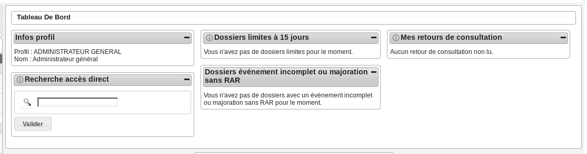

######################
ADMINISTRATEUR GÉNÉRAL
######################

Description
===========

Fonctionnalités disponibles
===========================

Tableau de bord
---------------

Widget *Infos profil*
#####################

- Visualiser les informations du profil de l'utilisateur connecté

Widget *Recherche accès direct*
###############################

- Rechercher un dossier d'instruction par son identifiant

Widget *Dossiers limites à 15 jours*
####################################

- Visualiser la liste des dossiers d'instruction affecté à l'utilisateur connecté dont la date limite arrive bientôt à échéance
- Accéder aux dossiers d'instruction affecté à l'utilisateur connecté dont la date limite arrive bientôt à échéance

Widget *Dossiers événement incomplet ou majoration sans RAR*
############################################################

- Visualiser la liste des dossiers d'instruction affecté à l'utilisateur connecté dont l'incomplétude n'a pas été notifié au demandeur
- Accéder aux dossiers d'instruction affecté à l'utilisateur connecté dont l'incomplétude n'a pas été notifié au demandeur

Widget *Mes retours de consultation*
####################################

- Visualiser la liste des consultations des dossiers d'instruction affecté à l'utilisateur dont un avis a été rendu
- Accéder aux consultations des dossiers d'instruction affecté à l'utilisateur dont un avis a été rendu

Menu
----

.. image:: menu_admingen.png

Rubrique *Autorisation*
-----------------------

Rubrique *Guichet Unique*
-------------------------

Rubrique *Instruction*
----------------------

Rubrique *Suivi*
----------------

Rubrique *Export / Import*
--------------------------

Rubrique *Paramétrage Dossiers*
-------------------------------

Rubrique *Paramétrage*
----------------------

Rubrique *Administration*
-------------------------
