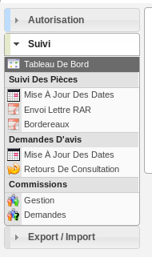

#############
CELLULE SUIVI
#############

Description
===========

C'est le profil utilisé pour le service de suivi. Il va leur permettre :

- d'assurer le suivi des dates et délais des dossiers ;
- de gérer les demandes de passage en commission ;
- de faire des exports CSV ;
- de visualiser les DA ;

Fonctionnalités disponibles
===========================

Tableau de bord
---------------

Aucun widget.

Menu
----

Rubrique *Autorisation*
-----------------------

Dossiers d'autorisation
#######################

Actions identiques à celles du profil instructeur (cf :ref:`Rubrique autorisation<profil_instructeur_rubrique_autorisation>`)

Rubrique *Suivi*
----------------

(Suivi des pièces) Mise à jour des dates
########################################

- Mettre à jour les dates de suivi d'événements d'instruction.
- Visualiser la synthèse des date de suivi d'événements d'instruction.

Envoi lettre RAR
################

- Télécharger au format PDF l'édition des pré-imprimés RAR.

Bordereaux
##########

- Télécharger le bordereau d'envoi des dossiers compris dans un intervalle de dates.

(Demandes d'avis) Mise à jour des dates
#######################################

- Mettre à jour les dates de retour de consultation de service.

Retours de consultation
#######################

- Saisir le retour d'avis du service consulté.

(Commission) Gestion
####################

- Visualiser la liste des commissions triées par date.
- Ajouter une commission.
- Accéder à la fiche de visualisation d'une commission.
- Modifier une commission.
- Supprimer une commission.
- Diffuser l'ordre du jour.
- Diffuser le compte rendu.
- Télécharger l'édition des propositions d'avis.
- Télécharger l'édition de l'ordre du jour.
- Télécharger l'édition du compte rendu.
- Visualiser la liste des dossiers de la commission.
- Rendre un avis sur un dossier en commission.
- Ajouter et retirer des dossiers de la commission.
- Planifier un dossier en commission.

(Commission) demandes
#####################

- Visualiser la liste des dossiers d'instruction qui ont une demande de passage en commission.

.. _profil_suivi_rubrique_export:

Rubrique *Export / Import*
--------------------------

Export Sitadel
##############

- Générer un export SITADEL des dossiers d'instruction compris dans un intervalle de dates.

Versement aux archives
######################

- Importer automatiquement le numéro de versement aux archives des dossiers depuis un fichier CSV.

Statistiques à la demande
#########################

- Exporter une liste de dossiers d'instruction selon leur type, et avec des détails 
  différents selon la requête utilisée.
