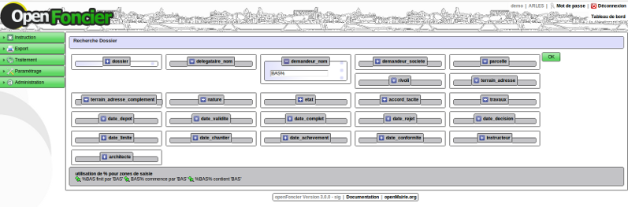
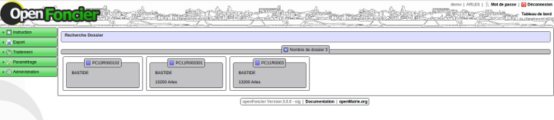
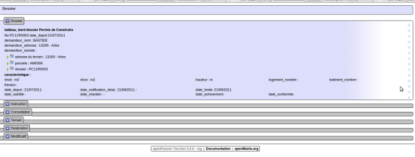

.. _recherche:

#######################
La recherche de dossier
#######################

Il est proposé de décrire le module de recherche

L'accès se fait par instruction -> recherche

Vous accédez à la grille ci dessous ou vous devez sélectionner vos critères
qui sont combinés avec des ET (AND) 

Exemple recherche des pétitionnaires dont le nom commence par 'BAS'

Les résultats sont :

en cliquant sur le numero de PC, il est affiché le dossier.

