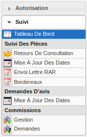
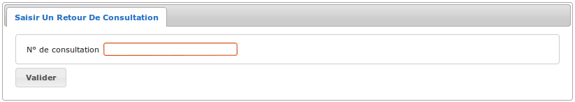
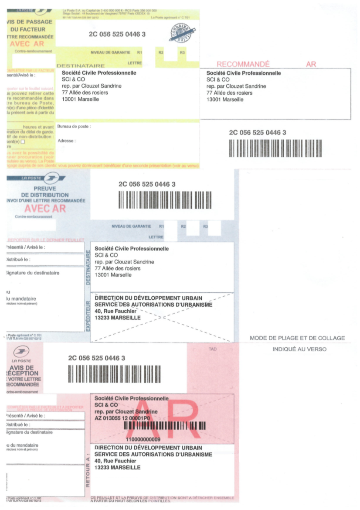
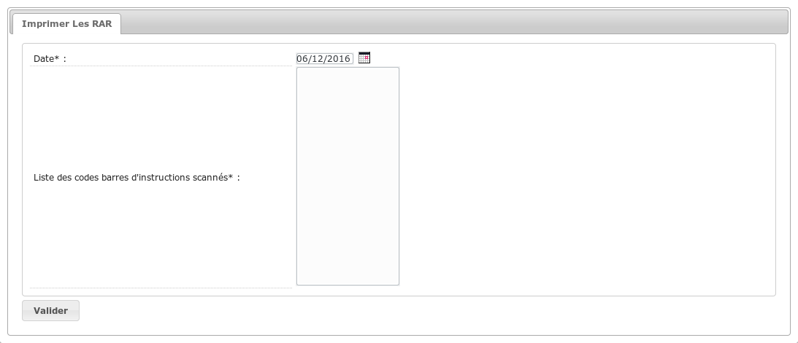
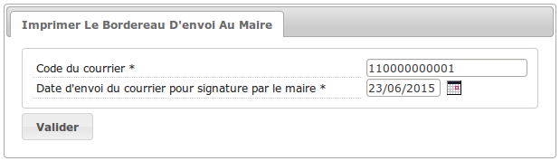
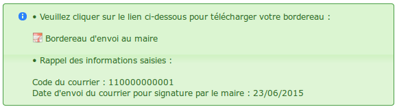
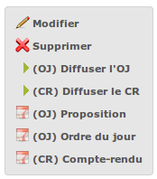

.. _suivi:

#####
Suivi
#####

.. _suivi_menu:

Le menu
#######

.. _suivi_suivi_des_pieces:

Suivi des pièces
################

.. _suivi_retours_de_consultation:

================================
Saisir un retour de consultation
================================

(:menuselection:`Suivi --> Suivi Des Pièces --> Retours De Consultation`)

Les retours de consultations peuvent se faire directement depuis le module
service consulté dans lequel le service consulté accède au logiciel pour y
saisir son avis.

Les retours de consultations peuvent aussi être envoyés par courrier ou par mail
lorsque la consultation du service se fait par voie papier. Dans ce cas, les
retours de consultation sont bippés, ce qui ouvre le formulaire de mise à jour
de consultation. L'utilisateur peut alors saisir le retour de consultation,
ainsi qu'un fichier, représentant le courrier. 

Un premier écran permet de rechercher la consultation : il suffit ici de saisir
l'identifiant de la consultation pour laquelle on souhaite saisir un retour.
Par exemple grâce au scan de code-barre ou simplement en saisissant manuellement
son identifiant.

Une fois le formulaire validé, trois cas de figures sont possibles :

* soit aucune valeur n'a été saisie :
  
  .. image:: suivi_retours_de_consultation_message_aucune_saisie.png

* soit l'identifiant de la consultation ne correspond à aucune consultation
  existante :
  
  .. image:: suivi_retours_de_consultation_message_consultation_inexistante.png

* soit la consultation existe, on obtient alors un formulaire de saisie du
  retour de consultation.

.. _suivi_mise_a_jour_des_dates:

=======================
Mettre à jour les dates
=======================

(:menuselection:`Suivi --> Suivi Des Pièces --> Mise À Jour Des Dates`)

Cet écran permet de mettre à jour les dates de traitement du processus de signature
des documents finalisés.

  .. image:: suivi_maj_date.png

Si l'instruction mise à jour a un événement retour paramétré (un événement 
retour AR ou retour signature), les dates potentiellement mises à jour, 
c'est-à-dire la date envoi/retour de signature, la date envoi/retour d'AR et la 
date envoi/retour de contrôle de légalité, sont répliquées dans l'instruction 
crée par l'événement retour paramétré afin que l'action puisse utiliser ces 
données (pour plus d'informations sur le paramétrage d'une action voir 
:ref:`parametrage_dossiers_action`).

.. _suivi_envoi_lettre_rar:

================
Imprimer les RAR
================

(:menuselection:`Suivi --> Suivi Des Pièces --> Envoi Lettre RAR`)

Cet écran permet un traitement en masse d'édition des pré-imprimés RAR pour les
courriers générés dans le cadre de l'instruction. Il suffit de saisir une date
d'envoi, par défaut la date du jour, et de bipper à la douchette les courriers
concernés (ou de saisir manuellement l'identifiant du courrier). Une fois que
tous les courriers sont bippés, un bouton permet de générer le fichier PDF qui
est adapté pour être imprimé sur les pré-imprimés RAR de La Poste.

Un seul fichier contient tous les RAR dans l'ordre de bip.

Exemple avec une étiquette de la poste :

Si l'événement d'instruction dont on notifie le demandeur, possède une :ref:`phase <parametrage_phase>` alors une ligne est ajoutée dans l'encadré **"retour à"** de l'avis de réception avec le code de cette phase et le libellé de la division à laquelle est affecté le dossier.

Exemple de l'affichage de la phase et de la division avec une étiquette de la poste (la phase à la valeur **"SUIVI"** et la division **"DIVISION H"**) :

Lors de la génération du fichier des RAR, la date d'envoi RAR est mise à jour
sur les événements ayant servi à générer les courriers, avec la date saisie par
l'utilisateur.

Une fois le formulaire validé, quatre cas de figures sont possibles :

* soit aucune valeur n'a été saisie :
  
  .. image:: suivi_envoi_lettre_rar_message_aucune_saisie.png

* soit l'identifiant de l'événement d'instruction est incorrect :
  
  .. image:: suivi_envoi_lettre_rar_message_evenement_instruction_incorrect.png

* soit l'identifiant de l'événement d'instruction ne correspond à aucun
  événement d'instruction existant :
  
  .. image:: suivi_envoi_lettre_rar_message_evenement_instruction_inexistant.png

* soit l'événement d'instruction existe et possède déjà une date d'envoi RAR qui
  est différente de la date passée en paramètre :
  
  .. image:: suivi_envoi_lettre_rar_message_evenement_instruction_deja.png

* soit l'événement d'instruction existe et n'a pas de date d'envoi RAR, on
  obtient alors un lien vers le fichier pdf permettant d'imprimer les
  pré-imprimés RAR :
  
  .. image:: suivi_envoi_lettre_rar_message_evenement_instruction_ok.png

.. _suivi_bordereaux:

==========
Bordereaux
==========

(:menuselection:`Suivi --> Suivi Des Pièces --> Bordereaux`)

L'objectif est d'assurer un meilleur suivi d'un envoi groupé de dossiers en signature.

.. image:: suivi_bordereaux_formulaire.png

Ainsi après avoir sélectionné le bordereau et renseigné un intervalle de dates (par défaut celle du jour), cet écran permet d'imprimer un tableau listant tous les dossiers y correspondants.

Selon le bordereau choisi la date contrôlée sera différente :

* Bordereau des décisions

Liste les dossiers dont la dernière instruction a pour date d'envoi pour signature la date saisie et dont l'événement est de type arrêté.

* Bordereau des courriers à la signature du Maire qui ne sont pas des décisions

Liste les dossiers dont la dernière instruction a pour date d'envoi pour signature la date saisie et dont l'événement n'est pas de type arrêté.

* Bordereau des avis du Maire au Préfet

Liste les dossiers dont l'autorité compétente est l'État ou la commune pour État et dont la dernière instruction a pour date d'envoi RAR la date saisie. Il est également appliqué un filtre sur l'événement spécifique "avis du Maire". On peut spécifier ce dernier (paramètre *id_evenement_bordereau_avis_maire_prefet* auquel il faut donner l'identifiant de cet événement, plus d'information sur le paramétrage :ref:`ici <parametrage_parametre>`).

* Bordereau des contrôles de légalité

Liste les dossiers dont l'autorité compétente est la commune et dont la dernière instruction a pour date d'envoi au contrôle légalité la date saisie.

Une fois le formulaire validé, trois cas de figures sont possibles :

* soit aucune date n'a été saisie :
  
  .. image:: suivi_bordereaux_message_aucune_date.png

* soit aucun bordereau n'a été sélectionné :
  
  .. image:: suivi_bordereaux_message_aucun_bordereau.png

* soit la saisie est correcte, on obtient alors un lien vers le fichier PDF du
  bordereau permettant de l'imprimer :
  
  .. image:: suivi_bordereaux_message_telechargement.png

Les quatre colonnes du tableau généré sont les suivantes :

* dossier

* événement

* coordonnées du demandeur

* coordonnées du terrain

.. _suivi_bordereau_envoi_maire:

==========================
Bordereau d'envoi au maire
==========================

(:menuselection:`Suivi --> Suivi Des Pièces --> Bordereau d'envoi au maire`)

Cet écran permet d'imprimer un bordereau à envoyer au maire, ayant pour objet
la transmission d'une proposition de décision ou d'un courrier d'instruction
selon que le type de l'événement soit respectivement un arrêté ou non.

Une fois le formulaire validé, trois cas de figures sont possibles :

* soit aucune date n'a été saisie

* soit le code-barres fourni est invalide

* soit la saisie est correcte, on obtient alors un lien vers le fichier PDF du
  bordereau permettant de l'imprimer. De plus la date d'envoi à signature du maire
  est mise à jour par celle saisie.

.. _suivi_demandes_avis:

Demandes d'avis
###############

.. _suivi_demandes_avis_mise_a_jour_des_dates:

=======================
Mettre à jour les dates
=======================

(:menuselection:`Suivi --> Demandes D'Avis --> Mise À Jour Des Dates`)

Cet écran permet de mettre à jour la date de réception de la demande d'avis.

  .. image:: suivi_demandes_avis_maj_date.png

.. _suivi_commissions:

Commissions
###########

.. _suivi_commissions_gestion:

=====================
Gérer les commissions
=====================

(:menuselection:`Suivi --> Commissions --> Gestion`)

Créer une commission
====================

Planifier/retirer un dossier
============================

Planifier un dossier spécifique
===============================

Diffusion de l'ordre du jour
============================

Dans la visualisation d'une commission, il est possible de diffuser via mail l'ordre du jour de la commission à la liste de diffusion.

Pour cela, il faut cliquer sur le lien "(OJ) Diffuser l'OJ" dans le portlet d'actions contextuelles.

Un clic sur ce lien déclenche aussi la finalisation de l'édition de l'ordre du jour de la commission.

Le clic sur le lien de l'édition de l'ordre du jour dans le portlet d'actions contextuelles ouvre le document depuis le stockage au format PDF.

Diffusion du compte-rendu
=========================

Dans la visualisation d'une commission, il est possible de diffuser via mail le compte-rendu de la commission à la liste de diffusion.

Pour cela, il faut cliquer sur le lien "(CR) Diffuser le CR" dans le portlet d'actions contextuelles.

Un clic sur ce lien déclenche aussi la finalisation de l'édition du compte-rendu de la commission.

Le clic sur le lien de l'édition du compte-rendu dans le portlet d'actions contextuelles ouvre le document depuis le stockage au format PDF.

.. _suivi_commissions_demandes:

===============================
Lister les demandes de passages
===============================

(:menuselection:`Suivi --> Commissions --> Demandes`)

