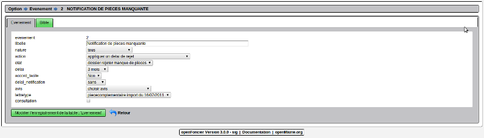
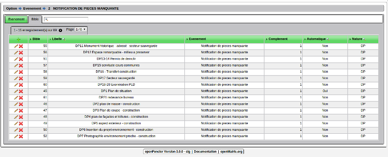
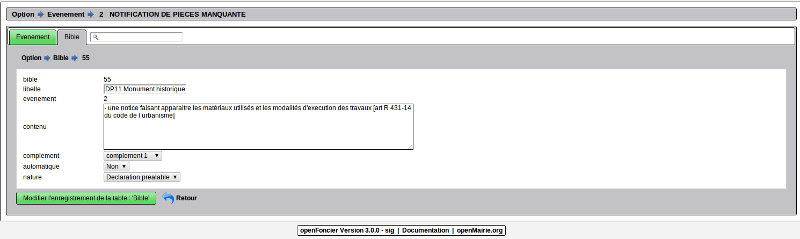
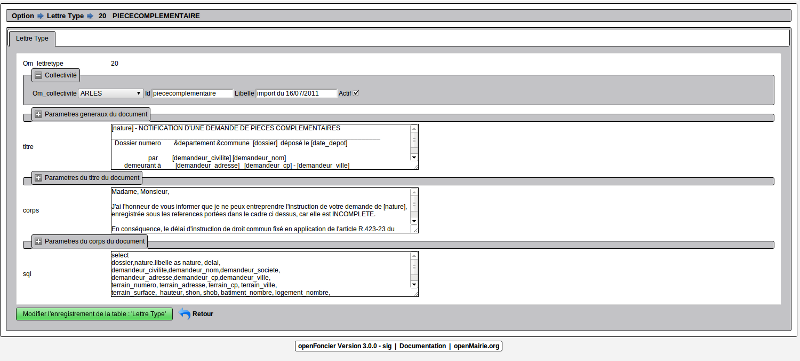
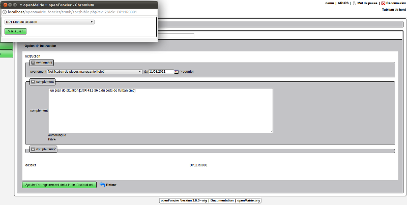
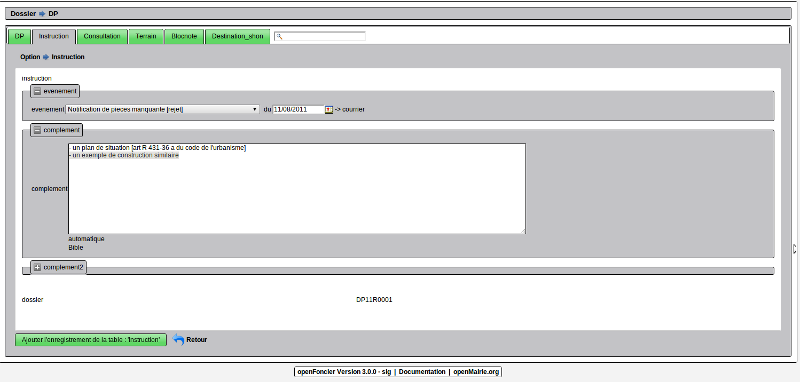
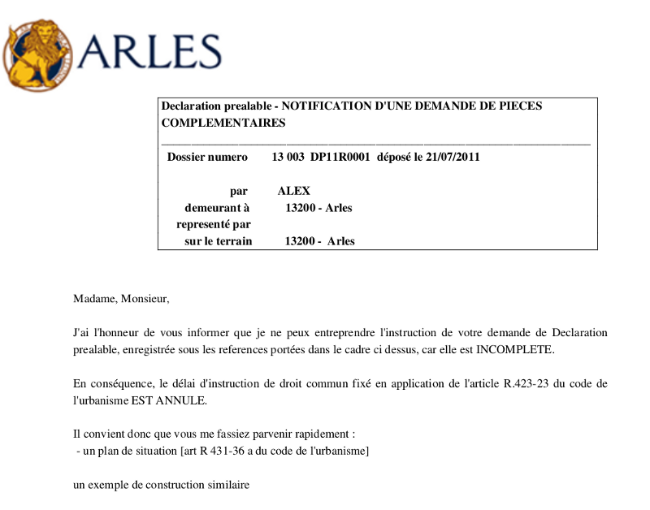
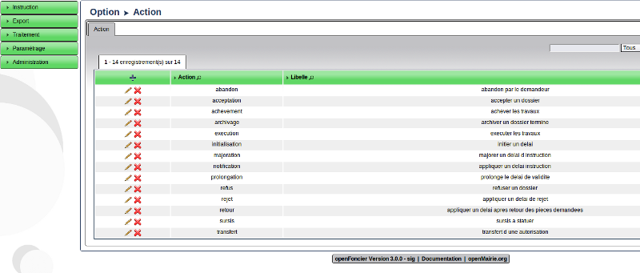
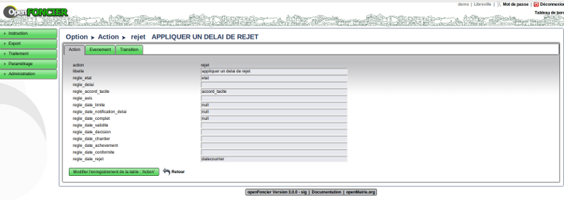
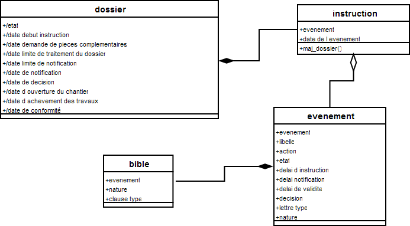

.. _evenement:

##############
Les événements
##############

Il est proposé de décrire dans ce chapitre le paramétrage de l'instruction au
niveau :

- des événements

- de la bible

- des lettres type

Le paramètrage des evenements
=============================

Le paramétrage des evenements se fait dans le formulaire evenement 

Le paramétrage dans le cas plus haut correspond à la notification de pièces manquante :

- cet evenement s'applique à tous les dossiers

- l'action est d' "appliquer un délai de rejet"

- le dossier sera dans l'état "rejeter"

- le delai de rejet est de 3 mois

- il n'y a plus d'accord tacite si le delai d'instruction est dépassé

- la lettre type qui s'applique est la lettre "piecescomplementaire"

La case consultation permet lorsqu elle est cochée de récupérer automatiquement les
avis de consultation. Cette case est surtout interessante pour la mise en oeuvre d'arrêtés
qui vise les consultations en zone "complement1". 

La bible
========

Dans l'onglet, il est possible de voir les textes applicables à l'événement décrit plus haut
Ces textes seront insérés dans les lettres type de chaque événement :

Le formulaire de saisie d'un texte de la bible est décrit ci dessous :

Dans notre exemple, il est demandé :

"une notice faisant apparaitre les matériaux utilisés et les modalités d'execution des travaux"

Ce texte ne sera pas appellé automatiquement et sera inscrit dans le complément 1 et ne concerne
que les déclarations préalables.

Les lettres type
================

Le formulaire ci dessous permet de modifier la lettre type "piecescomplementaire"

La description du paramétrage de lettre type est décrite dans le guide du
développeur openMairie.

De manière générale, il y a donc plusieurs niveaux de paramétrage de lettre type
suivant le niveau de spécificité :

. il est crée un canevas dans om_lettretype, et il est inséré les champs de la base
avec le paramètrage de la requête SQL et on rajoute des variables applicatives
(table parametre de la collectivité ou date système ...)

. les textes issus de la bible de manière automatique ou manuelle le sont dans le
formulaire instruction

. enfin il est possible de rajouter de texte spécifique dans ce formulaire

La mise en pratique dans une phase d'instruction
================================================

Il est proposé de saisir dans un dossier de "DP" la phase d'instruction "rejet par manque de pièce complementaire" :

Il est choisi dans le formulaire d'instruction l'événement correspondant.

Avec la bible automatique ou manuelle, il est complété complement1 du formulaire instruction:

et on rajoute en complement le texte suivant :

 "un exemple de construction similaire"
 
 
ce qui donne la saisie suivante :

L'édition de la lettre type devient avec les paramètres du formulaire instruction :

Le paramètrage de l'instruction
===============================

Le parametrage de l instruction est fait dans la table action
Cette table contient les règles applicables aux champs de la table dossier lors
de la mise à jour d'un événement d'instruction.

Le paramétrage se fait dans le menu  avec les options : paramètrage / action

Le formulaire de saisie des actions est le suivant :

Il est possible de modifier les règles applicables au dossier sur les champs suivants ::

        Il est possible de modifier 13 champs de la table dossier
        en paramétrant les champs "regle"
        
        Champ texte :                   regle unique = valeur de l'evenement
            regle_etat                  etat (de l evenement)
            regle_accord_tacite         accord _tacite (de l evevenement)
            regle_avis                  avis (de l evenement)
        Champ calcule                   regle de calcul delai avec ou sans ajout
            delai                       delai (de l evenement) + Nombre de mois
            
        Dates
        
            regle_date_complet
            regle_date_limite
            regle_date_notification_delai
            regle_date_limte
            regle_date_decision
            regle_date_validite
            regle_date_chantier
            regle_date_echevement
            regle_date_conformite
            
            Les regles possibles sont les suivantes
                exemple : avec 3 opérandes
                    datecourrier (de l evenment) + delai + nombre de mois
                exemple : avec 2 opérandes
                    date_complet + nombre de mois
                exemple avec 1 operande
                    null

Le diagramme de classe evenement :
==================================

Il est proposé ci dessous de présenter le diagrame de la classe evénement

