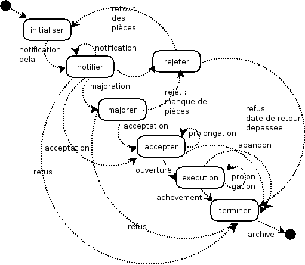

.. _workflow:

###########
Le workflow
###########

Le workflow décrit la procédure d'un dossier sous la forme UML état/transition
(voir à la fin du châpitre paramètrage le diagrame état/transition)

openFoncier ajoute à cette description traditionnelle la notion d'action.
(version 3.0.0).

L'état définit une étape dans un processus d'instruction dans laquelle se situe un dossier :

Lors de la saisie d'un dossier PC, le dossier PC est dans l'état "initialiser"

Les états de base sont les suivants ::

    initialiser     dossier sans notification de delai
    notifier 	    delai de notification envoye
    rejeter 	    dossier rejeter manque de pieces
    majorer 	    delai majore
    accepter 	    dossier accepter
    executer 	    dossier en cours de execution
    terminer 	    dossier en fin d instruction
    cloturer 	    instruction terminee (archive)

Les actions de base possibles sont décrites plus loin (parametrage / evenement)

La table transition sert à definir les actions possibles pour un etat d'origine

La correspondance état / action est décrite plus loin (parametrage / evenement)

Lors de la saisie d'un évenement d'instruction, openfoncier renvoie les événements autorisés.

<developpement>

En fait, les événements proposés sont fait suivant les requetes suivants ::

    // selection de l'état du dossier dans instruction.class.php
    $sql="select etat from dossier where dossier ='".
          $this->idxformulaire."'";
    $etat_dossier = $db->getOne($sql);
    $nature_dossier= substr($this->idxformulaire,0,2);
    
    // recherche des evenements (dans instruction.form.inc)
    $sql_transition = "select evenement,(libelle||' '||evenement.action||'') as lib
        from evenement inner join transition on evenement.action = transition.action";
    // et restriction des evenements dans instruction.class.php
    $sql= $sql_transition." where transition.etat ='".$etat_dossier."' and (evenement.nature ='".
          $nature_dossier."' or (nature ='T' and nature !='CU')) order by evenement.action";

</developpement>

Il est selectionné les événements

- d'après l'état du dossier, la table transition renvoie la ou les actions possibles 

- d'apres ces actions possibles, il est selectionné les evenements dans la table evenement 

- ces evénements sont restreints suivant la nature du dossier (sauf si l'evenement est commun à Tous)

Il est noté que pour les CU, le code est modifié en dur, ce qui est nuisible au paramétrage.

Dans notre cas ::

    l'état initial est "initialiser"
    dans la table transition, il y a une seule action : "initialisation" pour l'état initialisation
    La recherche des événement se fait pour :
        action = initialisation
        nature = PC ou T (comme tous)

Il est renvoyé les 2 événements ci dessus possibles dans notre cas ::

    notifier un delai pour maison individuelle
    notifier un delai autre que maison individuelle

Le diagramme etat transition
============================

Le diagramme etat/transition :

– permet de décrire les changements d'état d un objet en reponse aux inter actions des
autres objets ou des acteurs

– Un état se caracterise par sa stabilité

– une transition represente le passage instantanné d un etat à l autre

Il est représenté ci dessous le diagramme état/transition du dossier

ETATS DU DIAGRAMME::

    initialiser
    notifier
    majorer
    accepter
    refuser
    rejeter
    executer
    terminer
    
TRANSITIONS DU DIAGRAMME ::

    saisie
    notification de base
    notification supplementaire
    majoration
    acceptation
    refus
    demande de pieces complementaires
    retour de pieces complementaires et la notification de nouveau delai
    declaration d ouverture de chantier
    declaration achevement de travaux
    certificat de conformite

Le diagramme de séquence
========================

Le diagramme de séquence permettent une representation des collaborations entre
objets d un point de vue temporel

– la représentation se concentre sur l expression des inter actions (et non les etats)

– illustre les cas d utilisation : le temps s'ecoule de haut en bas de l'axe

Il est représenté ci dessous le diagramme de séquence du dossier :

.. image:: ../_static/uml_sequence.png

