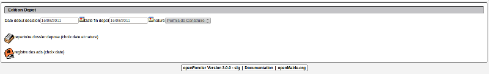
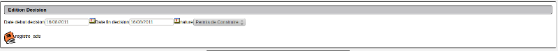

.. _affichage_public:

###############################
L'affichage public des dossiers
###############################

Il est proposé de décrire l'affichage au public

L'edition peut se faire par date de dépôt : export -> edition par date de dépôt :

Deux états / sousetats sont proposés :

- dossier_ads

- dossier_depot

Ils sont modifiables dans administration/etat et administration/sousetat

L'édition peut se faire par date de décision :

Il n'y a qu un etat disponnible

- dossier_ads_d

L'édition pour l'option Tous n'a pas été implémenté.

<developpement>

A voir si avis ='' (avis = vide) en mysql
