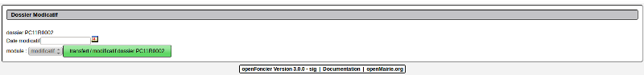

.. _modificatif:

#########################
Le modificatif de dossier
#########################

Il est proposé de décrire la mise en oeuvre d'un modificatif.

Lors de l'appel du traitement , l'écran suivant est affiché

Le modificatif reprend avec un numero de 01 à 99

- le dossier

- les terrains affectés

- le bloc note

- les destinations

Le champ "types" de dossier prend la valeur  "modificatif"

#######################
Le transfert de dossier
#######################

Il est proposé de décrire le la mise en oeuvre d'un transfert.

Le transfert reprend avec un numero de 01 à 99

- le dossier

- les terrains affectés

- le bloc note

- les destinations

Le champ "types" de dossier prend la valeur  "transfert".

le demandeur_nom est à compléter manuellement, il est inscrit en attente "transfert".

Les informations sur le demandeur et un eventuel délégataire sont à compléter.

Dans les 2 cas, modificatif ou transfert, l instruction n'est pas conservée.

<Developpeur> ::

    Le traitement se fait avec le script spc/dossier_modificatif.php
    
</developpeur>