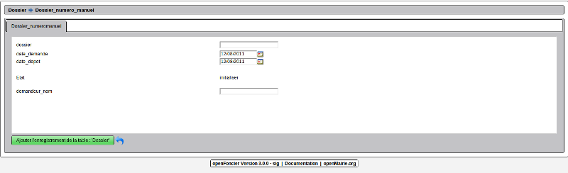

.. _numerotation_manuelle:

########################
La numerotation manuelle
########################

Il est proposé de décrire le numérotation manuelle

La numérotation manuelle permet de créer des modificatifs ou tansfert sur d'ancien
permis

<experience> ::

    Il n'est pas utile de récupérer dans la mise en oeuvre d'openFoncier les
    ADS antérieures.
    Le dispositif de numérotation manuelle permet d'éviter les difficultés de
    récupération d'instruction en cours pour les modificatifs et les transferts.
    
</experience>

Le formulaire de numérotation manuelle accessible en traitement  -> numero manuel
est le suivant

Il faut saisir :

- le numero de dossier
        
        nature sur 2 caractères  : PC, PA , DP, PD
        
        année sur 2 caractères : 10 pour 2010
        
        la lettre de la commune
        
        le numero d ordre
        
        le numero de modificatif ou de transfert (00 à 99)
        
- la date de depot et de demande (date du jour par défaut)

- le nom du demandeur

Une vérification est faite sur la nature et l'année (il n'est pas possible de saisir
des dossiers pour l'année en cours)