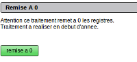

.. _remisea0:

###########################
La remise a 0 des registres
###########################

Ce traitement permet de remettre à 0 les registres des dossiers

Ces dossiers sont soit :

- a numerotation unique, (même sequence de numéro pour tous les dossiers)

- soit une numerotation par nature de dossier (PC, PA CU ...)

Le paramétrage se fait dans dyn/var.inc.

Le registre numerote sequentiellement le permis. Ce traitement est donc à faire
avant le premier permis de l'année suivante :

exemple ::

    année 2011 : dernier permis = PC11R0698
    année 2012 : premier permis = PC12R0001

    Il n'y a qu une sequence et il faut utiliser la procédure manuelle pour
    gérer 2 années en même temps. (voir traitement/numerotation_manuelle)

<developpeur>

En cas de lancement inopiné de ce traitement, il faut remettre à jour les sequences
dans la base :

- numero unique : dossier_seq

- numero par nature ::

    dossier_pc_seq
    dossier_pa_seq
    dossier_pd_ses
    dossier_dp_seq
    dossier_cu_seq
    

Procédure :

    x = dernier numero de dossier

    ALTER SEQUENCE dossier_pc_seq RESTART WITH x
    

Notes :

Le traitement num_dossier.php a été modifié pour pgsql

Il reste à faire la compatibilité avec mysql dans la mise à jour des séquences.

</developpeur>