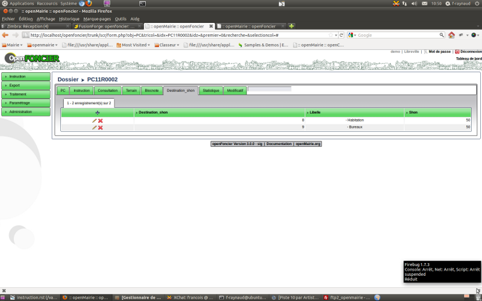
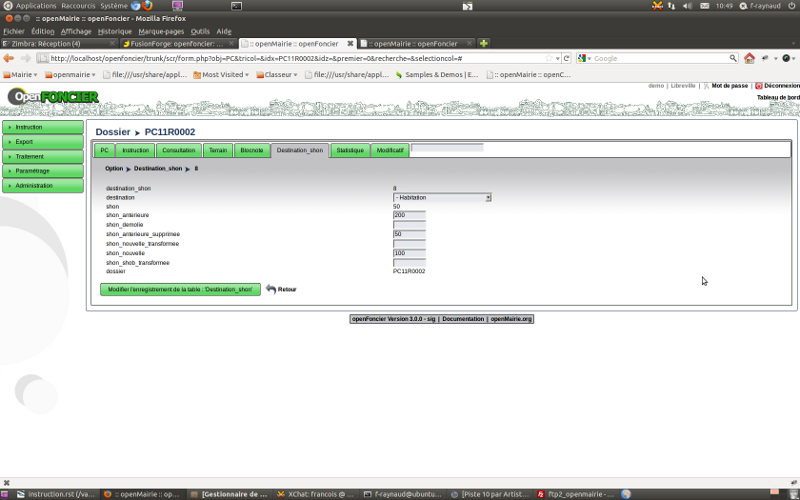

.. _destination:

#######################
Saisir les destinations
#######################

Il est proposé de décrire dans ce paragraphe la saisie des destinations d'un dossier.

Les destinations sont accessibles dans l onglet destination_shon

Il est possible de creer ou modifier ou supprimer une destination_shon dans le formulaire ci dessous

Les destinations sont paramétrées dans paramétrage / destination

Les shons de chaque destination se cumulent dans le champ shon_calcul de dossier.

<developpement>
Avec la mise en place de la transmission SITADEL, ce formulaire sera appellé à évoluer
pour prendre en compte les shon créées par destination, par transformation, destination
projettée par destination, démolie par destination. 
</developpement>