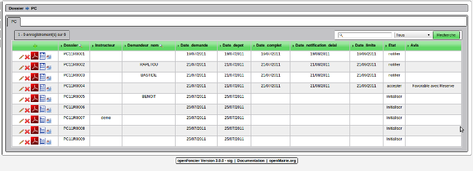
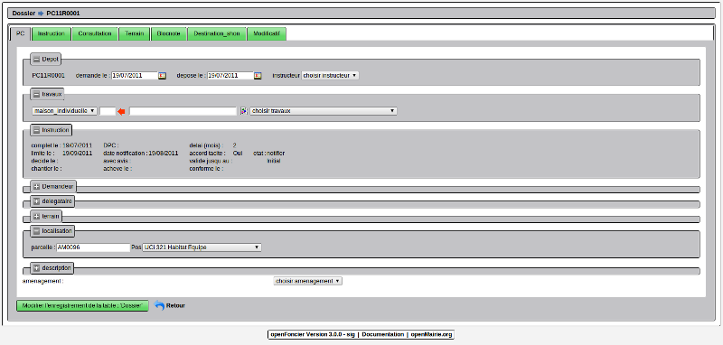
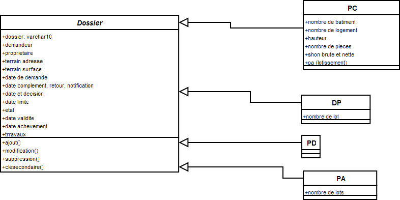

.. _dossier:

################
Créer un dossier
################

Il est proposé de décrire dans ce paragraphe la constitution d'un dossier.

Un dossier est lié à une procèdure : PC, PA, DP ou PD.

Il est possible de saisir un dossier :

- au niveau de l'accueil pour notifier un délai

- au niveau de l'instruction pour instruire un dossier

L'accueil ne s'occupe que de la notification des dossiers.

Ci dessous il est decrit l'accès au niveau de l'instruction :

Il est possible d'afficher :

- un état PDF du dossier

- un écran résumant le dossier

- une carte permettant la saisie manuelle de localisation géographique du dossier
  (voir chapitre intégration)

Le formulaire suivant est affiché :

Les informations sont affichées par fieldset (ouvert ou fermé suivant saisie accueil ou saisie instruction):

- sur le dépôt

- sur les travaux et architecte

- sur l'instruction (modifiable dans l'onglet instruction)

- sur le demandeur

- sur le délégataire

- sur le terrain

- sur la localisation : le dossier est localisé au centre de la parcelle si elle existe

- sur les caractéristiques du dossier.

L'héritage des differentes procèdures
=====================================

Le dossier est une classe abstraite, c'est à dire une classe qui n'instancie pas directement un objet.

le petitionnaire depose un permis de construire et non un dossier)

les procedures heritent de la classe dossier

