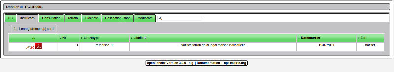
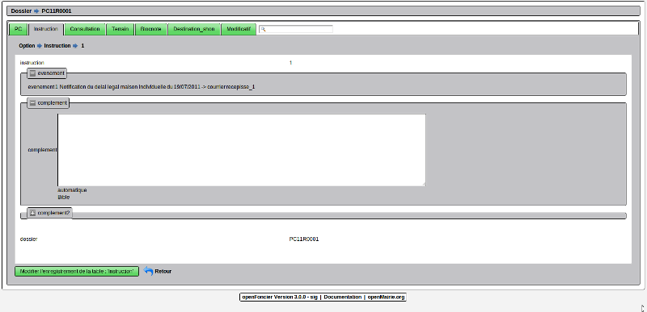

.. _instruction:

####################
Instruire un dossier
####################

Il est proposé de décrire dans ce paragraphe l'instruction d'un dossier.

Les phases d'instruction sont stockées dans l'onglet instruction

Il est possible d'éditer la lettre type PDF dans la grille ci dessous

Il est possible de creer ou modifier une phase d'instruction dans le formulaire ci dessous

En création il faut :

- choisir  l'événement d'instruction proposé suivant le workflow (voir paramètrage)

- personnaliser la lettre type (facultatif):
    
    soit en faisant appel à la bible (automatique ou manuelle)
    
    soit en complétant manuellement les cases "complément"
    
- saisir la date (obligatoire)

En modification

    Il est possible de modifier la date suivant le jour de signature de l'élu de l'arrêté
    dans la version 3.0.0.

En suppression :

La suppression n'est possible que dans l'ordre des événements sinon le message
suivant apparait ::

    destruction_chronologique
    SUPPRESSION NON EFFECTUEE

<developpeur>

Cette limitation permet de gérer correctement les phases de dossier dans le fieldset "instruction"

C'est ainsi que les données précédentes sont archivées dans chaque événement permettant de rétablir
la situation précédente. (champs archive ...  de la table instruction)

</developpeur>