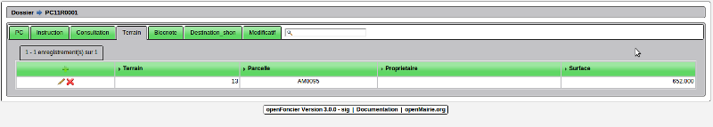
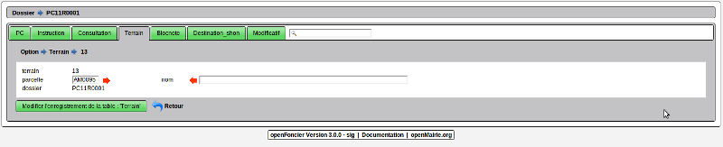

.. _terrain:

#####################
Affecter des terrains
#####################

Il est proposé de décrire dans ce paragraphe d'affecter des terrains à un dossier.

La parcelle de géolocalisation est saisie dans dossier. Toutefois, il se peut que plusieurs parcelles
soient concernées par un dossier. Dans ce cas là, vous devez faire une géolocalisation manuelle ou
préciser en dossier la parcelle où sera géolocalisé le dossier.

L'onglet terrain permet de visualiser les parcelles :

Il est possible d'ajouter, modifier ou supprimer des terrains dans le formulaire suivant :

La recherche se fait sur :

- la parcelle côté gauche

- le nom du propriétaire de la parcelle côté droit

Les surfaces de parcelles des terrains sélectionnés sont cumulés dans le champ terrain_surface_calcul
de dossier